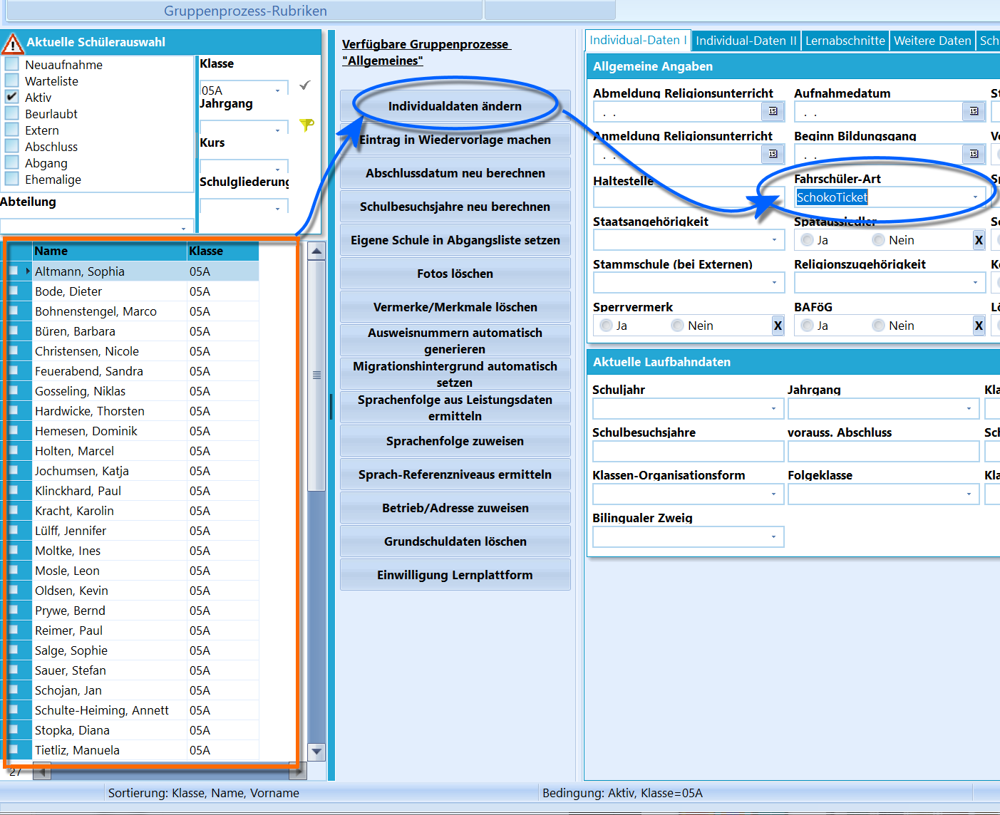
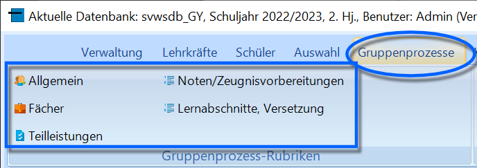
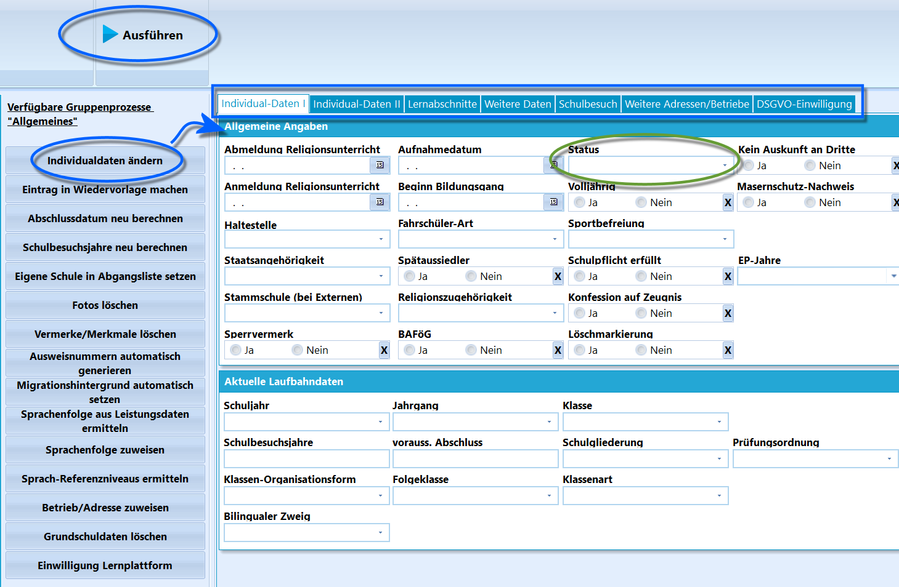
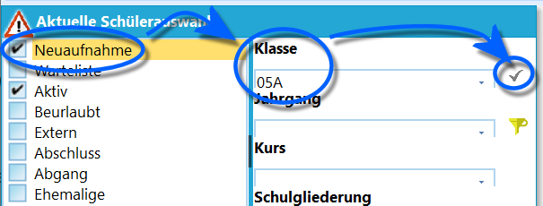
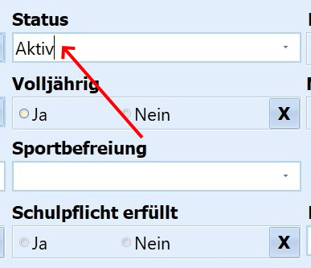
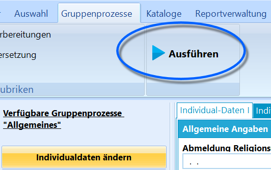
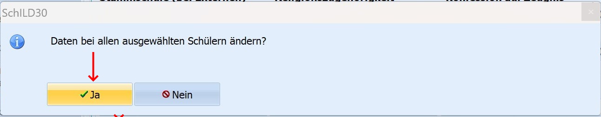
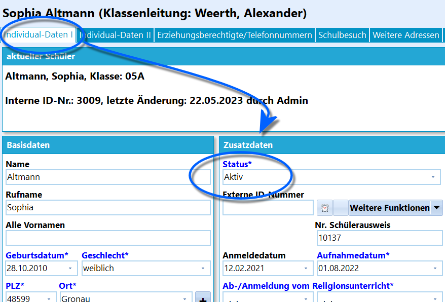

# Einführung in die Gruppenprozesse (Einführung in SchILD-NRW)

## Einführung in die Gruppenprozesse

 Gruppenprozesse erlauben es, Änderungen für eine
ausgewählte Gruppe von Schülerinnen und Schülern gleichzeitig
durchzuführen.

Dies erleichtert die Änderung von Daten oder die Berechnung von
Abschlüssen, da der notwendige Vorgang nicht für jeden einzelnen Schüler
manuell verändert werden muss, sondern für eine ganze Gruppe
durchgeführt werden kann.

Diese Gruppe kann dabei aus allen aktuellen Schülerinnen und Schülern
der Schule, einer Jahrgangsstufe oder einer Klasse bestehen. Auch für
nach beliebigen anderen Kriterien gefilterten oder beliebig
zusammengestellten Schülergruppen können gemeinsam Daten verändert,
ergänzt oder gelöscht werden.Gruppenprozesse wirken sich also immer auf die Schülergruppe aus, die
aktuell im *Container* gezeigt wird.  

 Die Gruppenprozesse erreicht man über den entsprechenden
Karteireiter **Gruppenprozesse**.Es stehen folgende Kategorien an Gruppenprozessen zur Verfügung:-   *Allgemeines*
-   *Fächer*
-   *Teilleistungen*
-   *Noten, Zeugnisvorbereitung* und
-   *Lernabschnitte, Versetzung*.Je nach Schulform und gewählter Schülermenge können auch noch andere
Kategorien erscheinen. Wählt man an einer Schule mit gymnasialer
Oberstufe exklusiv Schüler der Q2 aus, erscheint zusätzlich die
Kategorie *Abitur*.Unter diesen Kategorien stehen dann die zugehörigen Gruppenprozesse zur
Verfügung.  

 Wählt man einen zum Beispiel den Gruppenprozess
*Individualdaten ändern*, öffnet sich rechts ein Menü, in dem die Felder
der *Individualdaten* zur Verfügung gestellt werden. Eine Veränderung
hier wird für die gesamte Schülergruppe im *Container* durchgeführt.Im Gruppenprozess *Individualdaten ändern* sind auch noch weitere Felder
über die zusätzlichen Reiter zu erreichen.  

### Beispiel: Abändern des Feldes Status

Die Schule wurde ins neue Schuljahr hochgeschult. Die Schülerinnen und
Schüler der 05A wurden zu diesem Schuljahr neu aufgenommen und haben
daher alle den Status *Neuaufnahme*, dieser soll nun bei allen auf
*Aktiv* umgestellt werden.

 Wählen Sie zuerst die Schüler in der *Aktuellen
Schülerauswahl* aus, die im Container angezeigt werden sollen.-   Es werden auch die Schüler im Status *Neuaufnahme* durch setzen des
    Hakens angewählt. Der Haken bei *Aktiv* bleibt stehen.
-   Unter **Klasse** wird die *05A* im Dropdown-Menü gewählt.Wenden Sie den Filter mit einem Klick auf den kleinen Haken rechts neben
dem Dropdown-Menü an.  

 Zum Abändern des Status' wird der Gruppenprozess
*Allgemeines* ➜ **Individualdaten ändern** ausgewählt.Nun wird im Menü im Feld **Status** über das Drop-Down-Menü der Eintrag
*Aktiv* ausgewählt.  

 Anschließend muss der Gruppenprozess über den Button
*Ausführen* angestoßen werden.  

 Wird die folgende Sicherheitsabfrage *Daten bei allen
ausgewählten Schülern ändern* bejaht, ist der Gruppenprozess
abgeschlossen.  

 Die Kontrolle im Reiter *Individualdaten I* einer Schülerin
zeigt, dass der Prozess erfolgreich durchgeführt wurde.    
----

## Videotutorials

### Grundlagen zum Thema Gruppenprozesse
<youtube>mYl_uzhFLkA</youtube>

### Abändern des Feldes Status
<youtube>9retUdwaZhs</youtube>

### Klasse per Gruppenprozess zuweisen
<youtube>BLH3x_G72JU</youtube>
