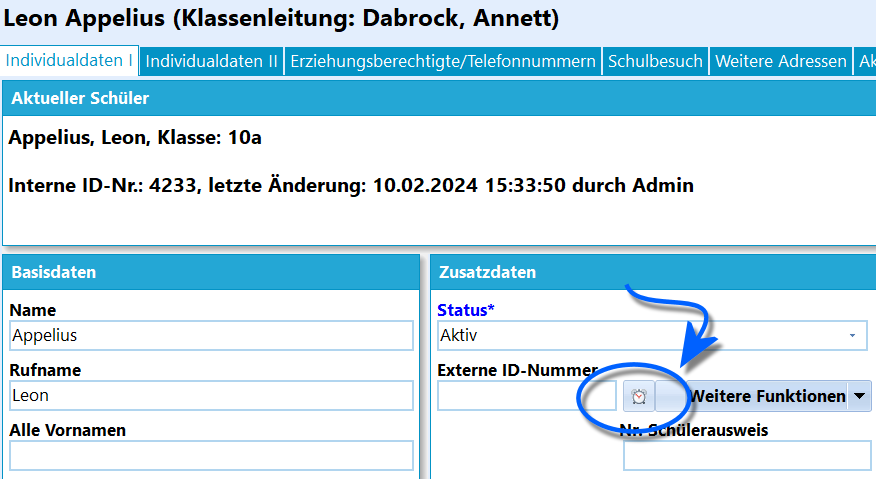
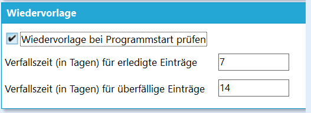
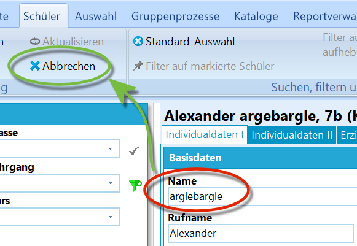
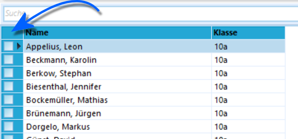
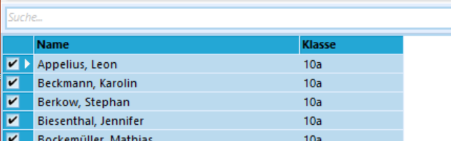
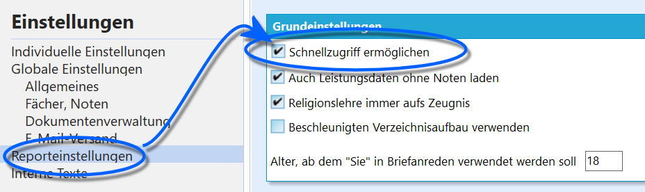
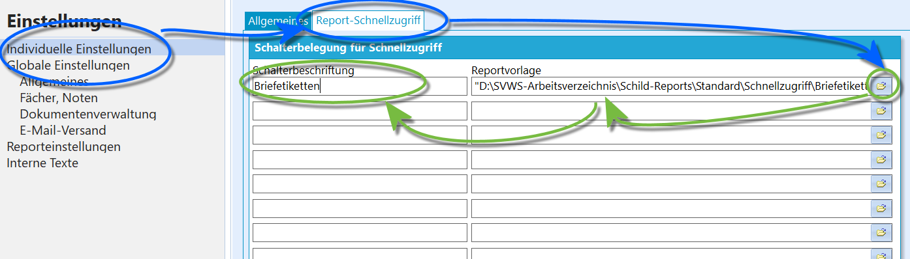
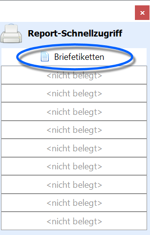
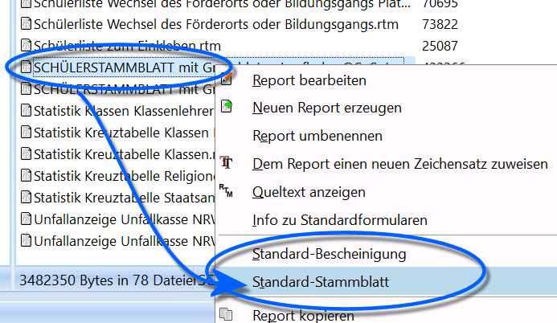

# Tipps zur Bedienung (Einführung in SchILD-NRW)) In diesem Artikel finden sich Tipps zu den Bedienelementen
von SchILD-NRW.

## Nutzeroberfläche

### Spaltenbreiten anpassenSchILD-NRW speichert die von Ihnen eingestellten Spaltenbreiten auf
individueller Nutzerebene ab.

### Statistikrelevante Felder hervorheben

 Heben sie für die Statistik relevante Felder farblich
hervor, indem Sie Über *Verwaltung ➜ Individuelle Einstellungen ➜
Benutzeroberfläche* ➜ **Farbe für statistikrelevante Felder** eine
passende Farbe setzen.  

## Listen mit Checkboxen-   Wenn man einen Buchstaben eintippt, geht die Liste automatisch auf
    und springt zu dem ersten Eintrag, der mit dem eingegebenen Text
    übereinstimmt
-   Über `Esc` kann man die Liste wieder schließen
-   Wird bei aufgeklappter Liste die `Enter`-Taste drückt, wird das
    Häkchen beim ausgewählten Eintrag aktiviert beziehungsweise
    deaktiviert
-   Über die Pfeiltasten kann Liste navigieren
-   Über die `Entf`-Taste können alle Häkchen zurückgesetzt werden.

## Nutzen Sie die *Wiedervorlage*

 Nutzen Sie die *Wiedervorlage* auf *Schüler ➜
Individualdaten I*, um sich einen Schüler nach Ablauf eines Datums mit
einem Memo anzeigen zu lassen.

Das **Weckersymbol** öffnet die Wiedervorlage.  

 Wurde der Haken bei *Verwaltung ➜ Einstellungen ➜
Wiedervorlage* ➜ **Wiedervorlage bei Programmstart prüfen** gesetzt,
geschieht genau dies und Wiedervorlagen mit verstrichenem Datum werden
angezeigt.Stellen Sie auch die Verfallszeiten für Wiedervorlagen ein.

::: warning

Denken Sie daran, dass Wiedervorlagen über Schulferien
verfallen können.

:::

## Fehlerhafte Eingabe abbrechen

 Bemerken Sie auf dem Reiter **Schüler** während der Eingabe
eine fehlerhafte oder versehentliche Eingabe, lassen Sie den Curser im
Datenfeld stehen und klicken Sie oben auf `Abbrechen`.Es wird der bisherige Inhalt des Feldes aus der Datenbank
wiederhergestellt.Bewegen Sie den Curser jedoch aus dem Feld heraus, wird das Feld in die
Datenbank geschrieben, ohne dass es eine Funktion zum Rückgängig machen
gibt.  

## Alle Schüler auswählen

Um im Schülercontainer *alle Schüler* auszuwählen, klicken Sie auf das
*Quadrat direkt über den Auswahlboxen*:  

Nun sind alle Schüler im Schülercontainer ausgewählt worden.  

## Reports: Schnellzugriff und Schulbescheinigungen, Stammblatt

### Schnellzugriff nutzen

 Damit der Schnellzugriff zur Verfügung steht, muss dieser
durch den Haken bei **Schnellzugriff ermöglichen** in *Verwaltung ➜
Einstellungen* in SchILD-NRW global aktiviert werden.  

 Wählen Sie über *Verwaltung ➜ Einstellungen ➜ Individuelle
Einstellungen ➜ Report-Schnellzugriff* die Reports, die bei Ihrem Nutzer
im Schnellzugriff auftauchen sollen.Vergeben Sie auch eine Beschriftung für diesen Report.  

 Nach einem Neustart steht nun das frei bewegbare schwebende
Fenster des Schnellzugriffs mit den gesetzten Reports zur Verfügung.  

### Schulbescheinigungen und Stammblatt

 Um das verwendete *Stammblatt* und die *Schulbescheinigung*
schnell zu erreichen, klicken Sie mit der `Rechten Maustaste` auf den
jeweils gewünschten Report und wählen Sie den Eintrag
`Standard-Bescheinigung` oder `Standard-Stammblatt`.Der Report ist nun entsprechend hinterlegt.  

0 Im Reiter **Schüler** lassen sich die Reports nun im
Kopfband im Bereich *Drucken* über einen Klick auf `Schulbescheinigung`
oder `Stammblatt` direkt aufrufen.