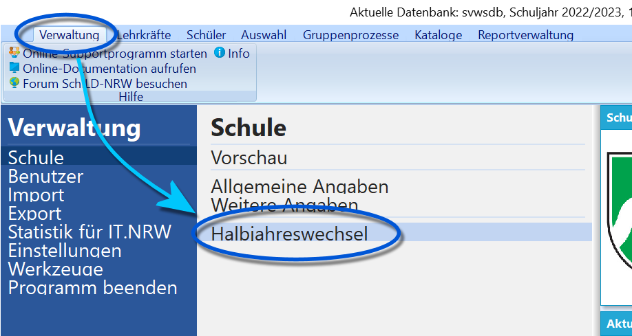
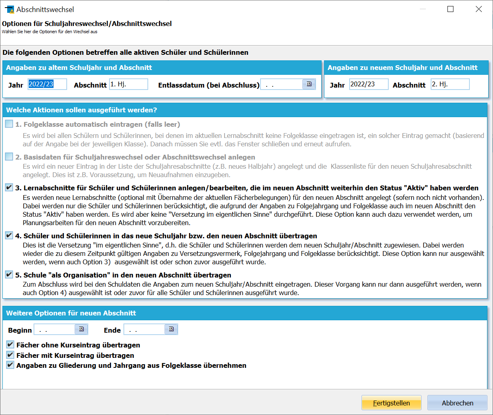
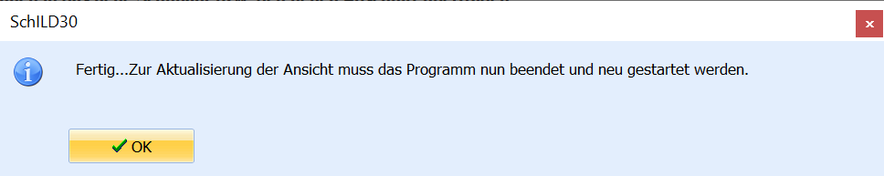
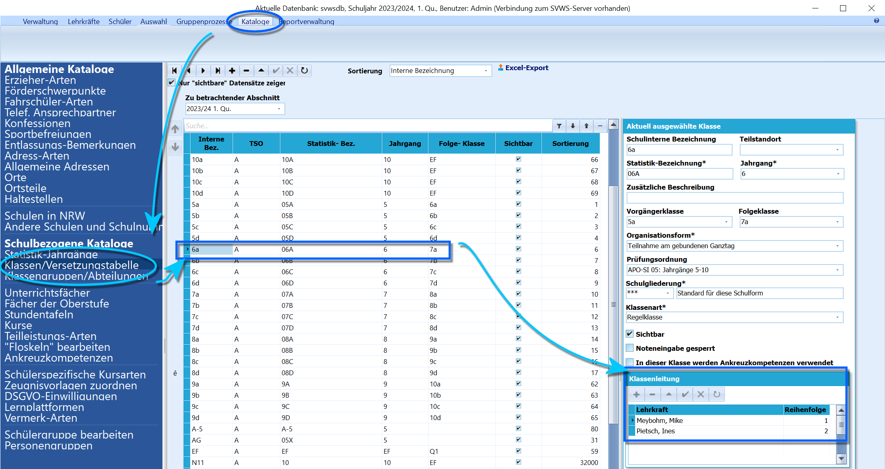
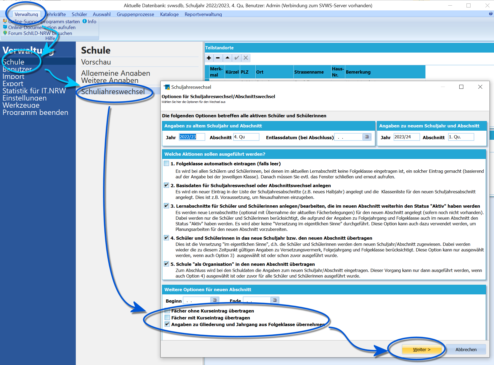
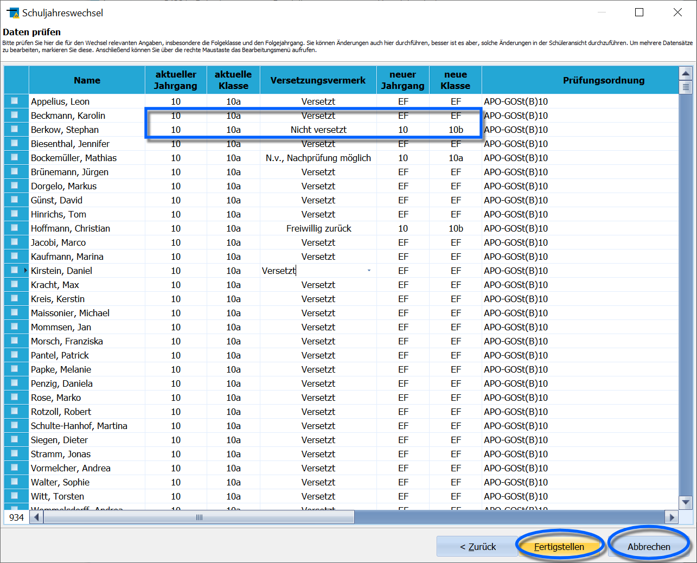

# Versetzung ins neue Schuljahr und Abschnittswechsel durchführen (Einführung in SchILD-NRW)Der Schuljahres- oder Halbjahreswechsel kann in SchILD-NRW auf
verschiedene Arten durchgeführt werden. Entscheidend sind oft die
Schulform und die Arbeitsweise an der jeweiligen Schule.Grundsätzlich gilt, dass der Weg über *Schulverwaltung ➜ Schule*
bearbeiten gewählt werden kann.

Die Schüler klassen- oder jahrgangsweise über den Gruppenprozess zu
versetzen ist nur notwendig, wenn es an der Schule Jahrgänge oder
Klassen gibt, die zu verschiedenen Zeitpunkten oder von verschiedenen
Abteilungsleitern versetzt werden müssen.

## Abschnittswechsel ohne Versetzung (Halbjahreswechsel)Findet ein Abschnittswechsel vom 1. ins 2. Halbjahr statt, wird keine
Versetzung durchgeführt.Bei diesem Abschnittswechseln geht es lediglich darum, die Schule in den
neuen Abschnitt zu übertragen, neue Lernabschnitte anzulegen und Fächer
und Kurse nach Bedarf mitnehmen bzw. im neuen Lernabschnitt passend neu
anzulegen.Arbeiten Sie sich zum Ende des Halbjahres durch eventuell für den
Zeugnisdruck erhobene Leistungsdaten. Relevant sind diese auch für
eventuell anliegende Abschlussprognosen, z.B. im Jahrgang 9.Sofern in der entsprechenden APO für einen Jahrgang vorgesehen ist, dass
zum Schuljahreswechsel eine Versetzung vorgesehen ist, sollte hier auf
das beabsichtigte Setzen von Mahnungen geachtet werden.

 Gehen Sie einfach auf **Verwaltung** und wählen Sie dann
ihren Wechsel. Da die verwendete Beispielschule Halbjahre verwendet und
sich im 1. Halbjahr befindet, wird hier passend die Schaltfläche
**Halbjahreswechsel durchführen** eingeblendet.Klicken Sie den Button **Halbjahreswechsel durchführen**.

 Sie werden dann automatisch durch den Wechsel geleitet und
die Haken sind in der Regel so wie eingestellt zu belassen.

Die Einstellungen bei Abschnittswechseln sind hierarchisch in sinnvoller
Reihenfolge aufgebaut. Damit etwa bei *4.* Schüler in einen Abschnitt
eingetragen werden können, muss dieser natürlich zuvor, bei *3.*
angelegt worden sein. Und damit dieses geschehen kann, muss zuvor bei
*2.* der entsprechende Abschnitt für die Schule erzeugt worden sein.
Wählen Sie einen Haken ab, werden daher alle folgenden Haken ebenfalls
abgewählt.Bitte kontrollieren Sie, ob der Haken zur Mitnahme der Fächer wie
gewünscht gesetzt ist.

::: warning

**Hinweise zum Schuljahreswechsel:**1.  In der Regel ist die Mitnahme der Fächer gewünscht.
2.  Die Angaben zu Beginn und Ende sind optional.
3.  Sind Schritte in der Übersicht ausgegraut, wurde der entsprechende
    Schritt schon ausgeführt.

:::  

  

## Abschnittswechsel mit Versetzung, Abschlüssen, Ausschulungen (Schuljahreswechsel)Am Ende des Schuljahres muss der Abschnittswechsel mit eventueller
Versetzung bzw. Ausschulung - mit Abschluss oder als Abgänger, wenn die
Schule verlassen wird - durchgeführt werden.

Grundsätzlich legt die *Versetzungstabelle* den Standard fest, wie mit
Personen einer Klasse bei der Versetzung zu verfahren ist.Bei der Versetzung kann es zu zwei Varianten kommen:-   Es wurden die Versetzungsvermerke automatisch und mit nach manueller
    Prüfung. Gleiches gilt für eventuelle Abschlüsse oder
    Abschlussprognosen. Dies wird in Jahrgängen durchgeführt, in denen
    Versetzungen und Abschlüsse anliegen.
-   Es wurden eventuell keine Versetzungsberechnungen durchgeführt, z.B.
    weil keine Zeugnisse mit ScHILD gedruckt wurden oder weil es in den
    entsprechenden Jahrgängen keine Versetzungen oder Abschlüsse gibt.Mitunter kommen beide Varianten auch an einer Schule vor, etwa, wenn es
an einer Gesamtschule in den unteren Jahrgängen in der Regel keine
Nicht-Versetzungen gibt, im Abschlussjahrgang aber individuell die
Abschlüsse eingestellt werden müssen und wenn die 10er mit der passenden
Qualifikation und bei einer erfolgten Anmeldung an der Gymnasialen
Oberstufe in die EF "versetzt" werden.In beiden Fällen wird der Abschnittswechsel über *Verwaltung ➜ Schule
bearbeiten* durchgeführt.

 Sind Sie bereit, den Schuljahreswechsel durchzuführen - das
heißt, die Verarbeitung des alten Schuljahres und alle Vorbereitungen
sind abgeschlossen - drücken Sie den Button **Schuljahreswechsel
durchführen**.  

Es öffnet sich das Fenster **Daten prüfen**, in dem die zuvor für den
Lernabschnitt automatisch oder manuell eingestellten
Versetzungsergebnisse zu finden sind.

Diese können hier noch individuell angepasst werden. Hier im Beispiel
wurde für einige aus unterschiedlichen Gründen Nicht-Versetzte der neue
Jahrgang mit dann neuer Nachfolgeklasse gewählt.Klicken Sie auf **Fertigstellen**, wenn Versetzung und
Schuljahreswechsel so in Ordnung erscheinen oder beenden Sie den Prozess
ohne dass bislang Änderungen an der Datenbank vorgenommen wurden über
**Abbrechen**.Es öffnet sich ein Fenster, das mit **Ok** bestätigt wird.SchILD meldet nach Abschluss des Schuljahreswechsels eben dieses mit
einem Fenster, nach der Bestätigung schließt sich das Programm.  

### Sich anschließende ArbeitenSofern vor der Versetzung die *Versetzungstabelle* nicht angepasst
wurde, wären nun noch die neuen Klassenleitungsteams über
Gruppenprozesse einzustellen.

Die eventuell vorher noch vorhandenen Schüler in Abschlussklassen haben
nun nicht mehr den Status *Aktiv*, sondern sind *Abgänger* oder haben
einen *Abschluss*. In größeren Systemen mit unterschiedlichen
Abschlüssen sollten diese Klassen vor der Versetzung zusammen mit dem
Zeugnisdruck schon passend ausgeschult werden.

Die Eingangsjahrgänge der Schule sind nun leer, so dass die Schüler aus
der *Neuaufnahme* über Gruppenprozesse *Aktiv* geschaltet werden und auf
ihre vorgesehenen Klassen verteilt werden können.Über die entsprechenden Werkzeuge sind ebenfalls passende Fächer, Kurse
und Lehrkräfte einzutragen.