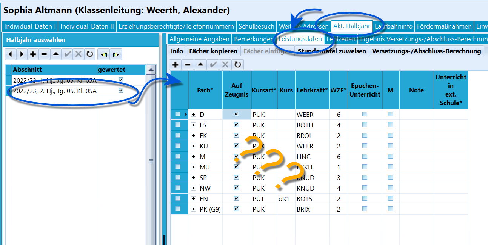
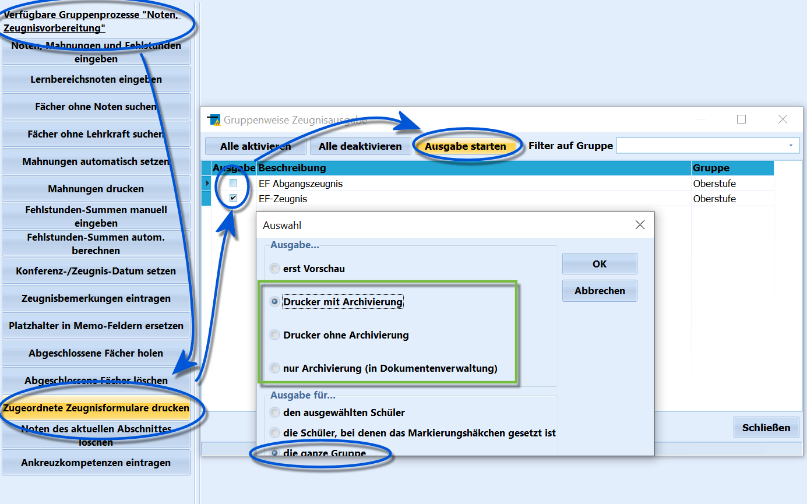
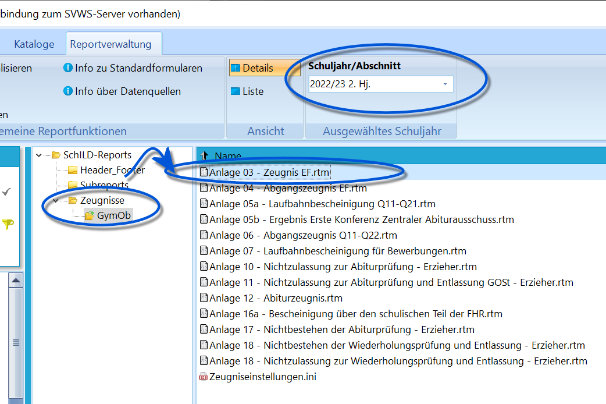
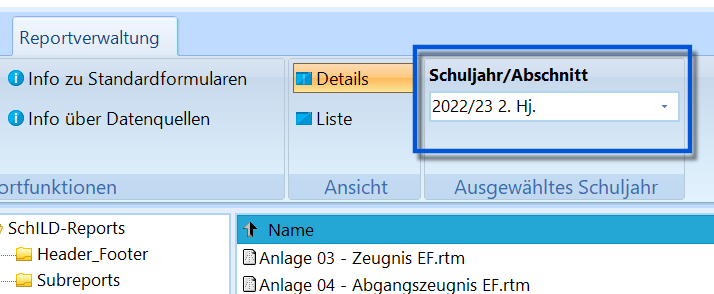

# Zeugnisvorbereitungen und Zeugnisdruck (Einführung in SchILD-NRW)

## Administration von SchILD als Vorbereitung

### EinstellungenGrundsätzlich sind an einer Schule Rahmenbedingungen für die Eingabe von
Noten und Fehlstunden zu klären.

Dies betrifft unter anderem:-   wie Fehlstunden in der SI und SII erfasst werden (als Gesamtsumme,
    fachbasiert kursweise oder aus tagesbezogenen Fehlstunden).
-   ob in der SI erweiterte Noten zugelassen sind (z.B. 1-, 3+ usw.)
-   wie mit nicht-gemahnten 5en und 6en verfahren wird.Weiterhin lässt sich die Noteneingabe sperren, damit nach dem Einlesen
der Noten - oder sogar nach der Zeugniskonferenz! - keine
unabgesprochenen Nachträge mehr vorgenommen werden können.

Diese Einstellungen finden Sie unter *Verwaltung ➜ Einstellungen ➜
Fächer, Noten* und der entsprechende Artikel im Wiki enthält weitere
Informationen hierzu.Ebenso sind die verwendeten Floskeln zu setzen und eventuell

WIKILINK: Abgeschlossene_Fächer_holen_(Gruppenprozesse_Noten,_Zeugnisvorbereitung)
zu holen.

### Floskeln

 In Schild-NRW gibt es sogenannte Floskeln. Dies sind
wiederkehrende Bemerkungen, die in *Zeugnisbemerkungen*, *Bemerkungen
zum Arbeits- und Sozialverhalten*, *Angaben zum außerunterrichtlichen
Engagement* oder den *fachbezogenen Bemerkungen* vorkommen können.Außerdem können Floskeln für *Textzeugnisse* angelegt werden.Um diese Bemerkungen nicht immer eintippen zu müssen und damit einen
gleichbleibenden Standard einzuhalten, können sie in SchILD-NRW mit
einem Kürzel hinterlegt werden und so im Zeugnisdruck schnell per
Mausklick eingefügt werden.Der Artikel 

WIKILINK: Floskeln_bearbeiten_(Schulbezogene_Kataloge)
listet die zur Verwendung von Floskeln notwendigen Informationen auf.

::: warning

Die endgültig zu verwendenden Floskeln beschließt die
Schulkonferenz.

:::

## Die Zeugnisphase in SchILD

### Gegebenenfalls Abfrage an SchülerEs kann sich empfehlen, ab und zu eine Abfrage an die Schüler (deren
Erziehungsberechtigte) in Bezug auf ihre aktuellen Daten zu starten.Eine solche Abfrage muss nicht in jedem Jahr stattfinden. Es sollte eine
Abfrage rechtzeitig in Abschlussjahrgängen vorgenommen werden, um
eventuelle Namensänderungen oder Änderungen der Konfession zu erfassen.
Weiterhin sollte geklärt werden, ob die Konfession auf das Zeugnis
gedruckt werden soll.**Vorlaufzeit**: Monate bis Wochen vor dem Zeugnisdruck.

### Überprüfung der angelegten Leistungsdaten

 Damit Noten eingetragen werden können, müssen die
**Leistungsdaten** des **aktuellen Abschnitts** korrekt sein.Hat ein Schüler einen falschen Kurs oder einen tatsächlich besuchten
Kurs nicht oder ist bei einem Fach aufgrund eines Wechsels eine falsche
Lehrkraft eingetragen, erzeugen solche Fehler während und im Nachgang
des Noteneintragens unnötige Nacharbeiten. Eventuell schlagen auch
automatische Berechnungen von Abschlüssen oder der Versetzung fehl.  Überprüfen Sie daher im Vorfeld, ob alle Kurse, Fächer, Lehrkräfte usw.
korrekt sind.Überprüfen Sie direkt bei dieser Gelegenheit, ob vorherige nicht
gewertete Abschnitte bei Wiederholern auch als "nicht gewertet" markiert
wurden.Sollen auch Teilleistungen oder Prüfungsnoten (z.B. der ZP10) erfasst
werden, müssen Teilleistungen und die Fächer bis zu diesem Moment
entsprechend konfiguriert werden.**Vorlaufzeit**: Einige Wochen zuvor, wenn relative Ruhe herrscht. Auf
jeden Fall muss die Kontrolle vor dem Beginn der konkreten
Noteneingabe/dem Notenexport abgeschlossen sein.

### NoteneintragungTragen Sie nun die Noten ein. Hierzu gibt es diverse Wege:-   Sammeln der Leistungsdaten und Eintragung direkt in SchILD durch
    ausgewählte Personen
-   Zugriff von Lehrkräften direkt auf SchILD über einen eigenen
    Benutzernamen
-   Export der Leistungsdaten, z.B. in Excel-Tabellen oder das Externe
    Notenmodul mit anschließendem Import
-   Eintragung über kostenpflichtige Weboberfläche SchILDWeb von RibekaJe nach gewähltem Weg, können auch Bemerkungen (AuE wie
"Klassensprecherin"), Prüfungsnoten oder Teilleistungen in
Exportprogramme eingetragen werden.Lassen Sie genug Zeit zum Eintragen der Noten. Je nachdem, wie Ihre
Schule funktioniert, können einige Tage ausreichen, eventuell ist die
Noteneintragung auch für zwei Wochen zu öffnen.Beachten Sie bitte, dass ein Update auf SchILD-NRW, während mit einer
anderen Version erstellte Notenlisten oder Externe Notenmoduldateien in
Ihrem Haus unterwegs sind, beim Import dieser Dateien zu Fehlern führen
kann. Warten Sie mit einem erneuten Update also bitte, bis die
Leistungsdaten importiert wurden.**Vorlaufzeit**: Ca. zwei Wochen zur Noteneintragung und ca. zwei
Werktage zur Kontrolle der Noteneingänge auf Vollständigkeit und
eventuellem Hinterherlaufen und -telefonieren.

### Teilleistungen, Projektkursarbeiten, ...Erfassen Sie auch rechtzeitig je nach Notwendigkeit
[Teilleistungen](../../Unterricht_Leistungsdaten_Noten/Teilleistungen/Teilleistungen_einrichten_und_verwalten_(Tutorial).md),
Lernbereichsnoten und Titel von Projektkursen und Themen von
Projektkursarbeiten.Beachten Sie hierzu die entsprechenden Wikiartikel.*Lernbereichsnoten* werden im *Aktuellen Abschnitt* manuell oder über
Gruppenprozesse eingegeben.

Die Themen von *Projektkursen* können unter Kurse bei der
*Zeugnisbezeichnung* eingegeben werden. Bei der Anlage eines
Projektkures ist unter den *Katalogen* das Fach mit dem Kürzel *PX* zu
wählen und diese Projektkurs-Fächer müssen dann als *Fach der Oberstufe*
markiert werden (das Kürzel *PX* ist Pseudofach und nicht für ASD).

Die individuellen Themen der *Projektkursarbeiten* sind als
*Fachbezogene Bemerkungen* zu erfassen. Hierzu aktiveren Sie das Feld
für *Fachbezogene Bemerkungen* über *Verwaltung ➜ Einstellungen ➜
Globale Einstellungen*. Dort findet sich unter *Ansicht* der Haken, mit
dem Fachbezogene Bemerkungen in SchILD aktiviert werden können. Dann
kann in den Leistungsdaten mit einem Doppelklick auf **Fachbez.
Leistungsentw.** eine Bemerkung per Floskel oder manuell gesetzt werden.**Vorlaufzeit**: Zusätzliche Informationen wie Projektkursthemen usw.
sollten bis einige Tage vor der Nachbearbeitung der eingegebenen Daten
vorliegen und können im Zuge der Konferenzvorbereitung eingepflegt
werden.

### ZeugnisbemerkungenGeben Sie *Außerunterrichtliches Engagement* und eventuelle
*Zeugnisbemerkungen* ein. Diese lassen sich teilweise auch z.B. über das
Externe Notenmodul durch die Klassenleitungen erfassen.Einige Informationen liegen den Zeugnisbeauftragten nicht vor. Dies
wären etwa Jahrgangssprecher oder wer in welcher Rolle in der
Schülervertretung oder wer als Streitschlichter oder Schulsanitäter usw.
mitwirkt.Manche dieser Informationen können über AGen erfasst werden, andere
müssen manuell zusammengetragen werden.**Vorlaufzeit**: Holen Sie rechtzeitig verteilte Informationen zusammen.

### FehlstundenberechnungWurden Fehlstunden nicht als Gesamt-Fehlstunden erfasst, sondern müssen
aus *Tagesbezogenen* oder *Fachbezogenen* Fehlstunden gebildet werden,
führen Sie den Gruppenprozess *Noten, Zeugnisvorbereit.* ➜
**Fehlstundensummen autom. berechnen** aus.Über den Gruppenprozess *Fehlstunden-Summen manuell eingeben* können die
Summen klassenweise leicht nachgetragen werden.

### Eingabe von Konferenz- und ZeugnisdatumSetzen Sie per Gruppenprozess das Konferenz- und Zeugnisdatum für den
aktuellen Abschnitt.**Vorlaufzeit**: Im Rahmen der Konferenzvorbereitung.

### VersetzungsberechnungFühren Sie den Gruppenprozess *Lernabschnitte, Versetzung* ➜
**Versetzungs-/Abschlussberechnung** durch, um basierend auf den
Leistungsdaten und dem in SchILD-NRW hinterlegten Algorithmus diese
Felder zu berechnen und zu befüllen.Wurden Veränderungen an den Leistungsdaten vorgenommen, ist die Prüfung
erneut auszuführen. Diese kann über einen Gruppenprozess oder bei den
individuellen Leistungsdaten des aktuellen Abschnitts (oben in der
Kopfzeile des Fensters) angestoßen werden.

### Berechnung des FHR usw.Liegen nun noch weitere Berechnungen, wie zum Beispiel für den
*Schulischen Teil der Fachhochschulreife (FHR)* an, führen Sie diese wie
in den entsprechenden Artikel beschrieben aus.Achten Sie darauf, dass bei veränderten Leistungsdaten die Daten für den
FHR neu geholt und dieser, beziehungsweise sein Schnitt, neu berechnet
werden muss.Sofern ein Abitur anliegt, sind die entsprechenden Berechnungen und
Eingabe der Prüfungsleistungen wie in den Artikeln zum Abitur
beschrieben durchzuführen.

### Sonstiges

#### ArbeitsgemeinschaftenVerarbeiten Sie nun Arbeitsgemeinschaften oder ähnlich. Diese können zum
Beispiel über Kurse erfasst und auf einem Zeugnis ausgegeben werden.Alternativ lassen sich passende Bemerkungen über Floskeln einfügen.

#### Schüler, die nicht automatisiert verarbeitet werdenKümmern Sie sich nun um Schüler, die nicht durch automatische Prozesse
zu Versetzung und Abschlussberechnungen erfasst werden.

Dies sind möglicherweise einer Klasse zugeordnete *Flüchtlingskinder*
oder Schüler, die *zieldifferenziert* unterrichtet werden und statt
Zeugnissen individuelle Textzeugnisse oder andere Leistungsübersichten
erhalten.Verarbeiten Sie auch eventuell vorliegende *Anträge* von
Erziehungsberechtigten.

#### Zuweisungen o.Ä.Werden zum Beispiel Zuweisungen zu einer Differenzierungsebene an einer
Gesamtschule vorgenommen, nehmen Sie diese soweit wie absehbar schon im
Vorfeld der Konferenzen mit auf.

## Vorbereitung der ZeugnisreportsAuf der Webseite des
[MSB fürSchulverwaltungssoftware](https://www.svws.nrw.de) finden sich aktuelle
Zeugnisformulare, die für den aktuellen Abschnitt genutzt werden sollen.Unter **

WIKILINK: Zeugnisse_Themenübersicht** finden sich die
hierzu notwendigen Informationen.Eventuelle Veränderungen der Zeugnisse sind an dieser Stelle ebenfalls
vorzunehmen. Soll zum Beispiel ein Stadtwappen oder ein anderes Logo des
Schulträgers, das nicht das in der Datenbank hinterlegte Schul-Logo ist,
auf dem Zeugnis auftauchen, muss dieses in die Reports eingebaut werden.Es empfiehlt sich, im Reportverzeichnis eine Ordnerstruktur anzulegen,
in dem die Zeugnisse nach Abschnitt sortiert werden und somit auch für
rückwirkende Nachdrucke mit den Originalreports zur Verfügung stehen.Beispiel für das 1. Halbjahr vom Schuljahr 2023/24:` C:\SVWS-Arbeitsverzeichnis\Schild-Reports\Zeugnisse\2023_24_1`Es kann sich noch eine Differenzierung gegebenenfalls in z.B. 'SI' und
'SII' anschließen.Beachten Sie ebenfalls, dass 

WIKILINK: Zeugnisvorlagen_zuordnen_(Schulbezogene_Kataloge)
werden können. Sollen Zeugnisse mit zugeordneten Vorlagen gedruckt
werden, würde dies in diesem Schritt konfiguriert werden. Der Druck
findet dann über den Gruppenprozess 

WIKILINK: Zugeordnete_Zeugnisformulare_drucken_(Gruppenprozesse_Noten,_Zeugnisvorbereitung)
statt.**Vorlaufzeit**: Je nach persönlichem Komfortgefühl einige Tage bis eine
Stunde vor dem Zeugnisdruck.

## KonferenzenLaden Sie fristgerecht und entsprechend des gültigen Rechtsrahmens zu
Zeugniskonferenzen und führen Sie diese durch.Pflegen Sie die sich aufgrund von Konferenzbeschlüssen ergebenden
Änderungen ein. Dies ist mitunter auch direkt von der Konferenz aus
möglich, wenn eine Netzwerkverbindung zu SchILD-NRW besteht.Leistungsübersichten können als Report erzeugt werden, um sie als .pdf
anzuzeigen.Es kann auch ein Konferenzmodul verwendet werden, um Änderungen auch
direkt einzugeben und anzuzeigen.

## Zeugnisdruck und ArchivierungEs gibt nun zwei Möglichkeiten, die Zeugnisse zu drucken.

 Zum einen kann über die Gruppenprozess *Noten,
Zeugnisvorbereitung* ➜ **Zugeordnete Zeugnisformulare drucken** gedruckt
werden.Wurden Zeugnisformulare zugeordnet, kann der Druck hier komfortabel
angestoßen werden. Wählen Sie erst die zu druckenden Zeugnisse aus und
klicken auf **Ausgabe starten**.Dann muss angewählt sein, dass **die ganze Gruppe** gedruckt werden
soll.Anschließend wählen Sie im üblichen Druckmenü die Art der Ausgabe.-   **Vorschau**, um einen Blick auf das fertige Ergebnis zu werfen
-   **Drucker mit Archivierung** um die Zeugnisse erst zu einem Drucker
    zu senden und dann anschließend einen zweiten Satz zu generieren,
    der in der Dokumentenablage abgelegt wird, sofern diese aktiviert
    wurde.
-   **Drucker ohne Archivierung** schickt die Zeugnisse zu einem
    Drucker, ohne dass eine Kopie in der Dokumentenablage erzeugt wird.
-   **nur Archivierung** erzeugt die Zeugnisse in der Dokumentenablage,
    ohne den Dialog für einen physischen Druck zu öffnen.
-   **Archivierung in Zeugnisverzeichnis** funktioniert wie die
    Dokumentenablage, jedoch werden die .pdf-Dateien im konfigurierten
    Zeugnisverzeichnis abgelegt.Bestätigen Sie mit **OK** und warten Sie bitte unbedingt ab, bis der
Gruppenprozess abgeschlossen ist, bevor Sie einen neuen anstoßen.  

 Weiterhin kann auch über die **Reportverwaltung** gedruckt
werden. Hierbei filtern Sie die zu druckende Schülergruppe im
Schülercontainer und starten dann den Druck des gewünschten Reports.Auch hier stehen die oben besprochenen Wahlmöglichkeiten zu Druck und
Archivierung zur Verfügung.Ist dies gewünscht, drucken beziehungsweise kopieren Sie an dieser
Stelle eventuelle, den Vorgaben entsprechende Exemplare für eine
physische Archivierung.  

### Überweisungszeugnisse, Abgangs- und Abschlusszeugnisse

 Verlässt ein Schüler mit einem ausgegebenen Zeugnis die
Schule, ist der Prozess wie oben durchzuführen. Jedoch sind darüber
hinaus zuvor noch weitere Vorbereitungen zu treffen:-   Eintragung des **Sprachreferenzniveaus**: Stellen Sie sicher, dass
    die Sprachenfolge korrekt eingetragen ist, dann lässt sich das
    Sprachreferenzniveau berechnen. Hier können die Gruppenprozesse in
    der Gruppe *Allgemein* helfen. **Sprachenfolge aus Leistungsdaten
    ermitteln** setzt diese aus vorhandenen Leistungsdaten zusammen,
    **Sprach-Referenzniveau ermitteln** setzt soweit möglich dieses
    automatisch fest. Tragen Sie weiterhin manuell ein eventuell
    erreichtes Latinum, Graecum oder Hebraicum ein, da diese nicht
    automatisch gesetzt werden.
-   Setzen Sie unter *Schüler* im Reiter *Schulbesuch* das Entlassdatum
    **Entlassen am...**. Dieses ist mindestens zu setzen, füllen Sie
    aber bitte auch die anderen Felder korrekt aus. Wird der
    Gruppenprozess **Zeugnisse drucken und Schüler ausschulen** genutzt,
    ist dieser Schritt nicht notwendig.

## Text- und AnkreuzzeugnisseÜber SchILD-NRW lassen sich *Text-* und *Ankreuzzeugnisse* generieren.
Ebenfalls können *Lernstandsberichte* erzeugt werden, die ähnlich wie
Textzeugnisse funktionieren.

Die Zeugnisse sind über die Seite des MSB für Schulverwaltungssoftware
wie alle anderen Zeugnisse auch zu beziehen. Sie finden sich im Bereich
für die Grundschule.Erzeugen Sie für *Textzeugnisse* erst die gewünschten Floskeln über
*Kataloge ➜ "Floskeln" bearbeiten*.Entsprechend werden die Ankreuzkompetenzen unter *Kataloge ➜ Angaben für
Ankreuzzeugnisse* hinterlegt.Schaue Sie für detaillierte Ausführungen zu diesen Zeugnisformen bitte
in die zugehörigen Artikel in diesem Wiki. Sie finden sich unter der
Überschrift *

WIKILINK: SchILD-NRW_3#Tutorials*.

## Häufige Fehler beim Zeugnisdruck

::: warning

Nehmen Sie das Tutorial zu den *Häufigen Fehlern bei
Zeugnisdruck* zur Kenntnis.

:::