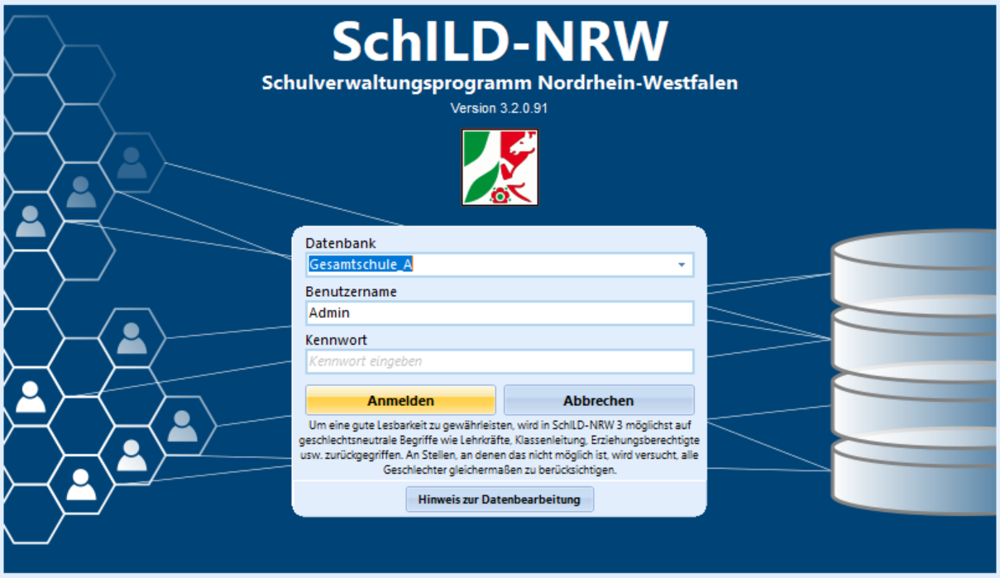

# Übersicht: SchILD-NRW 3 (Einführung)

 SchILD-NRW 3 ist das zentrale **Sch**ulverwaltungsprogramm
für die **I**ndividualdaten- und **L**eistungs**d**atenverwaltung.SchILD-NRW 3 läuft auf einem modernen Datenbanksystem und kann daher
viele gleichzeitige Nutzer und auch große Datenbanken performant
unterstützen. Es läuft sowohl auf Einzelplatzrechnern und kann in einer
Netzwerkumgebung auf einem Server betrieben werden.

Das Windows-Programm verwaltet Schülerinnen und Schüler, Lehrkräfte,
Erzieherinnen und Erzieher und Betriebe und ist für alle Schulformen in
NRW geeignet.Beziehen Sie [SchILD-NRW 3](https://svws.nrw.de) kostenfrei über die
Webseite des MSB für Schulverwaltungssoftware.  

### Ausgewählte Features zur Übersicht-   Verwalten Sie alle Leistungsdaten Ihrer Schülerschaft. Dies betrifft
    Noten, Teilleistungen, Quartalsnoten, Fehlzeiten usw.
-   Organisieren Sie den konfigurierbaren Unterricht in frei
    einstellbaren Klassen und Kursen von der Grundschule bis zu Abitur
    und Berufs- und Weiterbildungskolleg.
-   Verwalten Sie viele weitere Informationen Ihrer Schülerschaft, wie
    Adresse, unterschiedliche Erzieher, Fördermaßnahmen, KAoA,
    Buslinien, Sportbefreiungen, Einwilligen zu Lernplattformen und
    DSGVO-Einwilligungen.
-   Legen Sie weitere frei konfigurierte Vermerke an.
-   Filtern Sie Schüler nach allen in der Datenbank eingetragenen und
    frei kombinierbaren Kriterien.
-   Führen Sie automatische Abschluss- und Versetzungsberechnungen
    durch.
-   Führen Sie Änderungen über große Schülergruppen zeitsparend mit
    Gruppenprozessen aus.
-   Verwalten Sie Schülerfotos und Nummer für Schüler- und
    Lehrerausweise.
-   Verwalten Sie alle Personen und Kontakte in und um Ihre Schule aller
    Schulformen in NRW.
-   Verwalten Sie alle personen- und zeitabhängigen Daten Ihrer
    Lehrkräfte.
-   Bereiten Sie die amtliche Schulstatistik mit Hilfe von SchILD-NRW 3
    vor.
-   Sichern Sie Ihre Datenbank von SchILD-NRW 3 aus.
-   Erzeugen Sie Noten-, Text- und Ankreuzzeugnisse und verwenden Sie
    hierzu konfigurierte Floskeln und zum Download bereitgestellte
    offizielle Zeugnisformulare.
-   Drucken Sie die Daten aus der Datenbank durch einen flexiblen
    Report-Designer als Übersichten, Listen, Schülerausweise,
    Stammblätter, Leistungsübersichten usw. aus. Nutzen Sie hier auch
    die zahlreichen mitgelieferten Vorlagen.
-   Archivieren Sie wichtige Schreiben als PDF direkt in eine
    schülerbezogene Dokumentenverwaltung oder Zeugnisse in ein
    Zeugnisverzeichnis.
-   Prüfen Sie automatisch die Daten auf eventuell geltende
    Löschfristen.
-   Erstellen Sie Serienbriefe und Emails direkt aus SchILD-NRW 3.
-   Nutzen Sie umfangreiche Möglichkeiten zum Im- und Export und die
    Schnittstelle von Textdateien von SchILD-NRW 3.
-   Nutzen Sie das vielfältige Supportangebot über die Webseite des MSB
    für Schulverwaltungssoftware und die Fortbildungsangebote Ihrer
    Bezirksregierung.