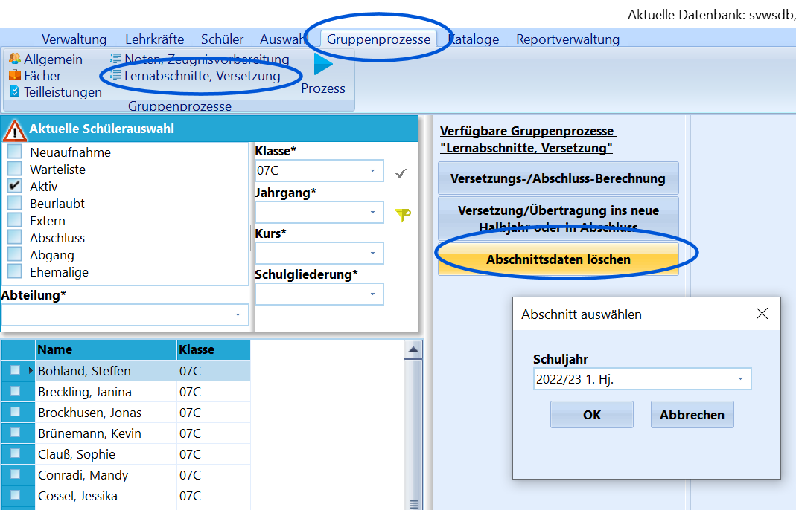

# Abschnittsdaten löschen (Gruppenprozesse Lernabschnitte, Versetzung)

::: warning

**

Dieses Feature verhält sich anders als in SchILD2:**Löscht man den *letzten aktuellen Abschnitt*, wird beim Schüler im
Schülercontainer keine Klasse/Jahrgang usw. mehr angezeigt, da diese in
SchILD3 *im letzten aktuellen Abschnitt gespeichert* sind!Achten Sie darauf, die Löschoperationen so auszuführen, dass bei den
Schülern, die den letzten Abschnitt gelöscht bekommen, im Anschluss die
fehlenden Daten im *dann* letzten Abschnitt eingetragen werden können.
D.h.: Löschen Sie jahrgangsweise oder sogar über mehrere Jahrgänge
hinweg, müssen die Schüler einzeln den Klassen neu zugeordnet
werden!

:::

 Dieser Gruppenprozess dient der Löschung ganzer Abschnitte.Im sich öffnenden Fenster muss das zu *löschende Schuljahr mit dem zu
löschenden Abschnitt* ausgewählt werden.Klicken auf `OK` bewirkt dann, dass bei allen im Container ausgewählten
Schülern der gesamte Inhalt dieses Abschnittes, inklusive aller
Leistungsdaten wie Fächerzuordnungen mit ihren Noten, gelöscht wird.

::: warning

Wie bei allen anderen Löschoperationen auch sollte zuvor
eine Datensicherung durchgeführt werden.

:::