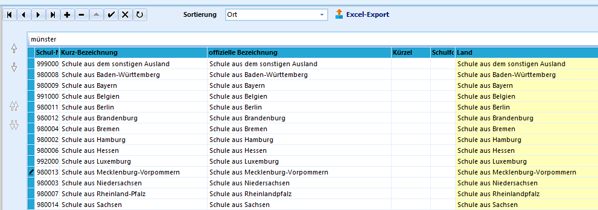

# Andere Schulen und Schulnummern (Allgemeine Kataloge)

 Kommen Schüler aus NRW zu Ihrer Schule, sind die
Herkunftsschulen über ihre Schulnummern zu erfassen. Dieser werden über
*Kataloge ➜ Schulen in NRW* verwaltet.Bei allen anderen Schulen aus dem In- und Ausland werden keine konkreten
Schulen mit Schulnummern erfasst.Hierzu werden *Andere Schulen und Schulnummern* verwendet. Über
*Kataloge* ➜ **Andere Schulen und Schulnummern** lassen sich mit dem
**+** die zur Verfügung stehenden Einträge anwählen. Hierbei ist
lediglich das Land, in dem die Herkunftsschule liegt, zu erfassen und
für die Statistik relevant.Kommt ein Schüler zum Beispiel aus dem *Bundesland Bremen*, wäre hier
der Eintrag *Schule aus Bremen* mit der verbundenen "Schulnummer"
*9990004* zu wählen.Als mögliche Herkunftsländer gelten neben den Bundesländern auch
aufgrund der Nähe und Grenzüberschreitung die Länder *Belgien*,
*Luxemburg* und die *Niederlande*. Jeder dieser Herkunft wird fest eine
Pseudo-Schulnummer zugeordnet. Alle anderen Herkunftsländer werden als
das *Schule aus dem sonstigen Ausland* mit der Schulnummer *999000*
aufgenommen.

Die **Kurzbezeichnung** und **Offizielle Bezeichnung** kann direkt
übernommen werden. Da keine konkrete Schule bezeichnet wird, können
weiteren Felder (Kürzel, Schulform sowie weitere Adressdaten, ...) frei
bleiben.

::: warning

Haben Schüler vor dem Besuch der Schulform *BK* oder
*WBK* keine Schule besucht, ist dies über die Herkunftsart
*Sonstige/keine Schule* zu erfassen. Diese ist mit der "Schulnummer"
*980500* verbunden.In der Statistik wird diese Herkunftsart mit dem Kürzel *XS* erfasst.
Gleiches gilt unter Verwendung dieser Schulnummer für die Herkunft aus
Wehr-, Zivil- oder Bundesfreiwilligendienst mit dem Statistikkürzel
*WZ*.

:::