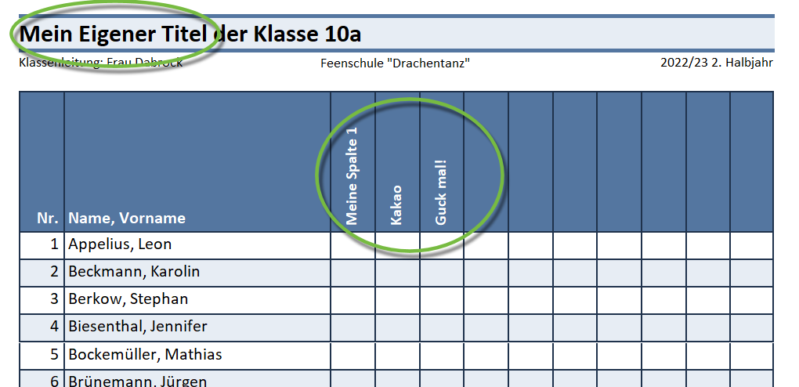
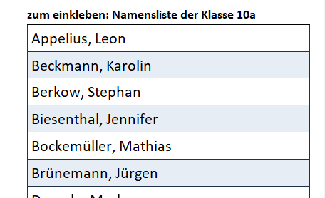
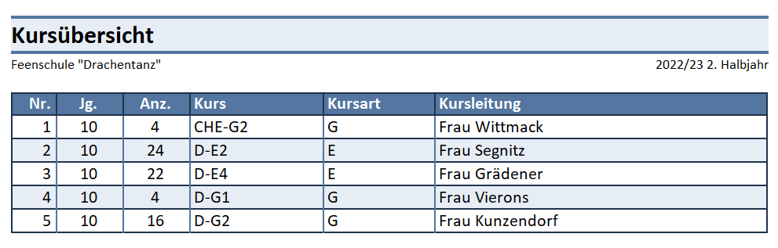
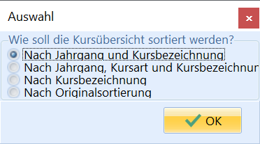
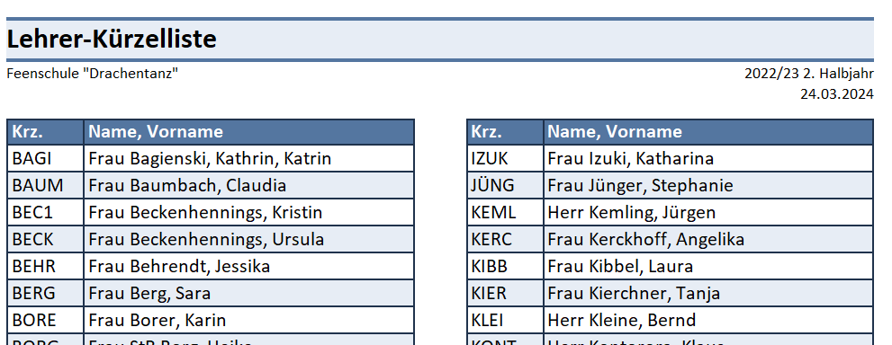
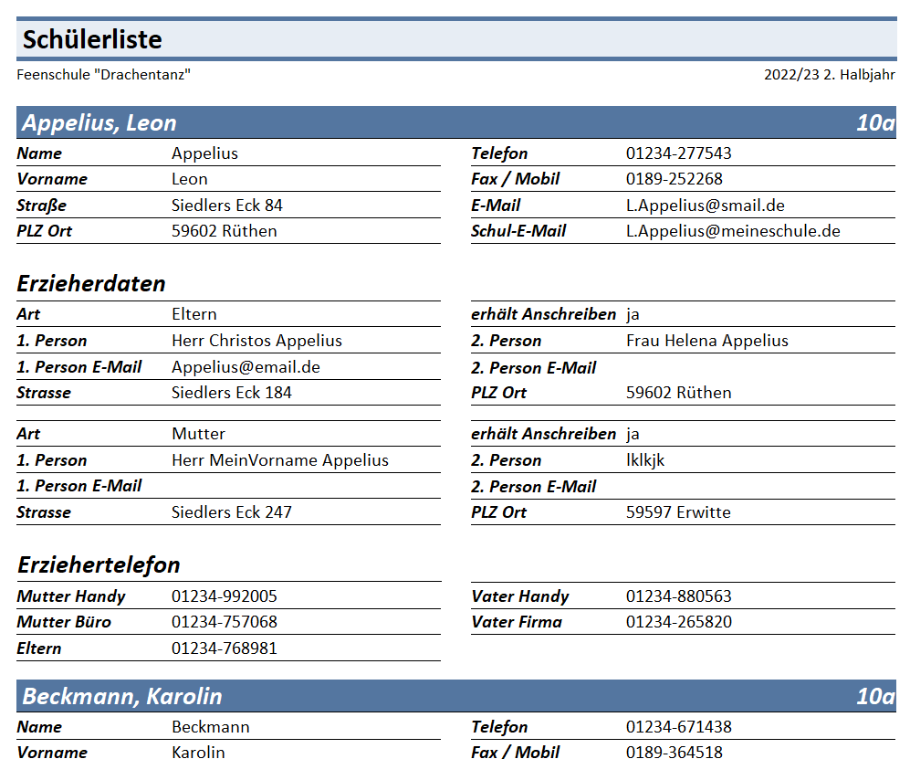

# Basisreportsammlung: Ein Überblick

Die Basisreportsammlung für SchILD-NRW 3 wurde vollständig überarbeitet.
Die Reports haben ein einheitliches Erscheinungsbild und sind vielseitig
einsetzbar.

## Enthaltene ReportsIn der Basisreportsammlung finden Sie unter anderem:-   **Aufnahmebögen** zur Neuaufnahme von Schülern.
-   Frei konfigurierbare **Briefetiketten** zum Ausdruck auf Aufkleber.
-   Informationsreports zur eigenen Schule, ein **Stammblatt** und eine
    **Schulbescheinigung**.
-   diverse **Klassenlisten**, zum Beispiel zu Adressen, Geburtsdaten,
    E-Mails von Erziehern, frei anpassbare Kästchenliste, Vermerke und
    vieles mehr.
-   **Lehrerlisten** diverserer Art, ebenso
-   allgemeine **Schülerlisten**, analog zu den Klassenlisten aber auch
    zu KAoA und so weiter.
-   Reports die bei zur **statistischen Auswertung** helfen, inklusive
    **Kreuztabellen** zu etwa Klassen, Religionen oder
    Staatsangehörigkeiten.
-   Weitere Reports, wie etwa **Unfallanzeigen**.

## Beispiele aus der Sammlung

 Der Report *Klassenliste Kästchen mit Abfrage @KL.rtm*
erlaubt es, eine Liste mit einem frei gewählten Titel und frei
benennbaren Spalten zu erzeugen.Kursweise wäre hier die Liste **Kursliste Klasse Kästchen mit
Abfrage.rtm** zu wählen.  

 Der Report **Klassenliste zum Einkleben @KL.rtm** erzeugt
eine einklebbare Namensliste, bei der die Breite der Namensspalte und
die Höhe der Liste - per 30 Einträge - selbst angegeben werden kann.  

 Mit dem Report *Kursübersicht Jahrgang Teilnehmerzahl
Kursart Lehrkraft.rtm* können Sie Kursübersichten für ausgewählte Kurse
generieren.  

 Bei der Generierung kann ausgewählt werden, wie die Liste
sortiert werden soll.  

 Je größer das Kollegium wird, desto nützlicher wird der
Report **Lehrerliste Lehrerkürzel Lehrername.rtm**, bei dem das Kürzel
und alle Namen ausgeben werden.Ebenso lassen sich für eine Zeugniskonferenz Unterschriftenlisten über
**Lehrerliste Zeugniskonferenz Unterschriftenliste.rtm** erzeugen.  

 Der Report *Schülerliste Adressen Telefonnummer
E-Mail-Adressen ausführlich.rtm* gibt ausführlich alle erfassten Daten
zu einer Schülerin bzw. einem Schüler wieder.