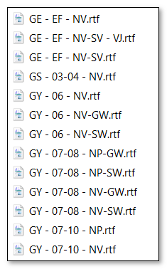
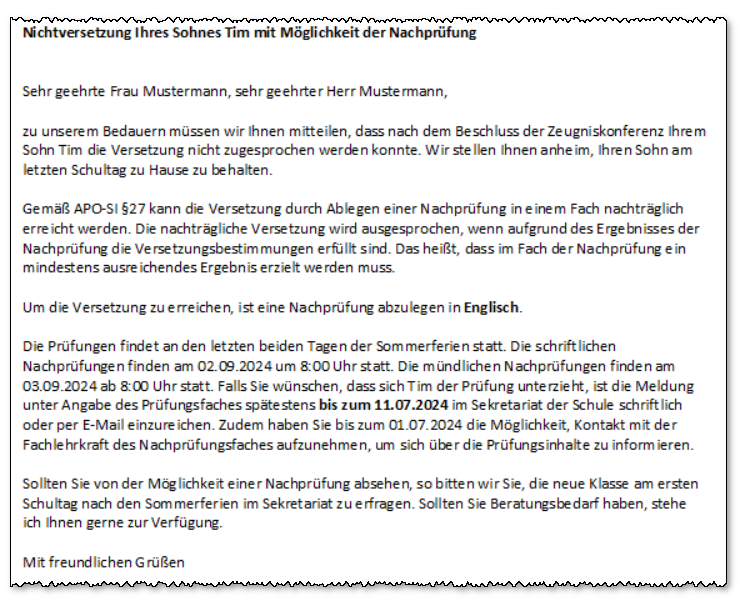

# Basisreportsammlung: Serienbrief Nichtversetzung

## Serienbrief NichtversetzungDer Serienbrief in SchILD-NRW 3 erzeugt Anschreiben an nichtversetzte
Schülerinnen und Schüler. Zunächst werden über Filter I alle
Schülerinnen und Schüler gefiltert, die nicht versetzt wurden. Der
Serienbrief analysiert bei diesen Schülerinnen und Schülern die
Schulform, die Gliederung, den Jahrgang, die Verweildauer sowie, ob das
aktuelle Schuljahr wiederholt wurde. Anhand dieser Eckdaten wird ein
passendes RTF-Dokument schülerindividuell automatisch nachgeladen.

Die RTF-Dokumente sind nach Schulform sortiert und können leicht an die
eigenen schulischen Bedarfe angepasst werden. Auch der Aufruf der
RTF-Dokumente kann bei Bedarf in den Berechnungen des Serienbriefes
unter „Programme“ in der Prozedur „RtfNichtversetztAutomatischLaden“
eingesehen und angepasst werden. In der EF wird zusätzlich geprüft, ob
die Schülerin oder der Schüler volljährig ist und ein eigenes
Anschreiben erhält. Für volljährige Schülerinnen und Schüler werden
gesonderte RTF-Dokumente geladen.Im dreigliedrigen Schulsystem wird an den entsprechenden Stellen auf
einen Schulformwechsel hingewiesen. In anderen Schulsystemen wird ein
gesonderter Report aufgerufen, der auf einen Gliederungswechsel
hinweisen kann. In den Schulsystemen werden die im Folgenden
tabellarisch dargestellten Fälle unterschieden.| Kürzel     | Versetzung     | Konsequenz                                                      | Inkl. volljährig |
|------------|----------------|-----|------|
| nv         | nicht versetzt |                                                                 |                  |
| nv-sw      | nicht versetzt | Schulformwechsel/Gliederungswechsel (nicht explizit aufgeführt) |                  |
| nv-sv      | nicht versetzt | Schule verlassen                                                |                  |
| np         | Nachprüfung    |                                                                 |                  |
| np-sw      | Nachprüfung    | Schulformwechsel/Gliederungswechsel (nicht explizit aufgeführt) |                  |
| np-sv      | Nachprüfung    | Schule verlassen                                                |                  |
| nv - vj    | nicht versetzt |                                                                 | volljährig       |
| nv-sv - vj | nicht versetzt | Schulformwechsel/Gliederungswechsel (nicht explizit aufgeführt) | volljährig       |
| np - vj    | Nachprüfung    |                                                                 | volljährig       |Der *Serienbrief Nichtversetzte* ist dafür vorgesehen, dass Schülerinnen
und Schüler vor den Sommerferien ein Anschreiben erhalten, das über die
Nichtversetzung und mögliche Nachprüfungsfächer informiert. Damit jede
Schülerin und jeder Schüler das korrekte Anschreiben erhält, analysiert
der Serienbrief die Schulform, die Gliederung, den Jahrgang, das
Versetzungskürzel, die Wiederholung sowie die Verweildauer.

## Filtern der nichtversetzten Schülerinnen und SchülerRufen Sie *Filter I ➜ Lernabschnitt / Leistungsdaten* auf. Wählen Sie
dort die Versetzungsvermerke *Nichtversetzt* und *N.v., Nachprüfung
möglich* aus. In manchen Fällen ist zusätzlich der Versetzungsvermerk
*Abschluss* hinzuzunehmen.Es werden daraufhin alle Schülerinnen und Schüler gefiltert, die ein
entsprechendes Anschreiben erhalten sollen.

## RTF-Anschreiben anpassen

Im Ordner *Serienbriefe* finden Sie den Unterordner
*RTF-Serienbriefvorlagen ➜ Nichtversetzung*. Dieser enthält alle
schulformspezifischen Anschreiben an nichtversetzte Schülerinnen und
Schüler. Die Dateinamen enthalten verschiedene Informationen:-   Schulform oder Schulgliederung (z. B. GY)
-   Jahrgangsbereich (z. B. 07–10)
-   NV (nicht versetzt)
-   NP (Nachprüfungsmöglichkeit)
-   SV (Schulformwechsel)
-   GW (Gliederungswechsel)
-   SV (Schule verlassen)
-   VJ (Brief an Volljährige)Jeder Brief kann inhaltlich in einem RTF-Editor (z. B. WordPad) an die
eigenen Bedürfnisse angepasst werden. RTF-Editoren unterscheiden sich
teils deutlich in der Menge des erzeugten RTF-Codes. Es wird empfohlen,
einen möglichst schlanken RTF-Editor zu verwenden. Sie können
RTF-Dokumente auch im Reportdesigner öffnen, bearbeiten und speichern.

## Serienbrief Nichtversetzung

Beim Aufruf des Serienbriefs analysiert dieser schülerspezifisch die
Bedingungen der Nichtversetzung und deren Folgen. Anhand des
Analyseergebnisses wird automatisch das passende RTF-Dokument geladen.Enthält das Dokument Abfragefelder zur Text- oder Datumseingabe, werden
diese einmalig abgefragt. In den RTF-Dokumenten müssen hierzu
entsprechende Platzhalter gesetzt sein. Solange identische Platzhalter
verwendet werden, erfolgt die Abfrage auch beim Wechsel des
RTF-Dokuments nicht erneut. Sollen in unterschiedlichen RTF-Dokumenten
verschiedene Text- oder Datumseingaben erfolgen, müssen dort
unterschiedliche Platzhalter verwendet werden.Als Beispiel kann eine Schule dienen, die die schriftlichen
Nachprüfungen der SI und der SII an unterschiedlichen Tagen plant. In
den RTF-Dokumenten der SI kann der Platzhalter
`$Eingabe|Datum|GY-07-10-NP: schriftliches Nachprüfungsdatum$` verwendet
werden und in den RTF-Dokumenten der SII der Platzhalter
`$Eingabe|Datum|GY-EF-NP: schriftliches Nachprüfungsdatum$`. In diesem
Fall erfolgen zwei getrennte Datumsabfragen, da sich die Platzhalter
unterscheiden.Der Programmcode kann unter *Berechnungen* in der Ansicht *Verwendete
Module* in der Prozedur *RtfNichtversetztAutomatischLaden* eingesehen
werden. Der Code ist so strukturiert, dass individuelle Anpassungen
leicht vorgenommen werden können. Dort können auch die Dateinamen der
RTF-Dokumente definiert und Sonderfälle hinterlegt werden.

## Weitere InformationenBei dem Serienbrief handelt es sich um einen erweiterten Serienbrief an
Erzieher. Damit der Serienbrief unterschiedliche RTF-Dokumente
schülerindividuell einlesen kann, muss der Parameter *rtfLaden* den Wert
*nein* haben. Dies entspricht der Voreinstellung. Andernfalls würde kein
schülerindividuelles RTF-Dokument automatisch geladen, sondern ein
einzelnes RTF-Dokument über ein Auswahlfenster – wie bei einem normalen
Serienbrief.Der Serienbrief analysiert keine Abschlüsse, die durch eine Nachprüfung
erreicht werden könnten. Wenn ein Brieftext Informationen zu
Nachprüfungsmöglichkeiten enthalten soll, sind Texte mit Auswahlfeldern
sinnvoll, die nach dem Ausdruck manuell angekreuzt werden können (siehe
RTF-Dokumente der EF am Gymnasium).Zusätzlich können eine Excel-Übersicht und eine LibreCalc-Übersicht
heruntergeladen werden, die die Konstellationen der Nichtversetzung nach
Schulform und Gliederung darstellen. Die Dateien enthalten außerdem eine
Übersicht darüber, welcher Serienbrief in welcher Konstellation geladen
wird.