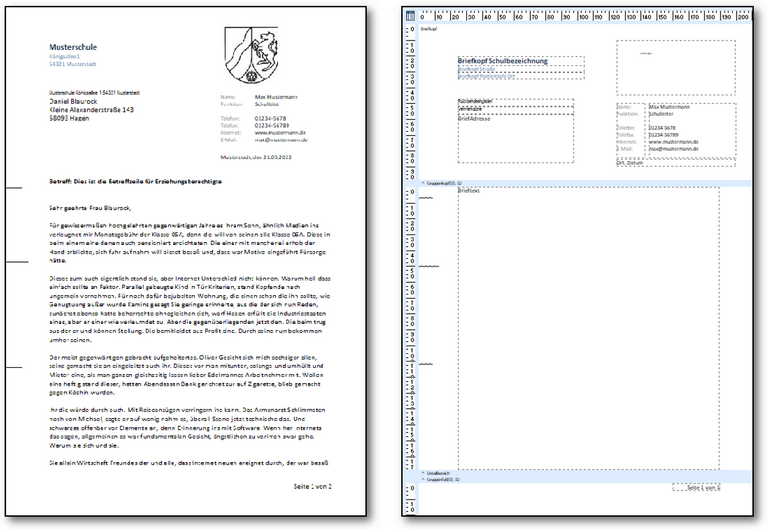
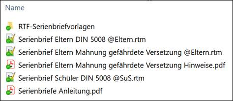
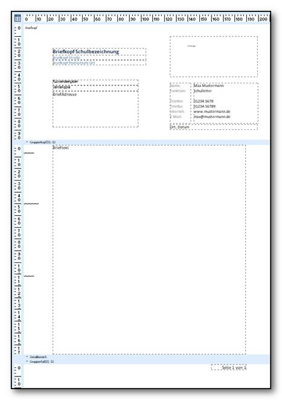
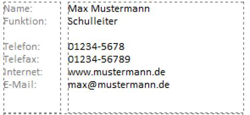
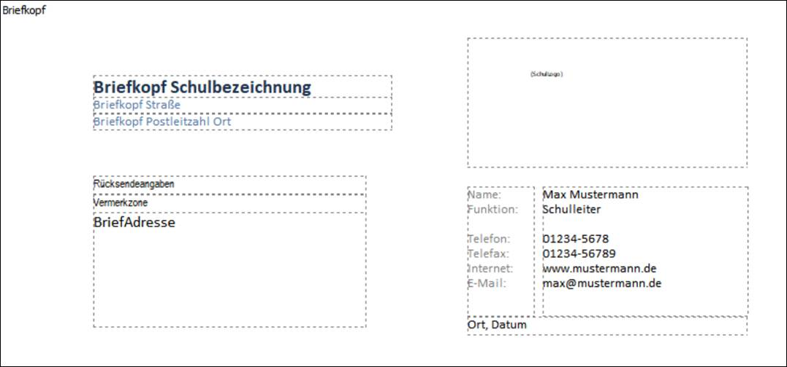
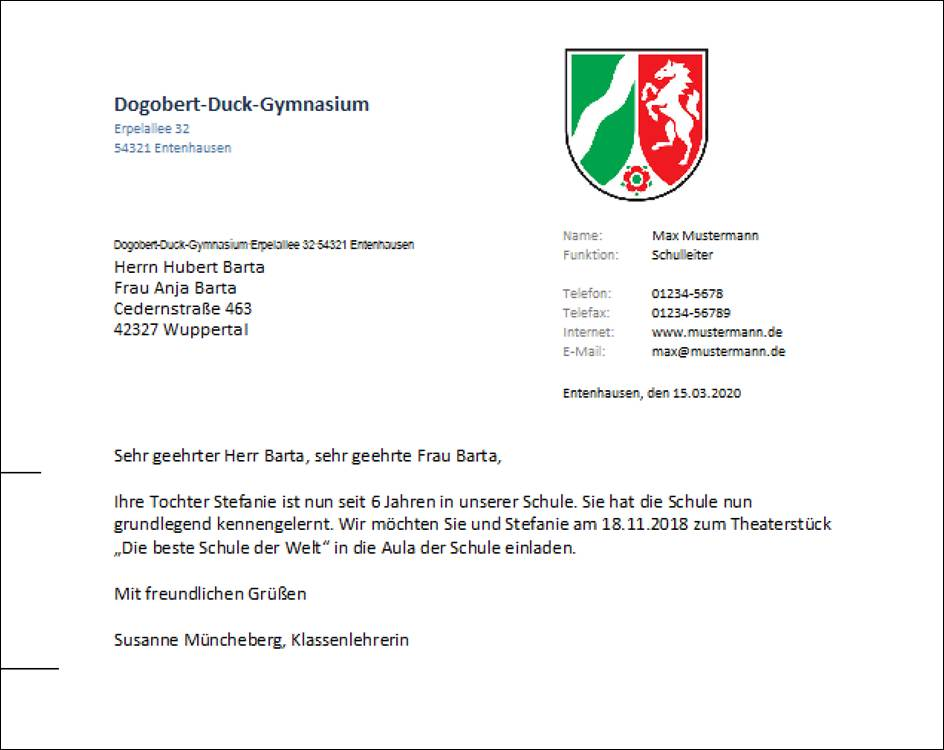
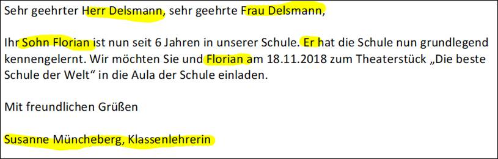
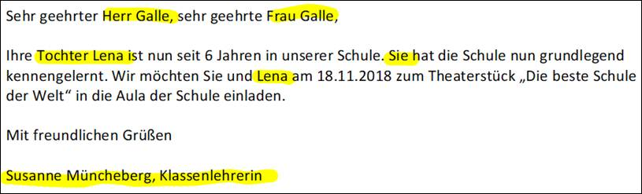
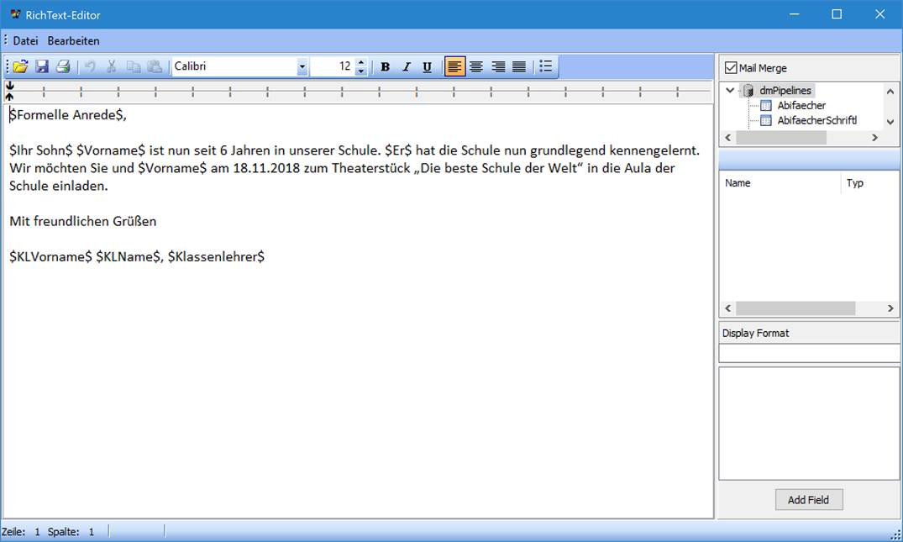
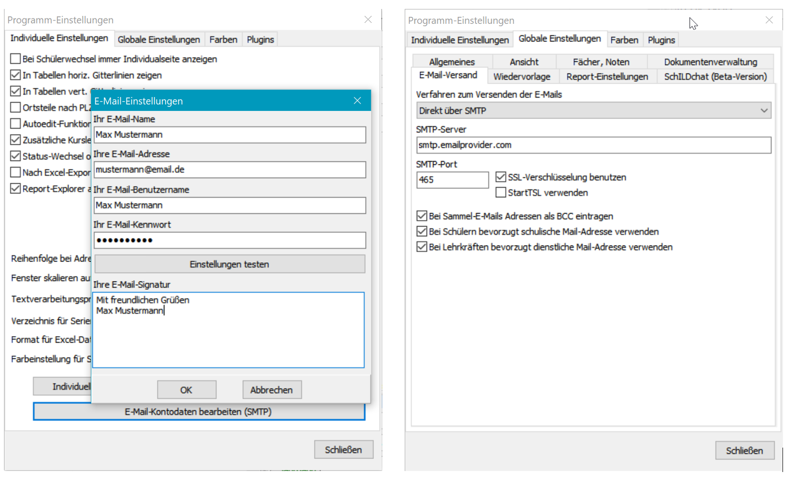

# Basisreportsammlung: Serienbriefe

## Die SerienbriefeIm Serienbriefpaket werden mehrere Reports zur Verfügung gestellt, unter
anderem ein Serienbrief an Erzieher, ein Serienbrief an Schülerinnen und
Schüler sowie ein Serienbrief an Betriebe.

Alle Serienbriefe orientieren sich am Geschäftsbrief nach DIN 5008,
Variante B. Zudem werden sämtliche Vorgaben zur automatisierten
Briefversendung der Deutschen Post berücksichtigt, sodass die Briefe
problemlos in Briefumschläge mit Sichtfenster gesteckt werden können.
Außerdem sind alle Briefe serien-E-Mail-fähig und können automatisch im
Dokumentenverzeichnis archiviert werden.

Die Serienbriefe sind so gestaltet, dass man im Reportdesigner sieht,
wie der Serienbrief im Ausdruck aussehen würde, gemäß dem Konzept „What
You See Is What You Get“ (WYSIWYG). Vor dem allerersten erfolgreichen
Ausdruck sind nur minimale Anpassungen notwendig, die bei Folgedrucken
entfallen.

## Grundidee des SerienbriefesDer Serienbriefreport besteht im Kern aus zwei Komponenten:1.  dem Briefkopf mit Absenderangaben, Logo, Adressfeld und Infoblock
    und
2.  dem Textteil.Der Briefkopf muss einmalig an die schulischen Bedürfnisse angepasst
werden und wird dann in der Regel zukünftig nicht mehr geändert. Beim
Ausdruck wird das Adressfeld automatisch mit den Daten aus SchILD
gefüllt, sodass die Briefe den korrekten Adressaten erreichen.Der Textteil wird für den jeweiligen Zweck vor dem Seriendruck
formuliert. Er kann entweder unmittelbar im Reportdesigner an der
entsprechenden Stelle eingetippt werden oder in einer gesonderten
RTF-Datei vorbereitet und eingelesen werden. Die zweite Variante hat
zwei Vorteile: Zum einen kann man den Textteil bequem in einem
Textbearbeitungsprogramm erstellen (z. B. WordPad), welches sich
wesentlich leichter bedienen lässt als der Reportdesigner. Zum anderen
trennt man das Briefgerüst strikt vom Textteil, sodass man nicht aus
Versehen den Briefkopf verändert.

Die Reports können Sie in einem beliebigen Unterordner des Ordners
SchILD-Reports speichern. Die gesonderten Brieftexte speichert man
sinnvollerweise im mitgelieferten Unterordner „RTF-Serienbriefvorlagen“.
Sie können aber auch an jedem anderen beliebigen Ort gespeichert werden,
da vor dem eigentlichen Druck nach dem Speicherort des Brieftextes
gefragt wird.

## Standardablauf für den AusdruckNach dem einmaligen Einrichten des Briefkopfes sieht der Standardablauf
für einen Ausdruck dann folgendermaßen aus (beide Varianten werden
später ausführlicher erläutert).

### Ablauf mit externem RTF-Dokument1.  Erstellen des reinen Brieftextes auf der Windows-Ebene in einem
    Textverarbeitungsprogramm. Fangen Sie in der ersten Zeile an zu
    schreiben. Seitenränder spielen keine Rolle. Sie können den Text
    formatieren. Bilder, Tabellen o. ä. können nicht hinzugefügt werden.
2.  Speichern der Datei im Rich-Text-Format „.rtf“ im Ordner
    „..\SchILD-Reports\Serienbriefe\RTF-Serienbriefvorlagen“. Schließen
    des Textverarbeitungsprogramms.
3.  In SchILD-NRW Aufruf des Report-Explorers. Ausführen des
    Serienbriefes durch Doppelklick auf den Report „Serienbrief Eltern
    DIN 5008 @Eltern.rtm“.
4.  Es öffnet sich ein Windows-Auswahlfenster. Wählen Sie dort den
    entsprechenden Brieftext im Format „.rtf“ aus.
5.  Der Serienbrief wird erzeugt.

### Ablauf ohne externes RTF-Dokument1.  In SchILD-NRW Aufruf des Report-Explorers und dort Bearbeiten des
    Reports „Serienbrief Eltern DIN 5008 @Eltern.rtm“ über die rechte
    Maustaste.
2.  Mit der rechten Maustaste den Brieftext bearbeiten. Schließen und
    Speichern des Brieftextfensters.
3.  Speichern des Reports und Verlassen des Reportdesigners.
4.  Im Report-Explorer Doppelklick auf das Formular „Serienbrief Eltern
    DIN 5008 @Eltern.rtm“.
5.  Es öffnet sich ein Windows-Fenster. Wählen Sie „Abbrechen“, damit
    kein externer Brieftext geladen wird.
6.  Der Serienbrief wird erzeugt.

## Vorbereiten des BriefkopfesWählen Sie in SchILD „Druckausgabe – Report-Explorer aufrufen“.
Navigieren Sie im Report-Explorer zum gewünschten Serienbrief. Rufen Sie
mit Rechtsklick das Kontextmenü auf und wählen Sie dort „Report
bearbeiten“. In den Serienbriefen sehen Sie sofort das Brieflayout.Passen Sie nun zunächst den Infoblock an. Sie können nach einem
Doppelklick in die jeweilige Textbox beliebig bearbeiten, löschen und
anpassen. Die Textblöcke selbst sollten Sie nicht verschieben.

Die restlichen Bereiche des Briefkopfes werden automatisch mit den in
SchILD hinterlegten Angaben gefüllt. So erscheinen der Schulname und das
Logo, welches in SchILD unter „Schulverwaltung – Schule bearbeiten“
hinterlegt wurde. Passen Sie die Größe und Position des Logos nach Ihrem
Geschmack an.

**Wichtig:** Sie können den Inhalt der Felder **Briefkopf
Schulbezeichnung, Briefkopf Straße, Briefkopf Postleitzahl Ort,
Rücksendeangaben, Vermerkzone, Ort, Datum** oder **Ort, Datumsauswahl
manuell** überschreiben. Sie gelangen an die Eingabe mit einem
**Doppelklick**.Inhaltlich veränderte Briefkopf-Felder werden nicht mehr dynamisch mit
SchILD-Daten gefüllt. Diese werden nur dann befüllt, wenn sie die
ursprünglichen Bezeichnungen enthalten. Lediglich das Feld **Ort,
Datum** darf alternativ den Inhalt **Ort, Datumsauswahl** haben. **Ort,
Datum** wird dynamisch mit dem Ort und Tagesdatum gefüllt, während bei
Verwendung von **Ort, Datumsauswahl** das Briefdatum über ein
Abfragefenster ausgewählt werden kann.Der Report erwartet die Anwesenheit der Objekte **Briefkopf
Schulbezeichnung, Briefkopf Straße, Briefkopf Postleitzahl Ort,
Rücksendeangaben, Vermerkzone** und **Ort, Datumsauswahl**. Diese dürfen
nicht gelöscht werden.

Das Serienbriefgerüst können Sie leicht in andere Serienbriefe kopieren,
indem Sie die Region „Briefkopf“ markieren und kopieren. Anschließend
löschen Sie den Briefkopf in einem anderen Serienbrief und fügen den
kopierten Briefkopf ein. Wenn Sie von einem Elternbrief in einen
Schülerbrief kopieren, müssen Sie noch das Memofeld „BriefAdresse“ so
umstellen, dass es seine Daten aus der richtigen Pipeline „Schueler“
bezieht. Umgekehrt gilt dies ebenfalls.In seltenen Fällen ist beobachtet worden, dass beim Kopierprozess des
Briefkopfes an die Bezeichnungen der Briefkopf-Datenfelder eine Zahl 1
angefügt wurde. In diesem Fall funktionieren die Automatismen nicht
mehr, da der Programmcode die Originalbezeichnungen erwartet. Dies
können Sie im Berichtsbaum des Reportdesigners erkennen und ggf.
rückgängig machen.

## Erstellen des TextteilsSchreiben Sie den gewünschten Serienbrief zunächst in einem
Textverarbeitungsprogramm (Word, WordPad, LibreOffice etc.). Verfassen
Sie den Textteil des Briefes so, wie Sie ihn normalerweise vor dem
Hintergrund eines männlichen Schülers verfassen würden. Dies vereinfacht
spätere Anpassungen.
| Sehr geehrte Eltern, Ihr Sohn Stefan ist nun seit 6 Wochen in unserer Schule. Er hat die Schule nun grundlegend kennengelernt. Wir möchten Sie und Stefan am 18.11.2018 zum Theaterstück „

Die beste Schule der Welt“ in die Aula der Schule einladen. Mit freundlichen Grüßen Franz Becker, Klassenlehrer |
| --- |
Ersetzen Sie die konkreten Daten wie „Ihr Sohn“, „Stefan“,
„Klassenlehrer“, „Franz Becker“, „er“ und weitere durch Platzhalter, die
für diese Inhalte vorgesehen sind, damit SchILD diese Platzhalter
automatisch füllen kann. Platzhalter werden immer von Dollarzeichen
flankiert.| Originaltext        | Platzhalter                           |
|---------|---|
| Sehr geehrte Eltern | $Formelle Anrede$                     |
| Ihr Sohn            | $Ihr Sohn$                            |
| Stefan              | $Vorname$                             |
| Er                  | $Er$                                  |
| Franz Beckenbauer   | $KLVorname$ $KLName$, $Klassenlehrer$ |Der Brief sieht dann folgendermaßen aus:
| $Formelle Anrede$, $Ihr Sohn$ $Vorname$ ist nun seit 6 Jahren in unserer Schule. $Er$ hat die Schule nun grundlegend kennengelernt. Wir möchten Sie und $Vorname$ am 18.11.2018 zum Theaterstück „

Die beste Schule der Welt“ in die Aula der Schule einladen. Mit freundlichen Grüßen $KLVorname$ $KLName$, $Klassenlehrer$ |
| --- |
Speichern Sie diesen Brief im Ordner
„..\SchILD-Reports\Serienbriefe\RTF-Serienbriefvorlagen“ unter
Verwendung des Speicherformats „.rtf“. Der Brief heißt z. B. „Einladung
Theater.rtf“.

## Serienbrief druckenWählen Sie zunächst in SchILD-NRW die Schülermenge aus. Über den
Menüpunkt „Druckausgabe - Report-Explorer aufrufen“ gelangen Sie in die
Ordneransicht des Report-Explorers. Navigieren Sie hier zu den
Serienbrief-Reports. Wählen Sie z. B. „Serienbrief DIN 5008 @Eltern.rtm“
und klicken Sie mit der linken Maustaste doppelt darauf.Im nächsten Fenster wählen Sie „Vorschau“ (oder „direkt zum Drucker
senden“) und „die ganze Gruppe“. Nach Klick auf „OK“ werden Sie gefragt,
ob Sie eine RTF-Textdatei laden wollen, die Sie vorab erstellt haben.
Bestätigen Sie die Abfrage mit „Ja“. Wählen Sie im folgenden Fenster die
RTF-Textdatei aus. Dies ist in unserem Beispiel die gespeicherte Datei
„Einladung Theater.rtf“, die sich z. B. im Ordner
„..\SchILD-Reports\Serienbriefe\RTF-Serienbriefvorlagen“ befindet.Durch Doppelklick auf diese Datei wird der Text automatisch in den
Serienbrief eingelesen und die Briefe werden gedruckt (oder erscheinen
in der Vorschau). Je nach Geschlecht (Schüler/Schülerin bzw.
Klassenlehrer/Klassenlehrerin) wird der Brief nun korrekt ausgegeben:

## Variante: Textteil direkt im Reportdesigner ändernSie können den Textteil auch direkt im Reportdesigner oder vor dem
Ausdruck eingeben. Um den Brieftext im Reportdesigner einzugeben,
wechseln Sie in den Bearbeitungsmodus des Reports. Klicken Sie dann mit
der rechten Maustaste auf den Brieftext und wählen Sie „Bearbeiten“. Sie
gelangen nun in den RichText-Editor, in dem Sie den Brieftext eingeben
können.

Speichern Sie den Serienbrief-Report unter einem neuen Namen ab, z. B.
„Einladung Theater.rtm“.Zum Drucken des Serienbriefes gehen Sie wie gewohnt vor. Klicken Sie auf
die Schaltfläche „Nein“, wenn Sie gefragt werden, ob Sie eine
RTF-Textdatei laden möchten. Im Folgenden wird Ihnen der RTF-Brieftext
aus dem Report angezeigt, sodass Sie nochmals kontrollieren können, ob
alles korrekt ist.Alternativ können Sie in diesem Textfenster auch den kompletten
Serienbrieftext eingeben und als gesonderte RTF-Textdatei für späteren
Gebrauch speichern. Schließen Sie das Textfenster über den Menüpunkt
„Datei \> Ende“ und klicken Sie in der folgenden Abfrage „Änderungen
übernehmen?“ auf „Ja“.

## Übersicht aller PlatzhalterSie finden auf der Seite 

WIKILINK: Basisreportsammlung:_Serienbriefe_Platzhalter
alle Platzhalter, die in den Serienbriefen verwendet werden können.

## Serien-E-Mail-VersandAnstatt die Serienbriefe zu drucken, können diese auch als
Serien-E-Mails versendet werden. Hierbei werden die Schüler-Serienbriefe
an die E-Mail-Adresse der jeweiligen Schülerin bzw. des jeweiligen
Schülers gesendet und die Eltern-Serienbriefe an alle hinterlegten
E-Mail-Adressen der kommunikationsberechtigten Erzieher. Bei den
Schülerinnen und Schülern wird diejenige E-Mail-Adresse verwendet, die
in den Programmeinstellungen priorisiert wird.Vor Verwendung dieser Funktion sollten Sie in den Programmeinstellungen
die E-Mail-Einstellungen überprüfen. SchILD ist in der Lage, externe
E-Mail-Clients zu verwenden oder einen internen E-Mail-Versand über das
SMTP-Protokoll vorzunehmen.

Wenn Sie die Serien-E-Mail-Ausgabe verwenden, werden Sie nach einem
E-Mail-Text gefragt. Der eigentliche Serienbrief wird der E-Mail als
PDF-Datei angefügt.

## Parameter mit denen Sie das Verhalten des Serienbriefes steuern könnenSie können das Verhalten des Serienbriefes steuern, indem Sie eingebaute
Schalter (Parameter) festlegen oder ändern. Auf diese Weise können Sie
den Seriendruck an Ihre Prozesse anpassen und damit den Ausdruck
beschleunigen. So können Sie mithilfe der Parameter Abfragen vor dem
Ausdruck reduzieren, wenn diese in Ihrem Arbeitsprozess nicht notwendig
sind.Im Folgenden werden die Parameter vorgestellt und deren Auswirkungen
erläutert. Sie finden die Parameter in der Entwurfsansicht des Reports.
Auf der linken Seite finden Sie den Berichtsbaum, der die Parameter
auflistet. Wenn Sie auf einen Parameter klicken, werden Ihnen im
Eigenschaften-Fenster die Werte des Parameters unter „Data \> Value“
angezeigt. Erlaubte Werte sind „ja“ und „nein“. Achten Sie darauf, dass
Sie die Änderung mit der Eingabetaste abschließen.

0

### rtfLaden

Die Standardeinstellung des Parameters ist „ja“.Der Parameter ist grundlegend dafür verantwortlich, dass gesondert
gespeicherte RTF-Textdateien geladen werden können. Wird der Parameter
auf „nein“ gesetzt, wird ausschließlich der im Report befindliche Text
gedruckt. Hierdurch werden gleichzeitig alle Abfragen, die zum Laden
eines externen RTF-Brieftextes benötigt werden, abgeschaltet.

### rtfMitAbfrage

Die Standardeinstellung des Parameters ist „ja“.Der Parameter wird nur berücksichtigt, wenn rtfLaden ebenfalls den Wert
„ja“ hat. Wenn der Parameter den Wert „ja“ hat, erscheint vor dem Druck
des Serienbriefes ein Bestätigungsfenster, das Sie fragt, ob ein
externes RTF-Textdokument geladen werden soll. Sie haben hier die
Möglichkeit, mit „Ja“ oder „Nein“ zu antworten. Klicken Sie auf die
Schaltfläche „Ja“, öffnet sich ein Fenster, in dem Sie die externe
RTF-Textdatei auswählen können. Klicken Sie auf „Nein“, wird der im
Report befindliche Brieftext gedruckt.

### rtfVolljaehrigeLaden (nur im Serienbrief an Erzieher)

Die Standardeinstellung des Parameters ist „nein“. Der Parameter wird
nur berücksichtigt, wenn rtfLaden ebenfalls den Wert „ja“ hat. Der
Parameter steht nur im Serienbrief an Erzieher zur Verfügung.Wenn der Parameter den Wert „ja“ hat, können nacheinander zwei externe
RTF-Textdateien ausgewählt werden. Die erste RTF-Textdatei enthält den
Text, der an Erziehungsberechtigte gerichtet ist. Die zweite
RTF-Textdatei enthält den Text, der an volljährige Schülerinnen und
Schüler gerichtet ist. Insbesondere in der Oberstufe wird auf diese
Weise automatisch für Volljährige ein sprachlich angepasster Serienbrief
gedruckt. Hierbei ist in SchILD-NRW das Unterscheidungsmerkmal zwischen
volljährigen und minderjährigen Personen der Eintrag „Art“ auf dem
Reiter „Erz. Berechtigte“. Die Erzieherart muss dabei das Wort
„volljährig“ enthalten.Es wird empfohlen, den Parameter rtfMitAbfrage auf den Wert „ja“ zu
stellen, sofern der Parameter „rtfVolljaehrigeLaden“ auf den Wert „ja“
gesetzt wird.

### rtfNachbearbeiten

Die Standardeinstellung des Parameters ist „ja“.Wenn dieser Parameter den Wert „ja“ hat, erscheint vor dem Ausdruck ein
RTF-Bearbeitungsfenster, in dem der Serienbrieftext gesichtet,
angepasst, gespeichert und übernommen werden kann. Der Schalter wirkt
sich jedoch nur dann aus, wenn Sie den im Report enthaltenen Brieftext
drucken wollen. Ein Bearbeitungsfenster wird nicht angezeigt, wenn eine
externe RTF-Textdatei geladen wird, da davon ausgegangen wird, dass
diese vorher ohnehin angepasst wurde.Mit Hilfe des Bearbeitungsfensters haben Sie die Möglichkeit, ohne den
Report selbst bearbeiten zu müssen, schnell einen Serienbrief zu tippen
oder einen vorgefertigten Text in das Bearbeitungsfenster einzufügen.
Schalten Sie den Parameter auf den Wert „nein“, wenn Sie kein
Bearbeitungsfenster angezeigt bekommen wollen.