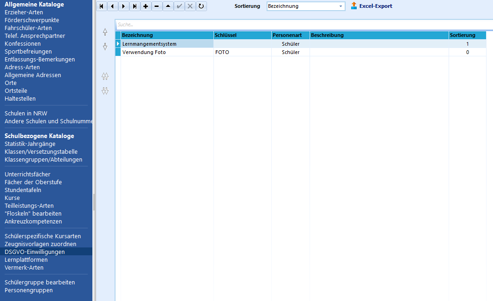
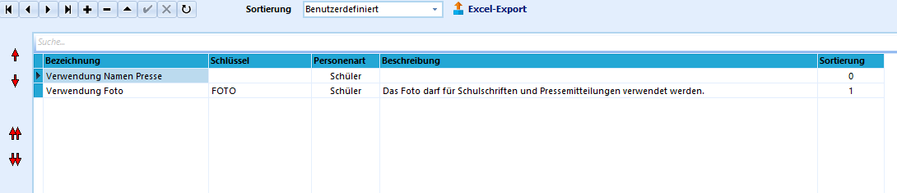

# DSGVO-Einwilligungen (Schulbezogene Kataloge)DSGVO-Einwilligungen dienen dazu, Einwilligungen gemäß der
Datenschutzgrundverordnung in die **Verarbeitung personenbezogener
Daten** zu verwalten, die für Schülerinnen und Schüler oder von
Lehrkräften erteilt wurden.Darunter fallen zusätzliche Verwendungen personenbezogener Daten, die
über die Daten hinausgehen, die in der DSGVO und damit auch der VO-DV I
und II geregelt sind oder dort als freiwillige Angaben gekennzeichnet
sind.Ein Beispiel ist die Verwendung des Fotos der Schüler.

Die angelegten Einwilligungen können im Reiter *Schüler ➜
Einwilligungen* für jeden Schüler individuell verwaltet werden.  

## Anlegen neuer Einwilligungen

 Durch Klick auf das **+** kann eine neue Einwilligung
angelegt werden.In der Spalte **Bezeichnung** kann die entsprechende Bezeichnung
eingetragen werden.In der Spalte **Schlüssel** kann eine Kurzbezeichnung für mehrerer
Einwilligungen ausgewählt werden.

Die Spalte **Personenart** dient dazu, diejenige Gruppe, Schüler oder
Lehrkräfte, auszuwählen, die die angelegte Einwilligungsart betreffen
soll.

Die Einträge in der Spalte **Sortierung** legen wie bei allen Katalogen
die Sortierung fest.

::: warnin

g
 Bei Anlage einer neuen Einwilligungsart wird diese
unmittelbar für alle Schülerinnen und Schüler im Reiter "Einwilligungen"
angelegt. Dieser Prozess kann einige Zeit dauern.

:::

## Sortierung der DSGVO-EinwilligungenBei Verwendung der **Sortierung** "Bezeichnung" sortiert das Programm
alphabetisch, wobei alle Großbuchstaben vor den Kleinbuchstaben
einsortiert werden. In dieser Reihenfolge werden die Einwilligungen auch
in den entsprechenden Auwahlfeldern im Programm sortiert.

 Ist eine **individuelle Sortierung** gewünscht, so kann
dies eingestellt werden. Die Pfeile am linken Rand werden damit
aktiviert und erlauben eine individuelle Reihenfolge. Im Beispiel
dargestellt ist die Verschiebung der neu angelegten Teilleistungsart
"Verwendung Namen Presse".  

## Bearbeiten von DSGVO-EinwilligungenDurch einen Doppelklick in das entsprechende Feld in der Spalte
**Bezeichnung** kann die Bezeichnung bereits angelegter
Teilleistungsarten geändert werden.Ebenso können auch die Inhalte der Felder **Schlüssel** und die
**Personenart** sowie die **Beschreibung** geändert werden.Ein Klick auf das **-** löscht die angelegte Einwilligung nach
Bestätigung einer Dialogabfrage.  

## Export in eine Excel-TabelleDurch Klick auf **Excel-Export** und **Speichern** im folgenden Fenster
kann die aktuelle Ansicht in eine Excel-Tabelle exportiert werden.