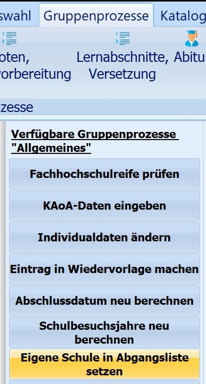
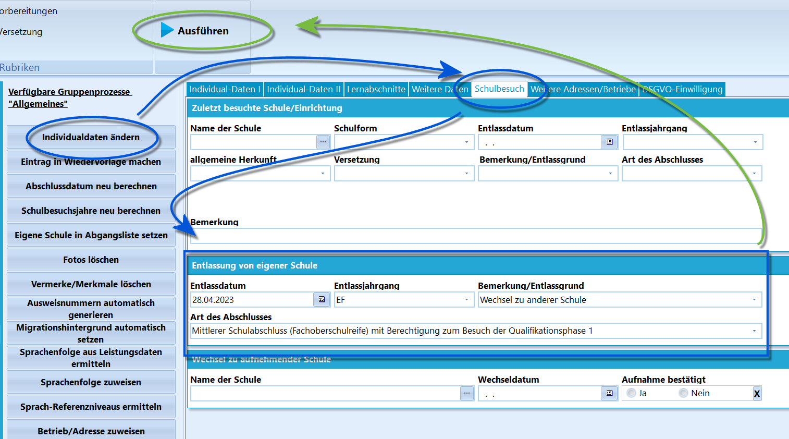
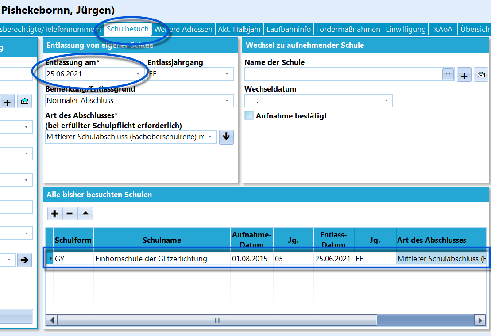

# Eigene Schule in Abgangsliste setzen (Gruppenprozesse Allgemein) 

 Dieser Gruppenprozess setzt bei allen zu
entlassenden Schülerinnen und Schülern der aktuellen Auswahl die eigene
Schule in die Liste *Alle bisher besuchten Schulen* unter dem
Karteireiter *Schüler ➜ Schulbesuch*.

::: warning

Die Voraussetzung dafür ist, dass bei den Schülern vor
der Ausführung des Gruppenprozesses ein **Entlassdatum** eingetragen
ist.

:::  

 Setzen Sie das *Entlassdatum* und andere wichtige Daten wie
*Entlassjahrgang*, der *Entlassgrund* und das Feld *letzte erreichte
Abschluss*.

Diese Daten werden im gleichen Fenster gesetzt.Starten Sie dann den Gruppenprozess mit einem Klick `Ausführen`.  

 Hier das Ergebnis, es kann manuell oder per Gruppenprozess
herbeigeführt werden.    
----

### Videotutorial
<youtube>lpuRtzolF_w</youtube>
