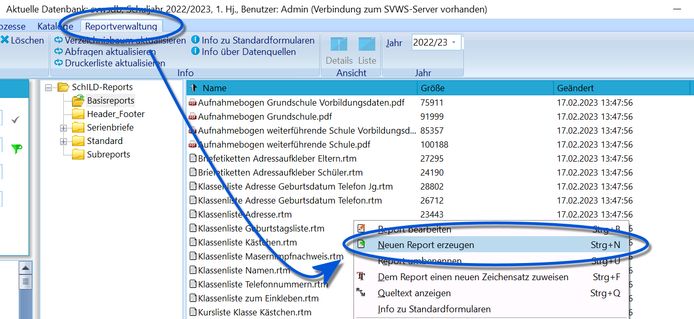
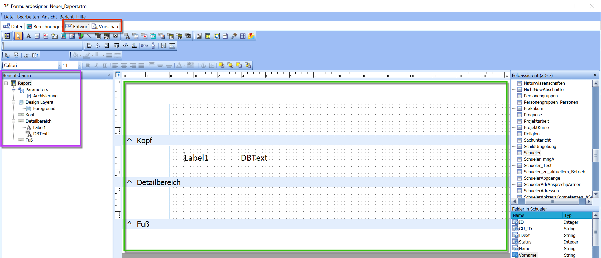
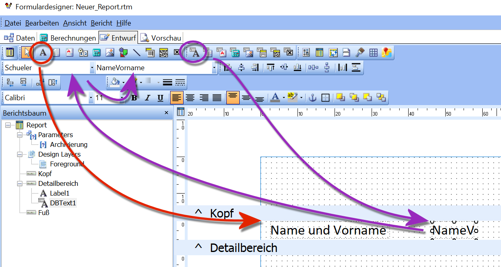
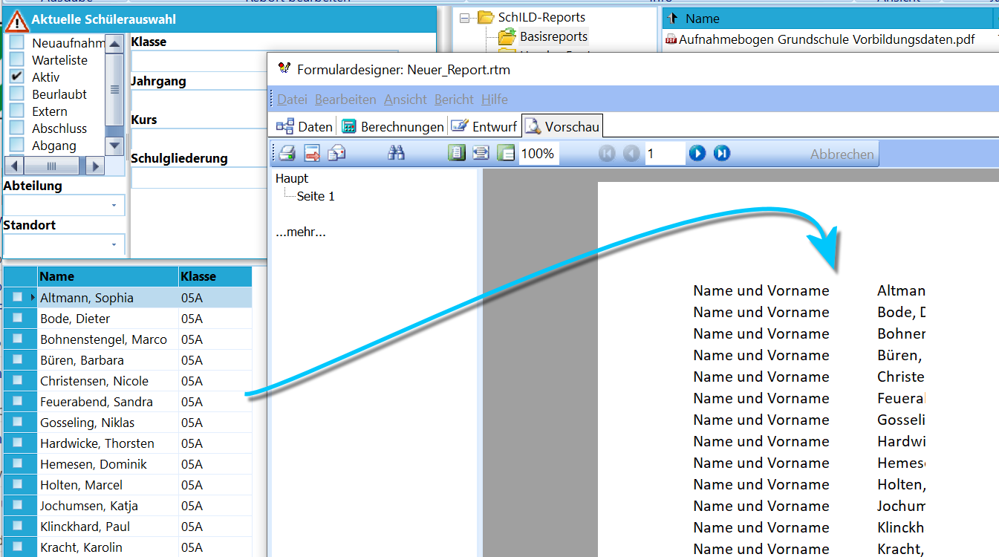
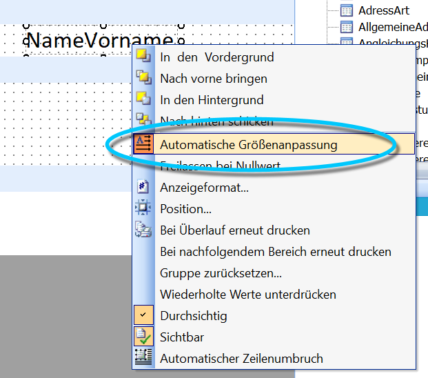
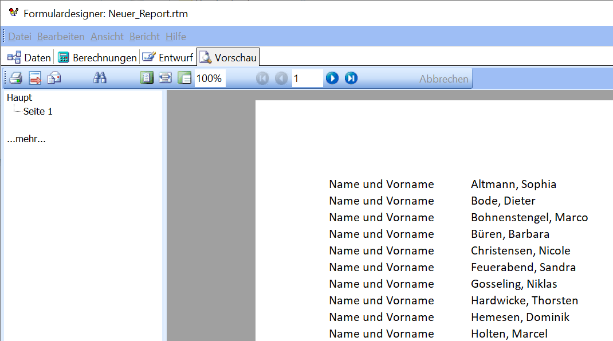
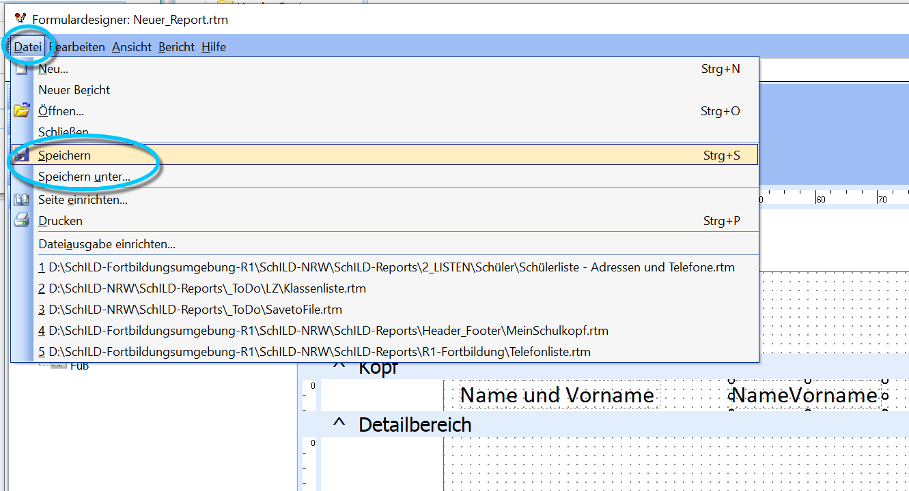

# Einen neuen Report erstellenUm die grundlegende Struktur eines Reports und des Reporteditors in
**SchILD-NRW 3** kennenzulernen, wird ein neuer, leerer Report erstellt.

Hierzu wird die **Reportverwaltung** geöffnet. Nachdem in den Ordner
navigiert wurde, in dem der neue Report entstehen soll, öffnet ein
Rechtsklick ein Kontextmenü, über das **Neuen Report erzeugen** gewählt
werden kann.

## Struktur und wichtige Elemente eines Reports

Wesentliche Elemente des Editors sind die beiden Schaltflächen
**Entwurf** und **Vorschau**. Die Entwurfsansicht dient der Bearbeitung,
die Vorschau zeigt das erzeugte Ergebnis.**Entwurf** bezeichnet die Ansicht, in der Felder als feste Texte,
Datenbankinhalte, Bilder, Linien usw. platziert und konfiguriert werden
können.**Vorschau** bezeichnet die Ansicht, in der der Report einmal erzeugt
wird, um das Ergebnis der vorgenommenen Einstellungen zu sehen. In der
Praxis wechselt man während der Bearbeitung häufig zwischen **Entwurf**
und **Vorschau**.Der Report selbst, im Bild grün markiert, besteht aus drei grundlegenden
Bereichen:-   **Kopf** – feste Elemente, die über dem eigentlichen Inhalt
    erscheinen (z. B. Schulkopf oder Kopfzeilen)
-   **Detailbereich** – enthält das Layout des eigentlichen Reports;
    hier werden die Daten zeilenweise ausgegeben
-   **Fuß** – abschließende Elemente wie Seitenzahlen, Datum oder andere
    ReportinformationenDer **Berichtsbaum** (lila markiert) zeigt die Struktur eines Reports
hierarchisch an. Er stellt übersichtlich dar, welche Elemente im Kopf-,
Detail- und Fußbereich verwendet werden. Gerade bei komplexeren Reports
ist dieser Bereich hilfreich.Im Beispiel ist zu sehen, dass ein **Label** (ein festes Textfeld) und
ein **DBText** (ein Datenbankfeld) in den Detailbereich gelegt wurden.
Kopf und Fuß sind leer, daher erscheinen dort keine Einträge im
Berichtsbaum.

## Unveränderliche Textfelder und Datenbank-Textfelder

Über die **Werkzeugleiste** werden die Feldtypen bereitgestellt, mit
denen ein Report aufgebaut wird.Es stehen Werkzeuge für feste Texte (Labels), Datenbankinhalte (DBText),
Bilder, Linien, Formen und formatierte Textblöcke zur Verfügung.Im Beispiel wurde hervorgehoben, wie ein festes Textfeld platziert wird:
dazu wird das entsprechende Werkzeug angeklickt und anschließend an die
gewünschte Stelle im Report geklickt. Das Feld kann danach noch
verschoben werden.Labels können mit beliebigem Text gefüllt werden, hier z. B. mit „Name
und Vorname“. Dies erfolgt entweder per Doppelklick auf das Label oder
über die Werkzeugleiste.

## Konfiguration von Elementen über die WerkzeugleisteIn Lila wurde ein Datenbankfeld (**DBText**) platziert. Dazu wird in der
Werkzeugleiste **DBText** gewählt und im Report abgelegt. Wird das Feld
aktiviert, kann oben eine passende **Datenquelle** ausgewählt werden.Im Beispiel wird die Datenquelle **Schueler** verwendet. Diese enthält
u. a. Stammdaten wie Name, Geburtsdatum, Klasse, Jahrgang und
Bildungsgang.Aus dem Dropdown-Menü wird anschließend ein konkretes **Datenfeld**
gewählt, im Beispiel das Feld **NameVorname**.

Nach einem Klick auf **Vorschau** wird ein Report erzeugt.Für jede Person im Container links entsteht eine Zeile, die aus dem
festen Textfeld „Name und Vorname“ und dem Datenbankfeld **NameVorname**
besteht.Allerdings ist das Feld im Beispiel so schmal, dass längere Namen
abgeschnitten werden. Dieser Fehler wird im nächsten Schritt korrigiert.

## Konfiguration von Feldern über das Rechtsklick-Kontextmenü

Mit einem Klick auf **Entwurf** ist der Report wieder bearbeitbar.Über einen Rechtsklick auf das **DBText**-Feld wird **Automatische
Größenanpassung** gewählt. Das Feld passt sich nun automatisch in der
Breite an den jeweiligen Inhalt an.Ein erneuter Klick auf **Vorschau** erzeugt ein besseres und korrekt
lesbares Ergebnis.

Dieses Beispiel zeigt, wie Felder in einen Report gezogen werden können
und wie sie über Werkzeugleiste oder Kontextmenü konfiguriert werden. Je
nach Feldtyp stehen weitere Einstellmöglichkeiten zur Verfügung.

## Report speichern

Der Report kann über **Datei → Speichern** beziehungsweise **Datei →
Speichern unter...** gespeichert werden.