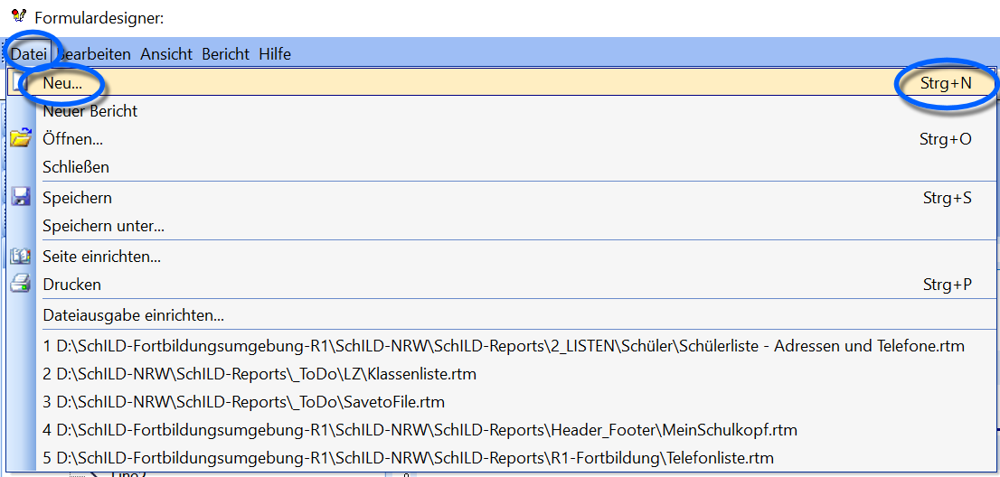
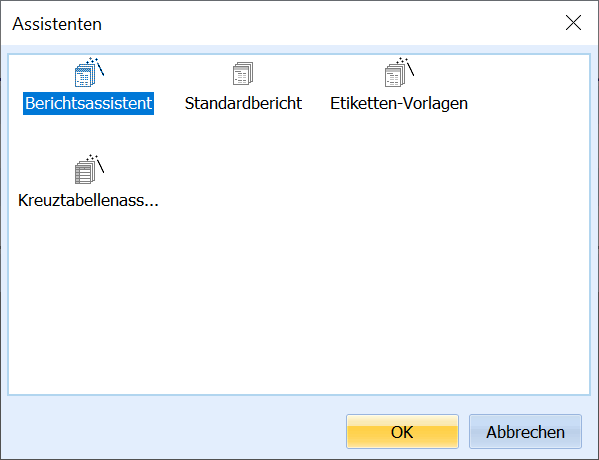
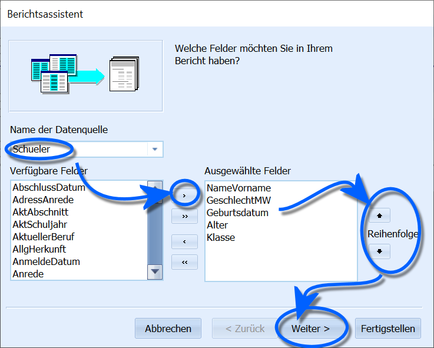
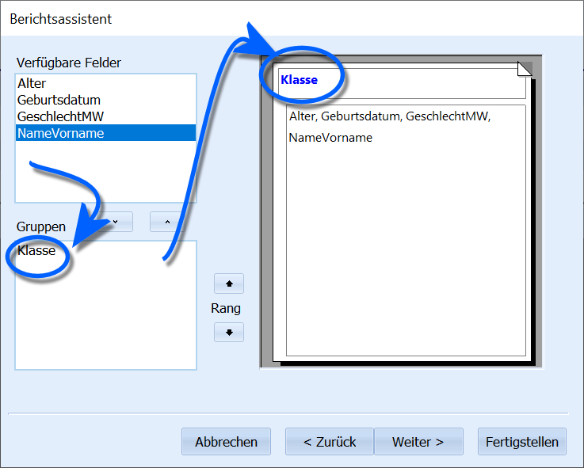
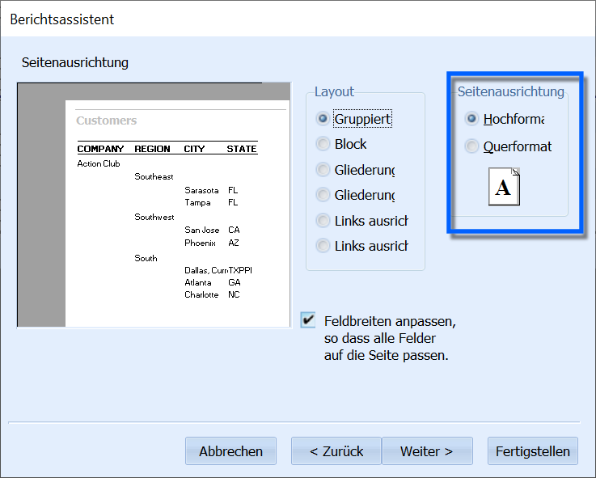
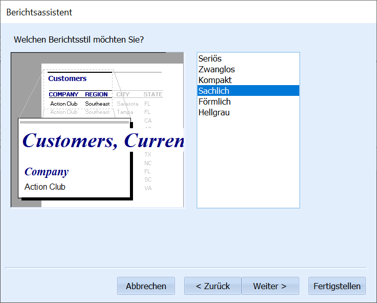
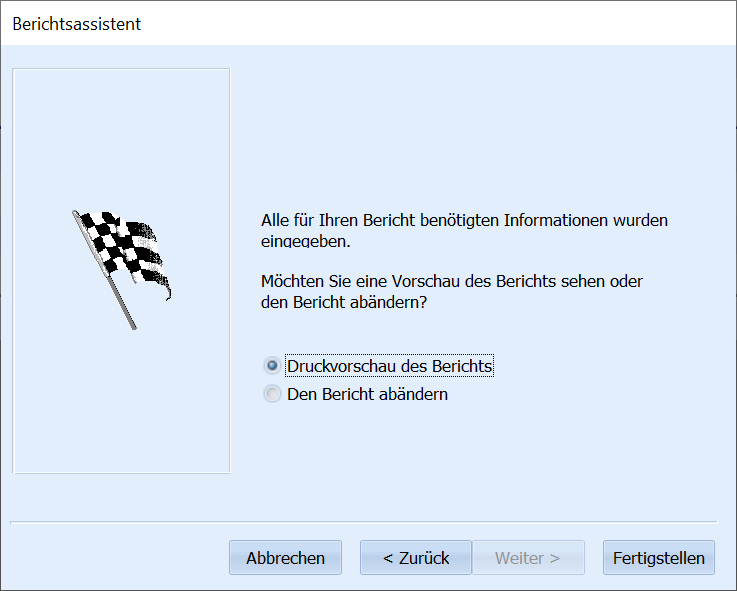
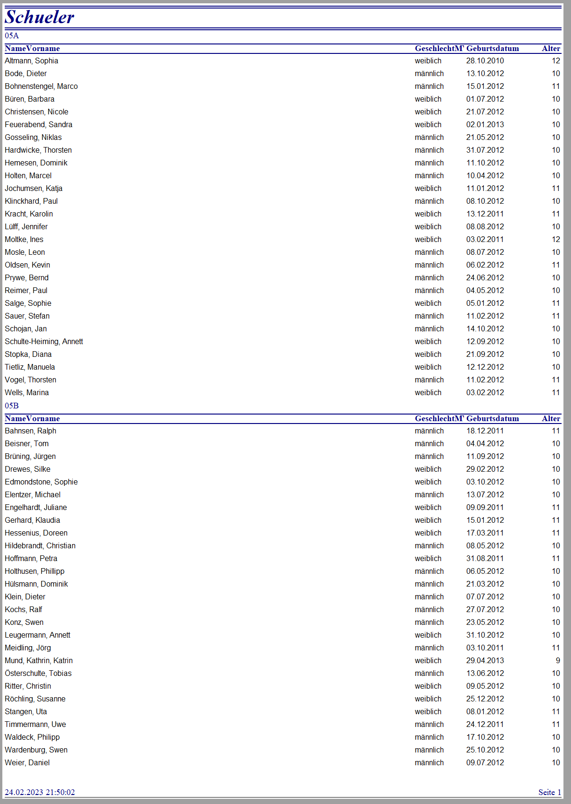
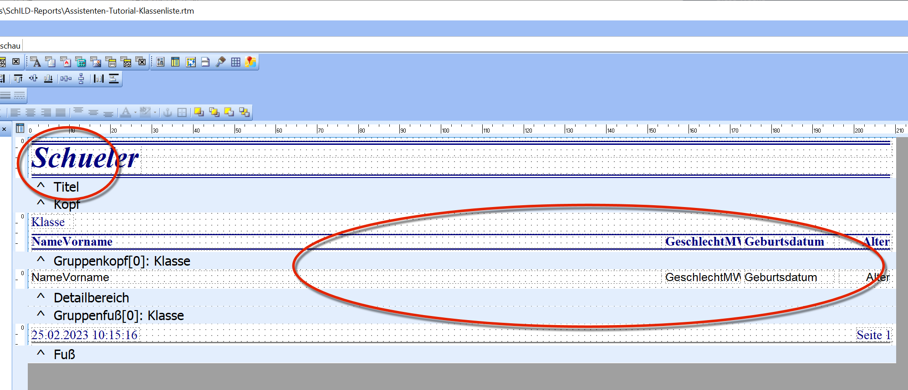
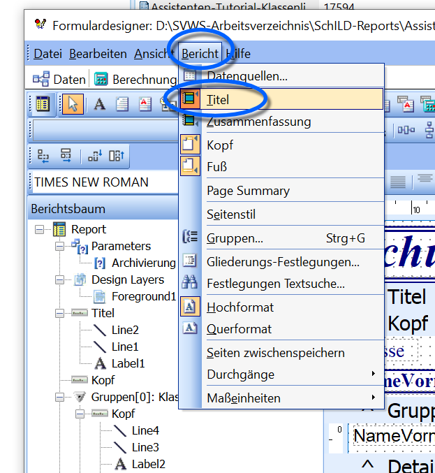

# Einen neuen Report mit dem Berichtsassistenten erstellenIn den bisherigen Beispielen wurden Reports und ihre Bestandteile
manuell erstellt. Der **Berichtsassistent** in **SchILD-NRW 3**
automatisiert große Teile dieses Prozesses: Er kann Datenfelder
auswählen, gruppieren, sortieren und erste Formatierungen vornehmen.
Dies spart Zeit und eignet sich gut für Standardlisten, die direkt
nutzbar sind oder anschließend leicht angepasst werden können.Im folgenden Beispiel wird eine einfache Liste erzeugt und anschließend
optimiert. Dies dient zugleich als Mini-Tutorial für wichtige Werkzeuge
im Reporteditor.

## Erstellung des Reports

Der Berichtsassistent wird über **Datei → Neu…** aufgerufen. Alternativ
kann die Tastenkombination **Strg + N** verwendet werden.

Im nächsten Schritt wird **Berichtsassistent** gewählt und mit **Ok**
bestätigt.

Nun wird eine **Datenquelle** gewählt. Da eine Liste von Schülerdaten
erzeugt werden soll, wird die Datenquelle **Schueler** gewählt.Darunter stehen nun die zur Verfügung stehenden **Datenfelder**. Mit
einem Doppelklick oder per Klick auf **\>** werden Felder nach
**Ausgewählte Felder** übernommen. Mit **\<** können Felder wieder
entfernt werden.

Die Pfeilsymbole rechts verändern die Reihenfolge der Felder. Die
obersten Felder stehen später in der erzeugten Liste links.Der Bericht kann bereits mit **Fertigstellen** erzeugt werden. Im
Beispiel werden jedoch zusätzliche Funktionen erläutert, daher wird
**Weiter \>** gewählt.

Im nächsten Schritt können Daten gruppiert werden. Durch Doppelklick
wurde das Feld **Klasse** in den Bereich **Gruppen** verschoben. Dies
erzeugt später eine nach Klassen sortierte Liste.Ohne Gruppierung würde **Klasse** als normales Feld in der Liste
erscheinen.

Nun wird ein Layout gewählt. Im Beispiel wurde **Links ausrichten**
gewählt.Bei der Wahl der Seitenausrichtung ist Folgendes zu bedenken:-   viele Datenfelder oder lange Inhalte → **Querformat** sinnvoll
-   typische Klassengrößen → passen im Querformat häufig nicht auf A4

Im nächsten Fenster wird ein Stil gewählt, hier **sachlich**.

Zum Abschluss wird gewählt, ob der Report im **Editor** oder in der
**Vorschau** geöffnet wird. Ein Wechsel zwischen beiden Ansichten ist
jederzeit möglich.

Der erzeugte Report enthält bereits:-   alle gewählten Felder
-   eine Gruppierung nach Klasse
-   eine saubere Listenstruktur
-   ein Druckdatum und eine Seitenzahl im Fuß

Das Layout ist verwendbar – lässt sich jedoch weiter verbessern.

## Anpassen des Reports

Die folgenden Anpassungen dienen als Beispiel und zeigen typische
Werkzeuge des Reporteditors.

### Einfache Anpassungen zu Layout, Linien und Schriften

Folgende Punkte sollen verbessert werden:-   Der **Titel** wird nur auf der ersten Seite ausgegeben – bei
    Klassenlisten oft unerwünscht.
-   Die Felder sollen weiter **nach links verschoben** werden, um rechts
    Platz für Eintragungen zu schaffen.
-   Farben sollen in **Schwarzweiß** geändert werden, um Farbdrucke zu
    vermeiden.

Der Titel kann über **Bericht** deaktiviert werden. Ein **Titel**
erscheint nur auf der ersten Seite, die **Zusammenfassung** auf der
letzten Seite. **Kopf** und **Fuß** erscheinen auf jeder Seite.Da eine **Gruppe** (Klasse) definiert wurde, erzeugt der Report
zusätzlich **Gruppenköpfe** und **Gruppenfüße**. Diese erscheinen am
Beginn bzw. Ende jeder Gruppe.Zum Verschieben mehrerer Felder können diese markiert werden.Im Beispiel werden die **Labels im Kopf** und die drei **DBText-Felder
im Detailbereich** gemeinsam verschoben.

0Mit **Shift + Klick** werden Felder in Blau markiert (z. B. Klassen und
Druckdatum). Mit dem **Schriftfarbenwerkzeug** werden sie auf Schwarz
geändert.

Das Feld **GeschlechtMW** wird im Gruppenkopf beschriftet – der
Datenbankname ist jedoch unschön. Daher wird der sichtbare Titel auf
**Geschlecht** geändert.

1Um handschriftliche Ergänzungen zu ermöglichen, werden Trennlinien
gesetzt.Ein Rechtsklick und die Funktion **Breite der Stammkomponente** setzen
die Linie automatisch auf die Breite des Detailbereichs.Im Beispiel wurden zusätzlich:-   beide Felder zum Alter linksbündig gestellt
-   alle Schriften modernisiert

2Der Report erscheint nun im Editormodus gut strukturiert.

3In der Vorschau ergibt sich ein funktionales Ergebnis.

## Weitergehende Anpassungen – Seitenwechsel, Systemvariablen und ZählerFolgende Erweiterungen werden ergänzt:-   automatischer Seitenwechsel je Klasse
-   Zurücksetzen der Seitenzahlen bei Gruppenwechsel
-   Nutzung von Systemvariablen
-   Zeilenzähler im Detailbereich

### Gruppen für Seitenwechsel

4Da der Report bereits nach **Klasse** gruppiert, wird diese Gruppe für
Seitenwechsel genutzt. Dies erfolgt über **Bericht → Gruppen…**.

5Unter **Bei Gruppenwechsel** können u. a. gewählt werden:-   **Neue Seite beginnen**
-   **Seitennummerierung zurücksetzen**

### Systemvariablen

6Eine **Systemvariable** wurde bereits vom Assistenten gesetzt: das
**Druckdatum** im Fuß. Eine weitere sinnvolle Variable ist der
**Dokumenten-Name**, mit dem der Dateiname des Reports ausgegeben wird.Systemvariablen werden wie andere Felder platziert und dann im Dropdown
gewählt. Zur Verfügung stehen u. a.:-   Druckdatum (mit/ohne Zeit)
-   Seitenzahlen
-   Dokumenten-Name

### Zeilennummerierung per Zähler

7Um Zeilen zu nummerieren, wird Platz geschaffen und ein **DBCalc**-Feld
gesetzt. **DBCalc** dient für datenbankbasierte Berechnungen.

8Per Rechtsklick wird **Laufender Zähler** ausgewählt.

9Wie bei den Seitenzahlen wird der Zähler bei **Klasse** zurückgesetzt.

0

1Über **Anzeigeformat** wird das Ausgabeformat definiert.

2Für die Ausgabe „5.“ wird z. B. **#'.** gewählt. **\#** steht für die
laufende Zahl.

3

Das Ergebnis ist eine nach Klassen getrennte Liste mit
Zeilennummerierung. Welche Klassen oder Gruppen verarbeitet werden, wird
zuvor in SchILD-NRW 3 über den Container ausgewählt.Je nach Bedarf können weitere Anpassungen erfolgen (z. B. größere
Zeilenhöhe).