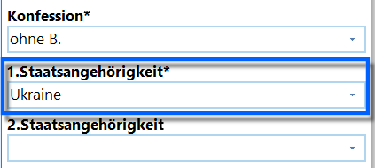
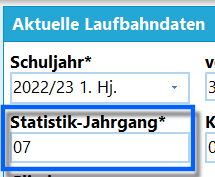
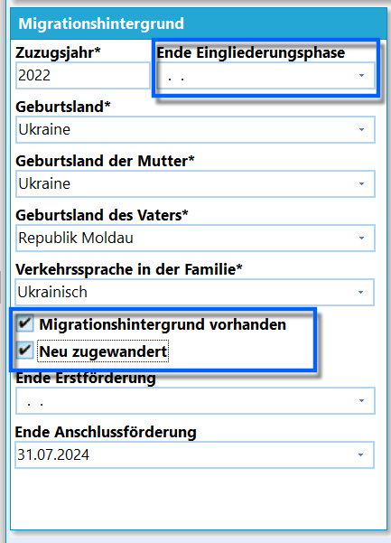
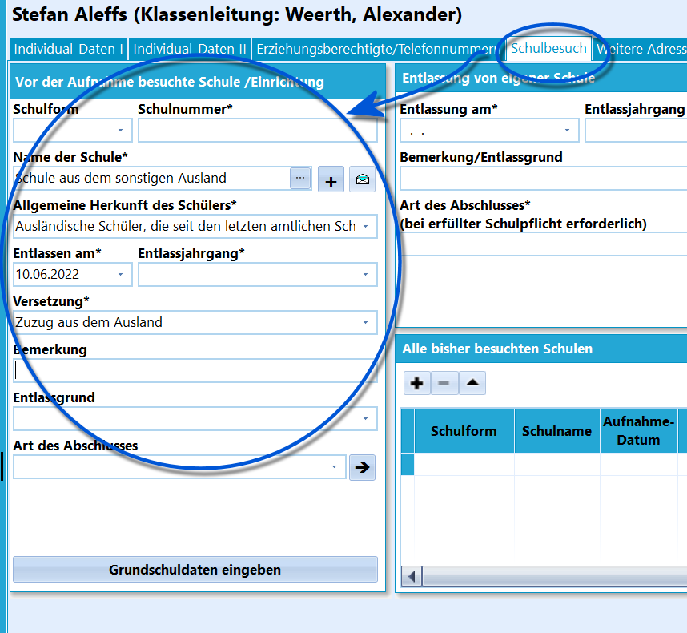
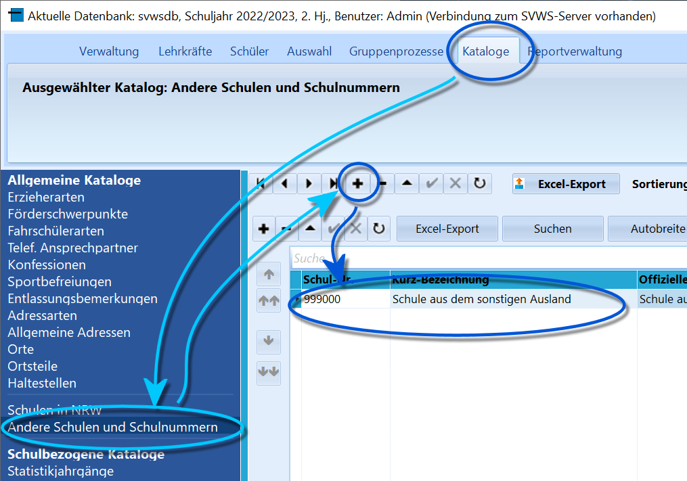
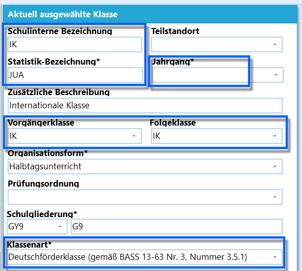
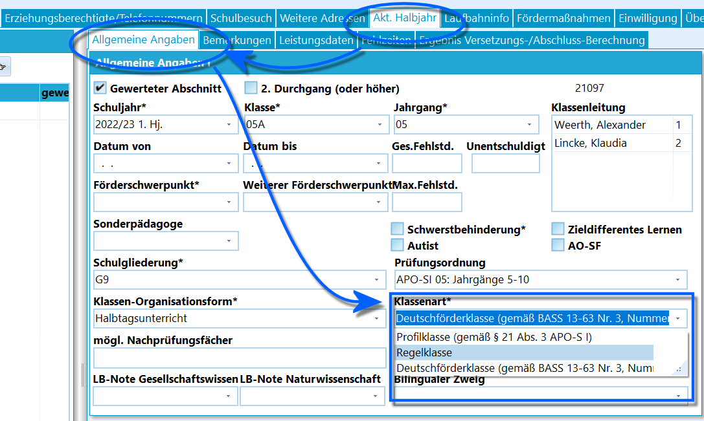

# Eingabe von Flüchtlingskindern (Tutorial)In diesem Artikel wird beschrieben, wie Flüchtlingskinder in der
Datenbank korrekt eingegeben werden können, damit die Statistik keine
Fehler zeigt.

## Individualdaten

### Individualdaten ITragen Sie die Individualdaten wie gewohnt nach besten Wissen ein.

-   **1. Staatsangehörigkeit**: Wählen Sie einen Eintrag, der nicht
    *"deutsch"* bzw. *Deutschland* ist.
-   **Aufnahmedatum**: Tag der Aufnahme, also z.B. den 19.06.2024

-   **Statistik-Jahrgang**: Tragen Sie unter *Aktuelle Laufbahndaten*
    einen Jahrgang ein, der dem Alter des Schülers in etwa entspricht.  

### Individualdaten II

 Unter *Migrationshintergrund* können Daten zur Herkunft und
der Verkehrssprache in der Familie aufgenommen werden.Setzen Sie den Haken bei **Migrationshintergrund vorhanden**.Hier kann auch ein *Datum Ende der Eingliederungsphase* eingetragen
werden, dieses Datum füllt das Feld *Ende Erstförderung* automatisch mit
einem identischen Eintrag mit aus. Dann haben Sie die Möglichkeit, nach
solchen Schülern mit Filter I zu filtern.Zudem können Sie das Häkchen **Neu zugewandert** setzen, das sich
ebenfalls über den *Filter I* nutzen lässt.  

## Vorheriger Schulbesuch

Erfassen Sie den vorherigen Schulbesuch, indem unter *"Schüler ➜
Schulbesuch ➜ Vor der Aufnahme besuchte Schule/Einrichtung"* diese
Einträge vorgenommen werden:-   **Schulform**: leer
-   **Name der Schule**: *Schule aus dem sonstigen Ausland (999000)*
-   **Allgemeine Herkunft des Schülers**: *Ausländische Schüler, die aus
    dem Ausland zugezogen sind (Statistikkürzel AS)*
-   **Entlassen am**: Tag vor dem Aufnahmedatum (z.B. *18.06.2022*)
-   **Entlassjahrgang**.: leer
-   **Versetzung**: *Schüler, die aus dem Ausland zugezogen sind (99)*  

## Zuordnung zu einer Klasse

 Flüchtlingskinder können entweder einer hierfür angelegten
Klasse zugeordnet werden oder auf Regelklassen verteilt werden.

### Zuordnung zu einer eigenen KlasseEs ist möglich, neu zugewanderte Schülerinnen und Schüler ausschließlich
in eigenständigen Klassen in vollständig äußerer Differenzierung zu
unterrichten. Die zugewanderten Schülerinnen und Schüler nehmen dann an
keinem Unterricht der anderen Regelklassen teil, sondern bilden eine
eigene Lerngruppe.Über die Bezeichnung dieser Lerngruppen entscheidet die Schule.Im diesem Fall legen Sie in SchILD-NRW in der
*Klassen-/Versetzungstabelle* eine eigene Klasse an.Vergeben Sie eine geeignete interne Bezeichnung (z.B. IK für
internationale Klasse) und benennen Sie die Klasse in der
Statistikbezeichnung mit einer Parallelität.Lassen Sie das Feld **Jahrgang** leer.Tragen Sie als **Folgeklasse** und **Vorgängerklasse** die eigene,
gerade erzeugte Klasse ein.Wählen Sie eine passende **Schulgliederung**, etwa *"GY9-G9"*,
*"\*\*\*-Standard für diese Schulform"* etc.Wählen Sie die **Klassenart** *"Deutschförderklasse (gemäß BASS 13-63
Nr. 3, Nummer 3.5.1)"*.  

 Sollten Sie eine komplette Klasse mit Flüchtlingen gebildet
haben, so wird auf dem Reiter *"Akt. Halbjahr"* im Unterreiter
*"Allgemeine Angaben"* die **'Klassenart** *Deutschförderklasse (gemäß
BASS 13-63 Nr. 3, Nummer 3.5.1)* automatisch aus der
*Klassen-/Versetzungstabelle* übernommen.Sie finden die Angabe der Klassenart des aktuellen Halbjahres ebenfalls
unter den aktuellen Laufbahndaten auf dem Reiter *Individualdaten I*.

Diese Klassenart darf nur für Flüchtlinge verwendet werden, welche nicht
am Regelunterricht von Regelklassen teilnehmen.

### Zuordnung zu den RegelklassenSollten die Flüchtlingskinder auf die *Regelklassen* der Schule verteilt
sein und einzelne Deutschförderangebote erhalten, so bekommen die
Schüler die **Klassenart** *"Regelklasse"*, so wie alle anderen Schüler
auch.

Diese Schüler können dann entsprechend der oben ausgeführten und in den
*Individualdaten II* gesetzten Bedingungen über den *Filter I* gefunden
werden.  

## Flüchtlingskinder in der Grundschule