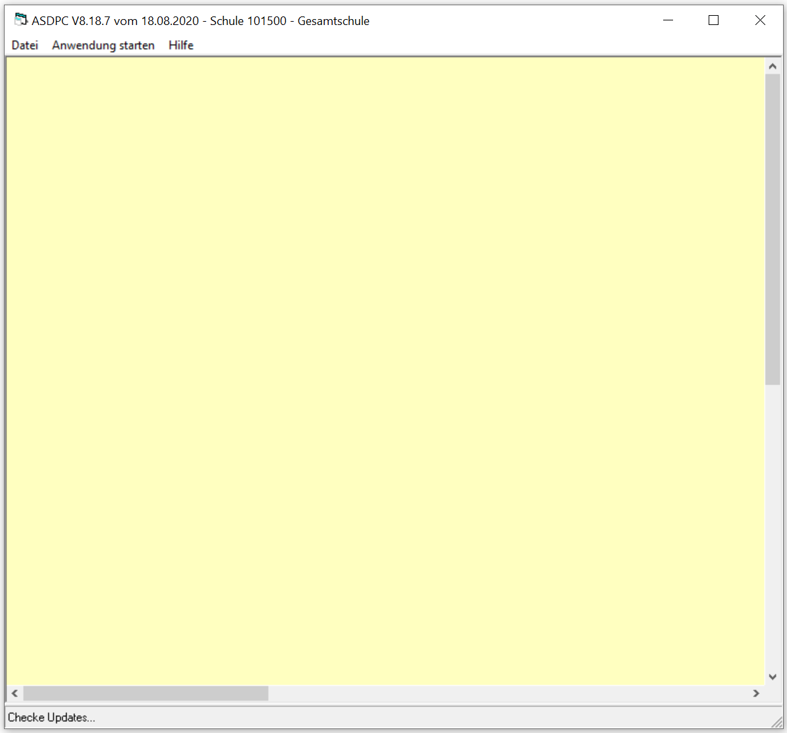

# Fehleranalyse zur Statistik (Tutorial)Auf dieser Seite werden in der Praxis häufiger auftretende Fehler
beschrieben, die zu Beginn oder am Ende der Statistik auftreten können.Kontaktieren Sie zu *technischen* Problemen mit der Statistik, zum
Beispiel die Installation und Konfiguration des Programms oder Erzeugen,
Verwenden und Übersenden von Schlüsseldateien oder der Statistikdatei,
den Support von IT.NRW.

## Vor der Statistik

### ASDPC auf einem Monitor mit hoher Auflösung

Wird ASDPC auf einem Monitor mit hoher Auflösung ausgeführt, werden die
Inhalte nicht korrekt dargestellt. In diesem Falle sind die Scrollbalken
unten und rechts zu nutzen, um die Inhalte in den sichtbaren Bereich zu
verschieben.

### ASDPC wurde auf dem Rechner nicht installiert bzw. die .dll wurden nicht registriertASDPC wird falsch dargestellt - das heißt, das Programm startet, aber
Menüs des Programms werden nicht angezeigt - wenn keine korrekte
Installation als Windows-Administrator durchgeführt wurde oder wenn die
notwendigen .dll-Bibliotheken nicht korrekt installiert wurden.Konsultieren Sie hierzu die Hilfeseite zu ASDPC, auf ihr liegt eine
Anleitung, um dieses Problem zu lösen. Alternativ kontaktieren Sie bei
weiterhin falscher Darstellung von ASDPC den Support von IT.NRW.Probieren Sie, die .dll-Dateien korrekt zu
[registrieren](../../Verwaltung_Administration/Hilfe_bei_Problemen_(Verwaltung_Statistik_für_IT-NRW).md).  

### Statistik.dll-Konflikte bei paralleler Installation von SchILD-NRW2Grundsätzlich können SchILD-NRW2 und SchILD-NRW3 parallel auf einem
Rechner betrieben werden.Hierbei ist aber zu beachten, dass jeweils nur eine Statistik-Datei
(jeweils *schulver.mdb* und die *ASDTABS.mdb*) verwendet werden kann!Beide Dateien liegen im Unterordner *\IT-NRW\\* im
SchILD-NRW-Installationsverzeichnis.

::: warning

Es wird von allen SchILD-NRW-Installationen die .dll
genutzt, *die zuletzt auf dem verwendeten Windows-Client registriert
wurde*.

:::

Dies gilt auch für eventuell mehrere Installationen von SchILD-NRW2 oder

SchILD-NRW3. Die Dateien werden bei der Installation von SchILD-NRW
automatisch registriert.Sind alle .dlls aktuell, ist kein Problem zu erwarten.Wird irgendwann SchILD-NRW2 nicht weiter geupdatet, könnte unabhängig
vom immer aktuellen Stand von SchILD-NRW3 dauerhaft die veraltete Datei
aus dem SchILD-NRW-2-Verzeichnis genutzt werden und zu Fehlern führen.

::: warning

Diese Ausführungen gelten auch, wenn SchILD-NRW als
Netzwerkinstallation neben einer lokalen Einzelplatzinstallation auf dem
Windows-Rechner verwendet wird - auf dem Windows-Rechner kann nur eine
.dll registriert sein!

:::

Führen Sie aus einer Installation von SchILD-NRW das nachträgliche

[Registrieren](../../Verwaltung_Administration/Hilfe_bei_Problemen_(Verwaltung_Statistik_für_IT-NRW).md)
der zu dieser Installation gehörenden Datei aus. Achten Sie bitte
darauf, dass die ASDTABS.MDB dieser Installation dann auch die aktuelle
ist.

### Fehler mit den SchlüsselnSiehe hierzu die Dokumentation von IT.NRW zum Schlüsselmanagement.1.  Achten Sie darauf, dass Ihr PRIVATER Schlüssel geheim bleibt und
    IT.NRW den jeweils aktuellen öffentlichen Schlüssel korrekt
    zugesandt bekommen hat.
2.  Achten Sie darauf, kein neues Schlüsselpaar zu generieren, wenn dies
    nicht beabsichtigt ist. Sollte ein neues Schlüsselpaar generiert
    worden sein, muss IT.NRW der neue öffentliche Schlüssel zugesandt
    werden.

## Bei der Abgabe

### Versand an eine inkorrekte EmailadresseMöglicherweise wurde nicht an die korrekte Emailadresse versendet, diese
entnehmen Sie bitten den von IT.NRW versendeten Unterlagen. Aus der
Praxis sind aber folgende leicht zu passierende Fehler bekannt:-   statistik.schule**n**@... ➥ hier ist das "n" zu viel.
-   statistik@.... ➥ hier fehlt ".schule".
-   statisik@... ➥ diverse (!) mögliche Tippfehler des Wortes
    "Statistik".
-   schluessel.schule@... ➥ Möglicherweise wurde eine vom
    Schlüsselaustausch im Mailprogramm gespeicherte Adresse verwendet
    und somit wurde die Statistik an die falsche Adresse geschickt.
-   statistik@schule.nrw ➥ Hier fehlt am Ende das ".de".Weiterhin kommt es vor, dass Meldungen, die Mail habe nicht versandt
werden können, übersehen.

### Versand von inkorrekten DateienEs soll die Datei V4\[SCHULNUMMER\].\[JAHR\]X versendet werden. In der
Praxis kann es vorkommen, dass stattdessen eine andere Datei verschickt
wurde, z.B.-   die Vorgabedaten
-   eine Statistikdatei aus einem vorherigen Schuljahr
-   eine Schlüsseldatei
-   eine Datenbank "asdpc.mbd", entweder als Original oder eine ihrer
    Sicherungsdateien
-   eine pdf-Datei, die für einen Papierausdruck erzeugt wurde
-   die Programmdatei ASDPC32.exe
-   die Statistik wurde mit einer Vorjahresversion von ASDPC erstellt
-   es wurde vergessen, die Datei anzuhängen

### Keine Bestätigungsmail erhaltenHaben Sie die Statistik versandt, sollten Sie innerhalb der
Arbeitszeiten von IT.NRW eine Bestätigungsmails des Eingangs erhalten.
Falls Sie keine Bestätigung erhalten, kann dies u.A. diese Gründe haben:-   der Maileingang bei IT.NRW wird erst am folgenden Werktag
    bearbeitet.
-   die Mail befindet sich noch im Postausgang der Mailsoftware.
-   die Statistik wurde an die falsche Emailadresse geschickt.
    Kontrollieren Sie bitte, ob Ihre Email korrekt verschickt wurde und
    ob Sie die korrekten Datei angehängt haben.