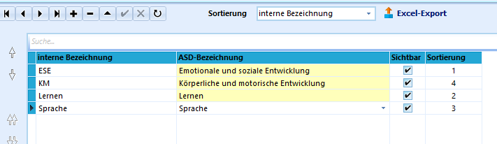
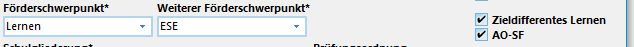
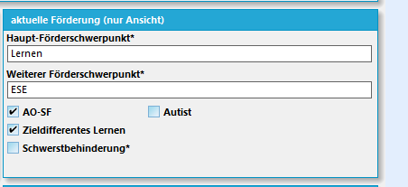

# Förderschwerpunkte (Allgemeine Kataloge)

 Bei Erstinstallation einer SchILD-Datenbank ist der Katalog
der Förderschwerpunkte leer.Sollten Schülerinnen und Schüler mit Förderschwerpunkt an der Schule
sein oder neu hinzu kommen, müssen deren Förderschwerpunkte unter
*Kataloge ➜ Förderschwerpunkte* eingetragen werden.Erst dann stehen diese zum Eintrag bei den Schülerinnen und Schülern zur
Verfügung.Es ist ratsam, im Listenknopf erst eine dieser vorgegebenen
ASD-Bezeichnungen auszuwählen und dann im links davon befindlichen Feld
eine frei formulierbare *"interne Bezeichnung"* dazu einzutragen, zum
Beispiel "Körperliche Entwicklung ➜ KME".Der neue Eintrag wird mit einem Klick auf den Haken **✓** bestätigt.Der Förderschwerpunkt beziehungsweise die zwei möglichen
Förderschwerpunkte werden dann unter dem Karteireiter *Schüler ➜
Aktuelles Halbjahr* bei *Allgemeine Angaben* eingetragen.Zuerst steht der Hauptförderschwerpunkt, dann folgt eventuell noch ein
weiterer Förderschwerpunkt.

::: warning

Beachten Sie hierzu die Schlüsseltabellen von IT.NRW in
Bezug auf zulässige Einträge als Hauptförderschwerpunkt und auf
zulässige Kombinationen. Sie finden die Schlüsseltabellen auf der
Downloadseite des Ministeriums für Schulverwaltungssoftware zur
Statistik.

:::

::: warning

Alle Schülerinnen und Schüler, die ein AO-SF-Verfahren
durchlaufen haben und dies dann genehmigt wurde, bekommen einen Haken
bei *AO-SF*.Sollte der Förderschwerpunkt *Lernen* oder *Geistige Entwicklung*
lauten, dann wird auch das Feld *Zieldifferentes Lernen* angehakt, da
diese Schüler dann nicht mehr nach dem Bildungsgang der jeweiligen
Schulform unterrichtet werden, sondern eben nach dem Bildungsgang
*Lernen* oder *Geistige Entwicklung*.

:::  

 Diese Einträge können im Anschluss unter *Individual-Daten
II* und *Akt. Förderung* angeschaut (nicht geändert) werden.Bei der Bereitstellung der Förderschwerpunkte im Katalog sind Sie bei
der Wahl der *internen Bezeichnung* frei (zum Beispiel ESE, GE, KM,
gehörlos, blind...), müssen aber natürlich bei der ASD-Bezeichnung unter
den zur Verfügung stehenden Begriffe wählen.Folgende Bezeichnungen stehen hier zur Verfügung:-   kein Förderschwerpunkt
-   Sehen (Blinde)
-   Emotionale und soziale Entwicklung
-   Geistige Entwicklung
-   Hören und Kommunikation (Gehörlose)
-   Körperliche und motorische Entwicklung
-   Lernen
-   Präventive Förderung im Bereich Emotionale und soziale Entwicklung
-   Präventive Förderung
-   Präventive Förderung im Bereich Lernen
-   Präventive Förderung im Bereich Sprache
-   Sprache
-   Hören und Kommunikation (Schwerhörige)
-   Sehen (Sehbehinderte)