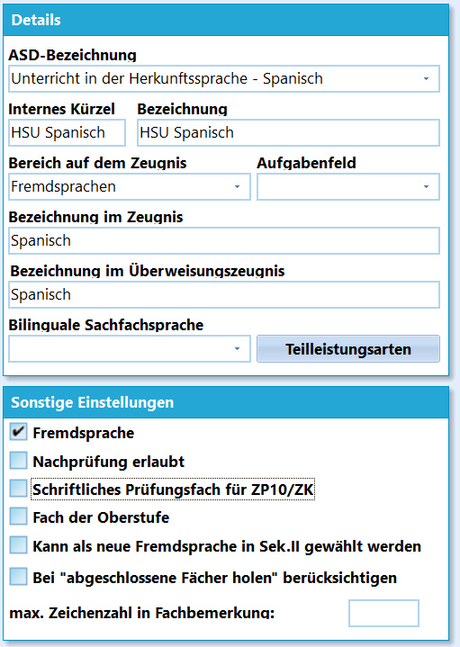
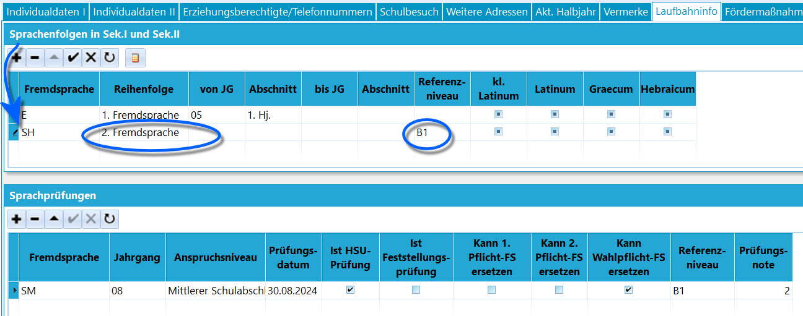
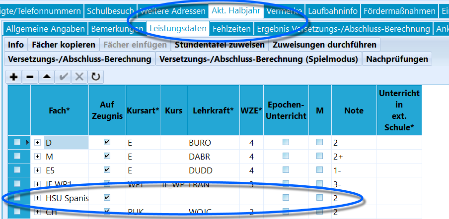

# Herkunftssprachlicher Unterricht (Tutorial)

## Herkunftssprachlicher Unterricht**Zielgruppe:** Schülerinnen und Schülern mit internationaler
Familiengeschichte, die ganz normal am Regelunterricht teilnehmen.**Teilnahmepflicht:** Die Anmeldung verpflichtet zur regelmäßigen
Teilnahme. Eine Abmeldung ist nur zum Schuljahresende für das kommende
Schuljahr möglich.**Sprachprüfung:** Schülerinnen und Schüler, die am
Herkunftssprachlichen Unterricht teilgenommen haben, legen am Ende ihres
Bildungsgangs in der Sekundarstufe I verpflichtend die Sprachprüfung im
Herkunftssprachlichen Unterricht nach § 5 Absatz 3 APO-S I auf der
Anspruchsebene des angestrebten Abschlusses ab (nur ESA, EESA und MSA,
nicht MSAQ-E).-   Schülerinnen und Schüler können mit einer mindestens guten Leistung
    in der Sprachprüfung bei der Vergabe der ***Abschlüsse*** nach §§ 40
    bis 42 APO-S I (ESA, EESA, MSA, nicht MSA-Q) eine mangelhafte
    Leistung in einer Fremdsprache ausgleichen.
-   Die Note hat keine Relevanz für die Versetzung beziehungsweise die
    Berechtigung zum Besuch der gymnasialen Oberstufe! Sie ist damit
    kein Ausgleich bei der Versetzungsentscheidung und kein Ausgleich
    bei der Erteilung der Berechtigung zum Besuch der gymnasialen
    Oberstufe (MSAQ-E).
-   Eine **vollständige Teilnahme am HSU** berechtigt in der gymnasialen
    Oberstufe zur Teilnahme am Kurs der fortgeführten Fremdsprache in
    dieser Sprache.
-   Bei **nicht vollständiger Teilnahme** berechtigt die Note
    "ausreichend" nach einem *Abschluss der Prüfung auf MSA-Niveau* zur
    Belegung der fortgeführten Fremdsprache in dieser Sprache in der
    gymnasialen Oberstufe.
-   Die Belegungsverpflichtung einer neu einsetzenden Fremdsprache im
    Umfang von 4 Wochenstunden bei Schülerinnen und Schülern, die in der
    Sekundarstufe I nur Englisch erlernt haben, bleibt in jedem Fall -
    auch bei Belegung der fortgeführten Fremdsprache in der
    HSU-Sprache - bestehen.
-   Bei Erreichen einer mindestens ausreichenden Note in der
    Sprachprüfung im Herkunftssprachlichen Unterricht auf dem
    Anspruchsniveau des Mittleren Schulabschlusses (MSA) kann diese
    Sprache in der gymnasialen Oberstufe als fortgeführte Fremdsprache
    belegt werden, sofern ein entsprechendes Angebot besteht.

## Zeugnisse und Bescheinigungen

### Zeugnis: Zeugnisse in der innerhalb der Primarstufe Klassen 3 und 4 und Sekundarstufe I

Die Schülerinnen und Schüler erhalten eine Bemerkung auf dem Zeugnis.
Diese kann als Floskel unter *Kataloge* ➜ **"Floskeln" bearbeiten**
unter der *Floskelgruppe* **Zeugnisbemerkungen** angelegt werden:` `***`"$Vorname$ $Nachname$ hat am Unterricht in HERKUNFTSPRACHE teilgenommen. Die Leistungen werden mit LEISTUNGSNOTE bewertet."`***

Die **Herkunftssprache** und die **Note** müssen in der Floskel
entsprechend eingetragen werden.In den **Zeugnissen der Schuleingangsphase der Grundschule** wird statt
der Leistungsnote eine Aussage über die Lernentwicklung im
Herkunftssprachlichen Unterricht unter **"Hinweise zu den
Lernbereichen/Fächern"** aufgenommen.

Dies gilt auch für Klasse 3, wenn die Schulkonferenz beschließt, im
Zeugnis der Klasse 3 oder im Versetzungszeugnis der Klasse 3 auf Noten
zu verzichten.In Klasse 4 wird eine Leistungsnote erteilt.

### Zeugnis: Abschlusszeugnisse der Sekundarstufe I

Die Note wird im Abschlusszeugnis Ende der Sekundarstufe I im
Prüfungsjahr, oder zeitverzögert in der Sekundarstufe II unter
„Leistungen“ bescheinigt. Unter „Bemerkungen“ wird angegeben, dass die
Note auf einer Sprachprüfung nach der Teilnahme am Herkunftssprachlichen
Unterricht beruht und auf welcher Anspruchshöhe die Sprachprüfung
abgelegt wurde.Sofern die Sprachprüfung nicht bestanden wurde, wird eine Bescheinigung
über die Teilnahme am Unterricht ausgestellt. Als Bemerkung kann
folgende Floskel angelegt werden:` `***`"

Die Note im Fach HERKUNFTSPRACHE beruht auf einer Sprachenprüfung nach der Teilnahme am Herkunftssprachlichen Unterricht und wurde auf der Anspruchshöhe ANSPRUCHSHÖHE abgelegt."`***

Die Herkunftssprache und die Anspruchshöhe (ESA, EESA und MSA) muss in
der Floskel entsprechend eingetragen werden.

### Zeugnis: Abiturzeugnis und Abgangszeugnisse der Sekundarstufe IIAuf dem Abiturzeugnis und den Abgangszeugnisse der Sekundarstufe II
erfolgt keine Bescheinigung der Prüfungsnote unter Leistungen, sondern
lediglich das erreichte GER-Niveau B1 unter "Fremdsprachen" auf Seite 4
mit folgender Bemerkung:` `***`"

Das für HERKUNFTSPRACHE ausgewiesene Niveau wurde durch eine Sprachprüfung nach der Teilnahme am Herkunftssprachlichen Unterricht erreicht.“"`***

### Bescheinigung

Die Teilnahme am Unterricht in der Herkunftsprache wird zusätzlich gemäß
Anlage BASS 13-61 Nr. 2 bescheinigt.

## Einstellungen in Schild-NRW

### Unterrichtsfächer

 Legen Sie ein Fach für die Prüfungssprache unter *Kataloge*
➜ **Unterrichtsfächer** an. Hier wird die Sprache als Beispiel
verwendet.-   **ASD-Bezeichnung**: Unterricht für Herkunftssprache - Spanisch
-   **internes Kürzel**: HSU Spanisch
-   **Bezeichnung**: HSU Spanisch
-   **Bereich auf dem Zeugnis**: Fremdsprachen
-   **Bezeichnung im Zeugnis**: Spanisch
-   **Bezeichnung im Überweisungszeugnis**: Spanisch
-   Sonstige Einstellungen, die anzuhaken sind: **Fremdsprache** unter
    Details und **Auf Zeugnis** und **Sichtbar** in der
    Fachübersichtsliste.

::: warning

Nach Anlegen des Faches sollte SchILD-NRW einmalig neu
gestartet werden, damit die Kataloge vollständig neu eingelesen
werden.

:::  

### Sprachenfolge und Sprachprüfungen

 Tragen Sie das Fach in die Sprachenfolge auf dem Reiter
*Schüler* ➜ **Laufbahninfo** ein:-   **Fremdsprache**: HSU Spanisch (hier im Screenshot SH)
-   **Reihenfolge**: 2. Fremdsprache
-   **Referenzniveau**: B1 (MSA)
-   **von Jahrgang/Abschnitt**: leer lassen, ggf. mit der Taste `Entf.`
    leeren
-   **bis Jahrgang/Abschnitt**: leer lassen, ggf. mit der Taste `Entf.`
    leeren**Sprachprüfungen** Tragen Sie die **Fremdsprache** ein, die dem HSU
entspricht und tragen Sie weiterhin die Daten der Prüfung ein und setzen
Sie den Vorgaben entsprechende Haken und das Referenzniveau.

### Leistungsdaten für das Abschlusszeugnis der Sekundarstufe I

 Fügen Sie den **Leistungsdaten** des Schülers im *aktuellen
Abschnitt* ein Fach hinzu:-   **Fach**: HSU Spanisch
-   **Auf Zeugnis**: Aktiviert
-   **Kursart**: leer
-   **Lehrkraft**: leer
-   **Note**: Prüfungsnote
-   **Wochenzeiteinheit**: leer  
Setzen Sie auch eine **Zeugnisbemerkung**:` `***`"

Die Note im Fach HERKUNFTSPRACHE beruht auf einer Sprachenprüfung nach der Teilnahme am Herkunftssprachlichen Unterricht und wurde auf der Anspruchshöhe ANSPRUCHSHÖHE abgelegt."`***

### Leistungsdaten für Abgangszeugnisse und das AbiturzeugnisZeugnisbemerkung:`  `***`"

Das für HERKUNFTSPRACHE ausgewiesene Niveau wurde durch eine Sprachprüfung nach der Teilnahme am Herkunftssprachlichen Unterricht erreicht."`***