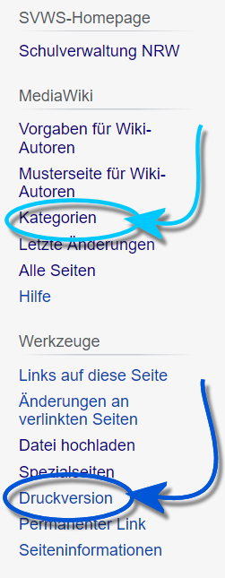

# Hinweise zur Recherche in diesem Wiki

 Dieses Wiki ist so ausgelegt, dass die Themen zum größten
Teil auf einer Seite umfassend dargestellt werden, so dass der Lesefluss
nicht gestört wird, man sich nicht in Unterseiten verliert und ein
Artikel leicht ausgedruckt werden kann.-   Eine **Druckversion** erzeugen Sie, indem Sie im Abschnitt
    `Werkzeuge` der Navigationsleiste am linken Fensterrand den Button
    `Druckversion` anklicken.<!-- -->-   Weiterhin sind die Artikel **kategorisiert**. Sie finden unterhalb
    jedes Artikels die Kategorien, denen der Artikel zugeordnet ist. Sie
    können sich eine Liste weiterer zugehöriger Artikel durch Klick auf
    die gewünschte 

DEADLINK: Kategorie - Spezial:Kategorien.md

 anzeigen
    lassen.  
    Eine Übersicht über alle Kategorien finden Sie auf der linke Seite
    unter *Mediawiki*.

::: warning

Beachten Sie bitte, dass sich das konkrete
Erscheinungsbild im Detail von SchILD-NRW an die jeweils gewählte
Schulform anpassen kann und dass auch je nach gewählter Jahrgangstufe
andere Reiter und auch Gruppenprozesse zur Verfügung stehen
können.

:::

Die Erklärungen in allen **Reitern** sind in der Regel so ausgelegt,

dass aus ihnen auch der mit ihnen verbundene Arbeitsprozess deutlich
wird. Weitergehende Informationen zu Arbeitsprozessen finden sich dann
in spezialisierenden *Tutorials*.Umfangreichere Arbeitsprozesse, zum Beispiel die Durchführung des
Abiturprozesses, werden über die jeweils zugehörenden
**Gruppenprozesse** durchlaufend abgebildet. In Fällen, für die dies
nicht sinnvoll ist, finden sich die Arbeitsprozesse bei den
**Tutorials**.Es sind alle Artikel von der Hauptseite aus erreichbar. Es wird in der
Regel vermieden, in Artikeln Links zu setzen, so dass immer nur einmal
der `Zurück`-Button im Browser verwendet werden muss, um zu einem neuen
oder weiterführenden Artikel zu navigieren. Dies soll auch die
Lesbarkeit in Ausdrucken verbessern.Gleiches gilt, um eine vergrößerte Ansicht eines **Screenshots** zu
bekommen. Ein Klick drauf öffnet die vergrößerte Ansicht, kehren Sie
dann über den `Zurück`-Button des Browers zum Artikel zurück.

::: warning

In diesem Wiki wird SchILD-NRW entsprechend die
Schreibvarinate *Schüler* oder *Lehrer* verwendet. Es sind hierbei immer
alle Geschlechter und Identitäten gemeint.

:::

Folgende Artikel verfügen über

**

DEADLINK: Videotutorials - :Kategorie:Video.md

**.