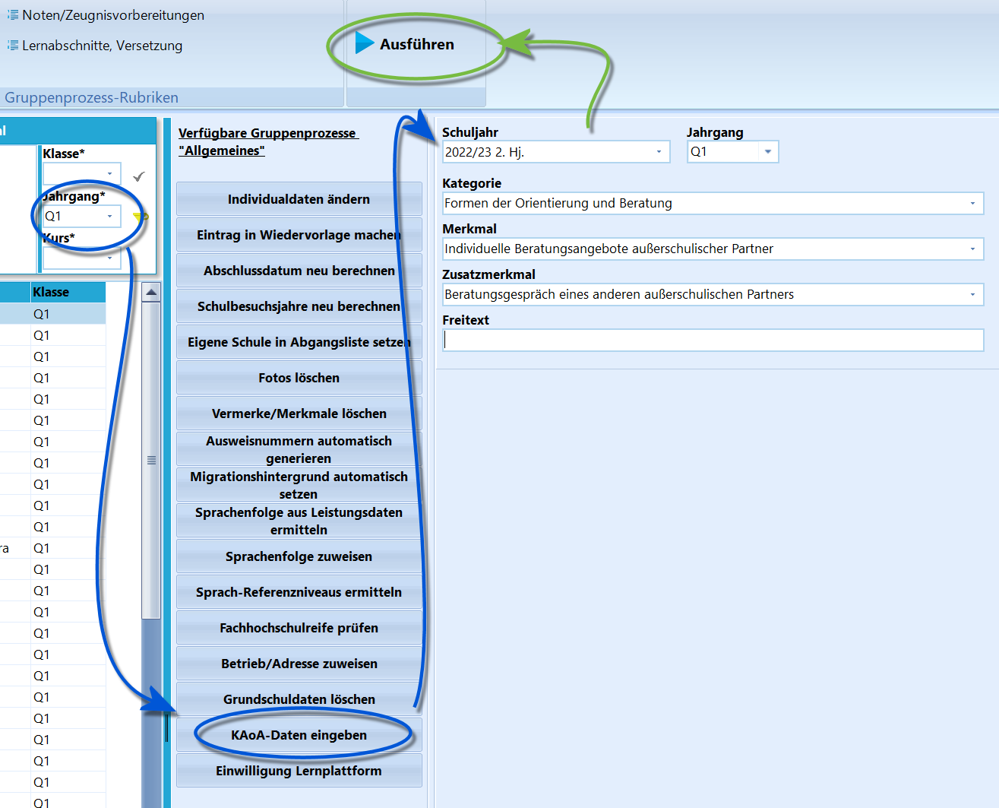

# KAoA-Daten eingeben (Gruppenprozesse Allgemein)

Wurde im Container auf eine Schülergruppe gefiltert, für die KAoA-Daten
eingegeben werden sollen, erscheint unter *Gruppenprozesse Allgemein*
der Prozess **KAoA-Daten eingeben**.Befüllen Sie die Felder entsprechend der gelaufenen Maßnahme(n) und der
Vorgaben.Der *Zusatzmerkmal* ist vom gewählten *Merkmal* abhängig.Klicken Sie anschließend auf `Ausführen`.

::: warning

Eventuell weißt der Gruppenprozess auf Eingaben hin, die
nicht den Vorgaben entsprechen - zum Beispiel, wenn bei einer konkreten
eingegebenen Maßnahme ein *Freitext* erwartet wird.

:::