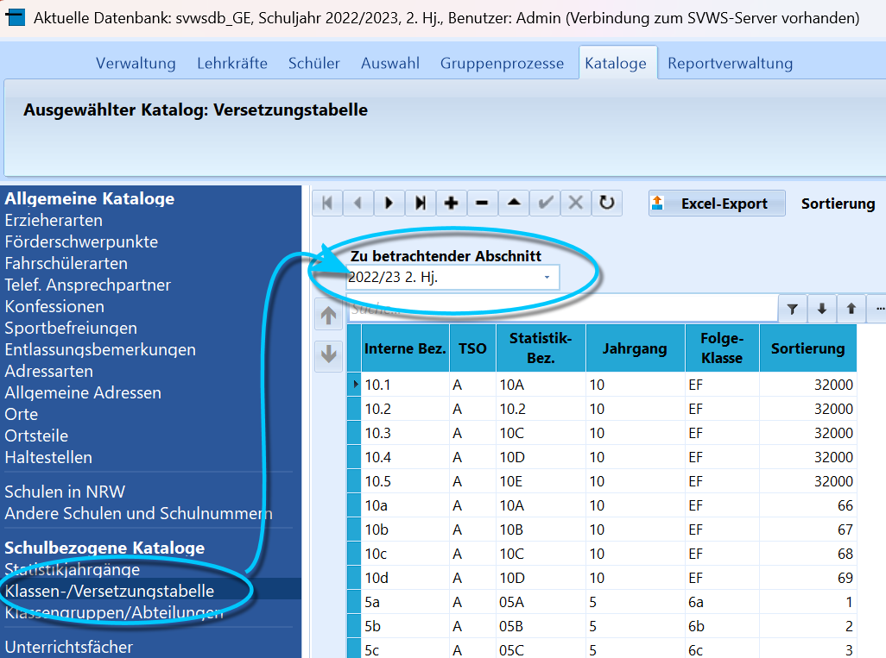
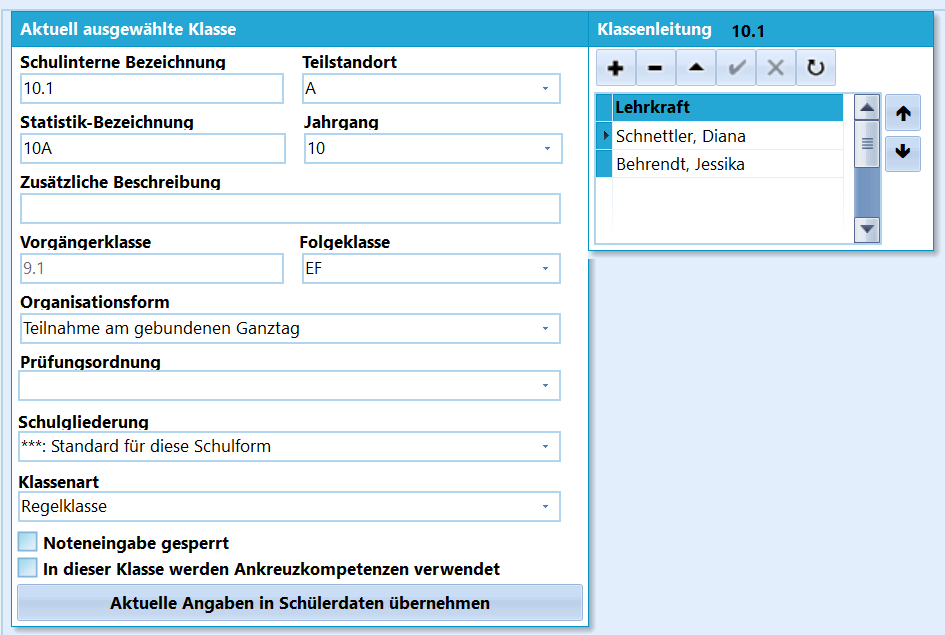

# Klassen-Versetzungstabelle (Schulbezogene Kataloge)

In der Klassen- und Versetzungstabelle werden die Daten für jede Klasse
erfasst, also Statistikbezeichnungen, die Klassenlehrkräfte, die
Prüfungsordnung und so weiter.Wählen Sie bei **Zu beachtender Abschnitt** einen Lernabschnitt und
konfigurieren Sie die für diesen Lernabschnitt hinterlegten Klassen.  

Bei den Details wird erfasst, welche **Folgeklasse** auf diese Klasse
bei der Versetzung folgt, in welche die SuS zum Schuljahresende
automatisch übertragen werden. Die **Vorgänger-Klasse** sollte ebenfalls
korrekt gesetzt werden, diese Information könnte für zum Beispiel
Blockungsprogramme wichtig sein.Wird eine Klasse in der Tabelle links angewählt, kann diese in "Aktuell
ausgewählte Klasse" bearbeitet werden. Hier in der Tabelle kann die
"Sortierung" wie bei allen anderen Katalogen eingestellt werden.-   Die **Schulinterne Bezeichnung** kann wie auch die **Zusätzliche
    Beschreibung** frei gewählt werden.
-   Bei den mit "**\***" gekennzeichneten Feldern sind die Vorgaben der
    Statistik einzuhalten. Bei der **Statistik-Bez.** werden Klassen
    dreistellig angegeben, wobei die ersten beiden Stellen der Jahrgang,
    die dritte die Parallelität darstellen. Ihre Klasse "5.1" wäre in
    der Statistik für ASDPC also die 05A, Ihre "9.3" die "09C".<!-- -->-   Wurden für die Schule mehrere **Teilstandstandorte** unter
    "Verwaltung" ➜ "Schule" ➜ "Weitere Angaben" konfiguriert, können
    diese hier mit "A", "B" usw. angewählt werden.<!-- -->-   **Organisationsform**: Dieser Eintrag wird auch an die Statistik
    übermittelt. Bitte beachten Sie, dass die Organisationsform
    "Teilnahme am offenen Ganztag" bei den Schülern individuell
    eingetragen werden muss, da u.U. nicht alle Schüler der Klasse dort
    teilnehmen.
-   **Prüfungsordnung**: Hier kann die Prüfungsordnung der Schüler in
    der Klasse eingetragen werden.
-   **Schulgliederung**: Hier wird der Bildungsgang eingetragen, in dem
    sich die Schüler der Klasse befinden. In Berufskollegs ist das die
    Anlage, bei vielen weiterführenden Schulen ist das einfach der
    Eintrag *"\*\*\* Standard für diese Schulform"*. In neu gegründeten
    Schulen können hier aber auch unterschiedliche Einträge stehen, z.B.
    *"R7 Realschulzweig auslaufend"*.
-   **Klassenart**: Dies ist die Klassenart, die bei der Statistik an
    ASDPC32 in die KLD übermittelt werden soll. Bitte informieren Sie
    sich in den Schlüsselverzeichnissen von IT.NRW, was dort eingetragen
    werden muss.<!-- -->-   Für einzelne Klassen lassen sich hier die **Noteneingaben** sperren,
    dies kann sinnvoll sein, wenn die Lehrkräfte direkten Zugang zu den
    Leistungsdaten haben, die Frist für eigeneständige Notenänderungen
    aber schon abgelaufen ist.
-   Weiterhin kann hier konfiguriert werden, dass in einzelnen Klassen
    **Ankreuzkompetenzen** verwendet werden.
-   Unter **Klassenleitung** können Lehrkräfte mittels der in SchILD
    üblicherweise verwendeten Liste hinzugefügt und entfernt werden.

::: warning
-   Wurden Veränderungen bei einer Klasse durchgeführt, können dies

e
    direkt über **Aktuelle Angaben in Schülerdaten übernehmen** bei den
    SuS dieser Klasse eingetragen werden.
-   Sind einer Klasse noch Schüler zugeordnet, kann die Klasse nicht
    gelöscht werden.

:::