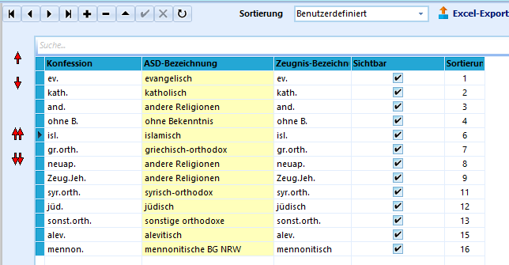

# Konfessionen (Allgemeine Kataloge)

Im Katalog *Konfessionen* können Sie selbst Einträge sortieren,
verändern und auch ergänzen.Bei der Ergänzung der Einträge müssen Sie sich bei der Benennung der
*ASD-Bezeichnung* an die dort vorgegebenen Statistik-Bezeichnungen
halten. Das sind Sammelbezeichnungen, die Konfessionen mit ihren Namen
werden in der Spalte Konfession eingetragen.Nicht alle Glaubensgemeinschaften sind für die Statistikbezeichnung auch
eigene Konfessionen. Zum Beispiel zu "andere Religionen" gehören:
Jehovas Zeugen, Neuapostolische Kirche, Buddhisten und weitere. Dies hat
den Vorteil, dass der Export der Schülerdaten zur Erstellung der
Schulstatistik problemlos verläuft.

::: warning

Konsultieren Sie die jeweils aktuellen Hilfen zur
Statistik von IT.NRW, wie Konfessionen zu erfassen sind.

:::

Sie sind in der Wahl der Konfessions- und auch der Zeugnisbezeichnung

frei. Die Zeugnisbezeichnung wird auf Zeugnissen ausgegeben, wenn beim
Schüler auf dem Karteireiter *Individualdaten I* ein Haken bei
**Konfession auf Zeugnis** gesetzt ist. Die Konfession wird dann in
Klammern gesetzt hinter dem Namen des Schülers ausgegeben.Eine benutzerdefinierte Sortierreihenfolge kann durch Wechsel auf
*Benutzerdefiniert* in der Schaltfläche *Sortierung* erfolgen.
Verschieben Sie hierzu mit Hilfe der Pfeile am linken Rand Ihre
'Favoriten' nach vorne. (siehe Foto)

::: warning

Innerhalb Ihrer Schule sollten Sie sich einigen, welche
Bezeichnungen Sie für die Konfessionen eintragen wollen:
*römisch-katholisch*, *röm-kath.* und *r.k.* sind alles sinnvolle
Bezeichnungen, dennoch sollten Sie sich der Übersichtlichkeit halber auf
**eine** Bezeichnung festlegen.In Schulen, in denen verschiedene Personen Daten im Sekretariat
eingeben, sollte diese Einheitlichkeit hergestellt werden. Blenden Sie
die nicht gewünschten Bezeichnungen aus, indem sie diese auf
**nicht-sichtbar** stellen. Die Verwendung von Suchfunktionen, wie zum
Beispiel im Filter I, wird so deutlich effektiver.

:::