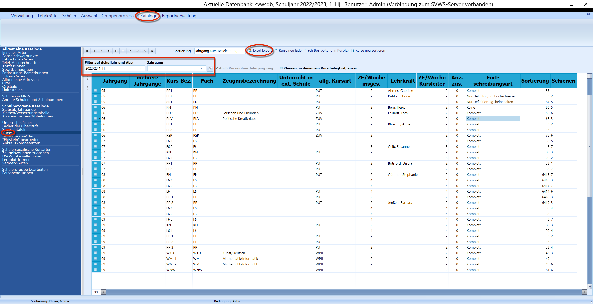
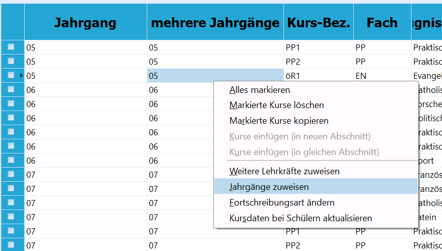
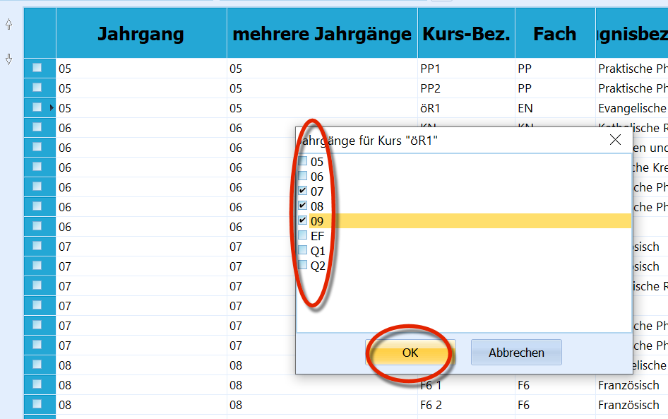
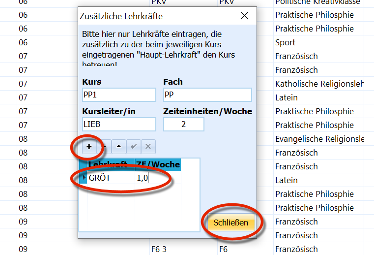
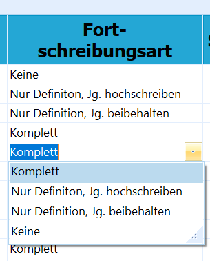
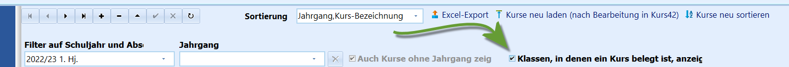
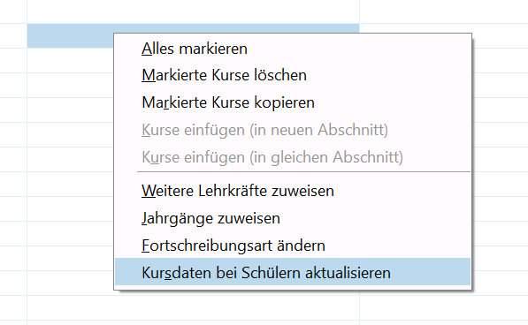

# Kurse (Schulbezogene Kataloge)

 Über die Kursverwaltung "Kataloge" ➜ "Kurse" können die
Kurse der Schule eingerichtet werden. Diese werden notwendig, wenn der
Unterricht nicht (mehr) im Klassenverband stattfindet.Es können Lernenden in "Schüler" ➜ "Akt. Halbjahr" nur Kurse zugewiesen
werden, die hier in diesem Katalog angelegt wurden.

Die eigentliche Zuweisung von Lernenden zu Kursen wird im Regelfall über
Gruppenprozesse vorgenommen, auch ein Import aus einem externen
Planungs- und/oder Stundenplanprogramm ist möglich. Im Einzelfall können
Lernende individuell zu Kursen zugewiesen werden oder es kann die
Kurszuweisung verändert werden, etwa, wenn ein Lernender das
schriftliche und mündliche Abiturfach tauscht, dann müssten in beiden
Fächern die Kursarten *"AB3"* und *"AB4"* getauscht werden.Um die Anzeige der Kurse auf bestimmte Jahrgänge einzuschränken oder
Kurse aus anderen Halbjahren anzuzeigen, benutzen Sie bitte die
Schnellfilter im oberen Bereich.Ergänzen Sie einen Kurs wie in allen Tabellen über das Pluszeichen
"**+**".Es stehen Ihnen ein *'Excel-Export* dieser Tabelle und einige
Aktualisierungsmöglichkeiten zur Verfügung. Zusätzliche Jahrgänge bei
jahrgangsübergreifenden Kursen (Spalte "Mehrere Jahrgänge") können auf
Knopfdruck ermittelt werden.  

## Die KurstabelleIn der Kursübersicht stehen folgende Spalten zur Verfügung:-   **Jahrgang**: Welchem Jahrgang ist der Kurs zugeordnet?

-   **Mehrere Jahrgänge**: ist ein Kurs jahrgangsübergreifend ausgelegt,
    können die weiteren Jahrgänge nach einem Druck auf die rechte
    Maustaste zugewiesen werden.

-   **Kurs Bez.**: Die konkrete Bezeichnung eines Kurses. Mehrere Kurse
    des gleichen Faches in einem Jahrgang können je nach
    *Fortschreibungsart* nummeriert oder mit einem den Abschluss- oder
    Einschulungsjahrgang kennzeichnenden Suffix ausgestattet werden. Die
    Wahl der Bezeichnung ist frei, achten Sie aber bitte auf
    Eindeutigkeit im jeweiligen Lernabschnitt. Für Leistungs- oder
    Konferenzübersichten empfiehlt es sich, die Bezeichnung sehr kurz zu
    halten.
-   **Fach**: das Fach, dem dieser Kurs zugeordnet ist. Hier stehen die
    Fächer zur Verfügung, die unter "Kataloge" ➜ "Unterrichtsfächer"
    eingerichtet wurden. Mitunter kann es sinnvoll sein, für Kurse
    eigene Fächer einzurichten.
-   **Unterricht in ext. Schule**: Findet der Kurs an einer anderen
    Schule statt, so kann dies hier eingetragen werden. Diese Schule
    muss dann im Katalog der Schulen ein Kürzel haben!
-   **allg. Kursart**: Hier wird die Kursart des Kurses festgelegt.

::: warning

Diese allgemeine Kursart kann sich von den beim Schüler
eingetragenen Kursarten unterscheiden. Z.B. wäre ein Grundkurs (GK) in
der Oberstufe beim Schüler dann mit *"Grundkurs schriftlich (GKS)"* oder
*"Grundkurs mündlich (GKM)"* eingetragen. Auch sog. Differenzierungkurse
(DK) an den Schulformen GE und SK würden bei den Schülern dann mit der
jeweiligen Differenzierungsebene E oder G eingetragen.

:::

-   **ZE/Woche insges.**: Zeiteinheit der Wochenstunden bei de

n
    Lernenden.
-   **Lehrkraft**: Die erste Lehrkraft, die den Kurs unterrichtet.
-   **ZE/Woche Kursleiter**: Wochenstundeneinheiten, die der Kursleiter
    für die Statistik angerechnet bekommt. Diese können zu den
    Schülerwochenstunden abweichen.  

-   **Anz. zus. Lehrkräfte**: Hier steht die Zahl der Lehrkräfte
    eingetragen, die noch als zusätzliche Lehrkräfte im Kurs
    unterrichten. Der Eintrag wird über die rechte Maustaste
    vorgenommen. Per Standard wird die Anzahl als *"0"* gezeigt, die
    sich bei der Zuweisung weiterer Lehrkräfte entsprechend verändert.  

-   **Fortschreibungsart** Die Fortschreibungsart bestimmt, wie bei der
    Versetzung mit dem Kurs umgegangen wird.
    -   **keine**: Der Kurs wird bei der Versetzung in den neuen
        Abschnitt gelöscht!
    -   **Nur Definition, Jg. beibehalten**: Alle Schüler werden aus dem
        Kurs gelöscht, *der Kurs bleibt in seinem Jahrgang bestehen*.
    -   **Nur Definition, Jg. hochschreiben**: Alle Schüler werden aus
        dem Kurs gelöscht, *der Kurs wird einen Jahrgang
        hochgeschrieben*.
    -   **Komplett**: Der Kurs wird mit allen Schülern in den nächsten
        Abschnitt geführt. Beim Schuljahreswechsel wird der Jahrgang
        erhöht.

::: warning

Beachten Sie, dass die Fortschreibungsart bei jedem
Abschnittswechsel berücksichtigt wird!

:::  

\* **Sortierung**: Hier können Sortiernummern für die Kurse gegeben
werden. Links oben im Fenster kann bei den Filtern über das
Drop-Down-Menü entsprechend sortiert werden.-   **Schienen**': Hier wird nach Import aus Kurs42 - oder anderen
    Programmen zur Blockung oder Kursplanung - eine Schienennummer
    angezeigt. Die Schienennummer kann auch manuell eingegeben werden.  

-   **Belegt in folgenden Klassen**: Zeigt die Klassen an, in denen der
    Kurs belegt ist. Diese Spalte wird angezeigt, wenn Sie den Haken in
    der Kopfzeile bei dem entsprechenden Feld gesetzt haben.

::: warning

Beachten Sie, dass SchILD-NRW neu gestartet werden muss,
damit die Kurstabelle komplett neu eingelesen wird und alle Felder in
den Leistungsdaten zur Verfügung stehen.

:::

## Optionen über die rechte Maustaste

-   **Alles markieren**: Markiert alle Kurse, die sich zur Zeit in der
    Auswahl befinden.
-   '''Markiere Kurse löschen": Löscht alle markierten Kurse.

::: warning

Dieser Menüpunkt kann nützlich sein, wenn Sie z.B. eine
Blockung für alle Schüler eines Jahrgangs löschen wollen.

:::

-   **Markierte Kurse kopieren**

-   **Kurse einfügen (in neuen Abschnitt)**: Nach dieser Funktion muss
    einmal der Button *"Kurse neu laden"* genutzt werden. Mit diese
    Funktion können Sie Kurse in einen neuen Abschnitt einfügen.

::: warning

Dies ist sehr nützlich, wenn man vergessen hat, bei der
Versetzung die Fächer mit in den neuen Abschnitt zu
übertragen.

:::

-   **Kurse einfügen (in gleichen Abschnitt)**: Nach dieser Funktio

n
    muss einmal der Button *"Kurse neu laden"* genutzt werden.

::: warning

Es liegt dann eine exakte Kopie des Kurses vor,
"**Kursbez.**" usw. sollten anschließend geändert werden.

:::

-   **Weitere Lehrkräfte zuweisen**: Wenn Teamteaching aktiviert ist

.
    Setzen Sie hierzu unter "Verwaltung" ➜ "Einstellungen" ➜
    "Allgemeines" ➜ "Team Teaching ermöglichen" den Haken. Anschließend
    können hier weitere Lehrkräfte zugewiesen werden, die auch
    unterschiedliche Wochenstunden bekommen können.

::: warning

Diese Funktion kann erst ausgeführt werden, wenn der
Kurs einmal gespeichert wurde.

:::

-   **Jahrgänge zuweisen**: Hier können nachträglich Eintragungen i

n
    "Mehrere Jahrgänge" gemacht werden.
-   **Fortschreibungsart ändern**: Hier kann gleichzeitig für alle
    markierten Kurse die Fortschreibungsart umgestellt werden.