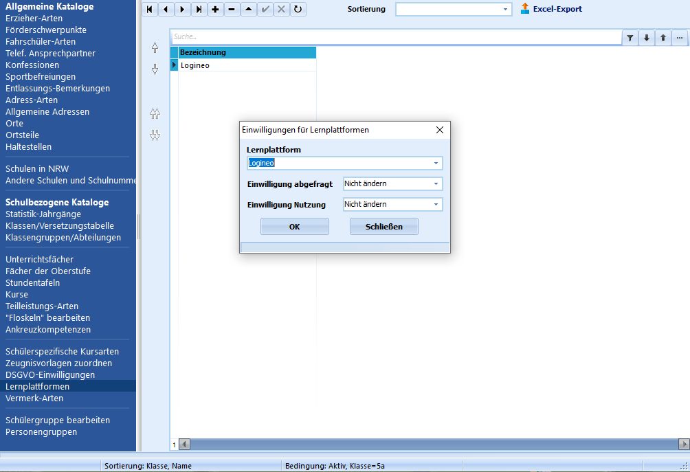

# Lernplattformen (Schulbezogene Kataloge)Hier können die von der Schule verwendeten **Lernplattformen** verwaltet
werden. Diese Angaben erhalten Relevanz, wenn die Einwilligungen für
diese Lernplattformen für die Schülerinnen und Schüler und die
Lehrkräfte dokumentiert werden.

Die Erfassung der **Einwilligungen** geschieht über den entsprechenden
Reiter unter *Lehrkräfte* beziehungsweise unter *Schüler*.  

## Anlegen neuer Lernplattformen

 Durch Klick auf das **+** kann eine neue Lernplattform
angelegt werden.In der Spalte **Bezeichnung** wird die entsprechende Bezeichnung
eingetragen.Durch Klick auf den Haken in der oberen Bedienfeldleiste wird die
Eingabe bestätigt. Es erfolgt eine Abfrage, ob die neu angelegte
Lernplattform direkt bei allen Schülerinnen und Schülern eingetragen
werden soll. Dies ist insofern sinnvoll, da in den meisten Fällen die
gesamte Schule diese Lernplattform nutzen soll.Im folgenden Fenster kann entschieden werden, ob bereits eingetragen
werden soll, dass die Einwilligung für diese Lernplattform abgefragt
wurde und in die Nutzung eingewilligt wurde.Hier kann auch, wie im Beispiel, ausgewählt werden, dass keine
Veränderung der Einwilligung stattfinden soll.

Dieser Schritt kann auch später mit denselben Optionen in Form eines
**Gruppenprozesses** durchgeführt werden.

Die Einträge in der Spalte **Sortierung** kann genutzt werden, um die
Sortierreihenfolge zu ändern.  

## Bearbeiten von LernplattformenDurch einen Doppelklick in das entsprechende Feld in der Spalte
"Bezeichnung" kann die Bezeichnung bereits angelegter Lernplattformen
geändert werden.Ein Klick auf das **-** löscht die angelegte Lernplattform nach
Bestätigung einer Dialogabfrage.