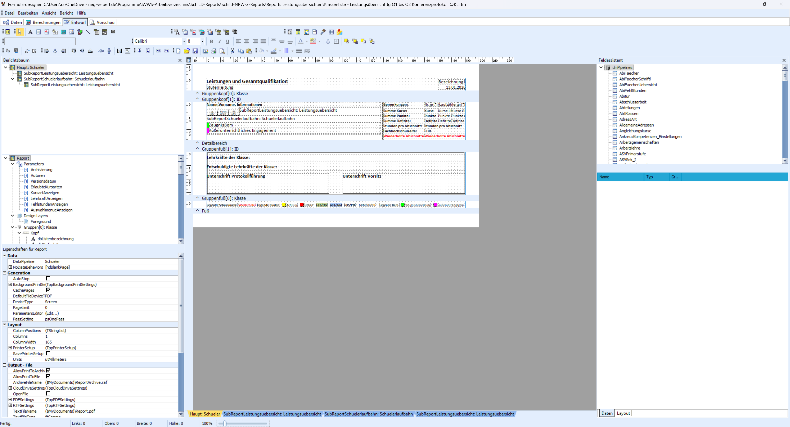
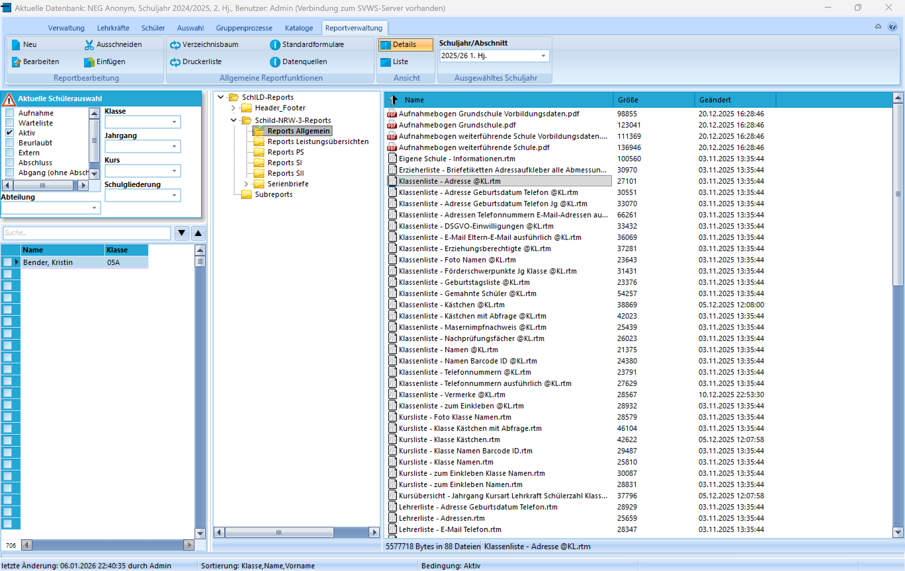

# Reportdesigner

## Der Reportdesigner - Was ist das?

Der Reportdesigner (auch Formulardesigner) ist eine eigenständiges
Programmkomponente der [Firma DigitalMetaphors](https://www.digital-metaphors.com), welche nahtlos in
SchILD-NRW 3 integriert wurde. Der Reportdesigner dient dazu, die in der
Datenbank gespeicherten Informationen ausdrucken, als PDF speichern oder
als E-Mail versenden zu können. Innerhalb des Reportdesigners erstellt
man hierzu einen Report nach eigenen Vorstellungen oder passt einen
existierenden Report an die eigenen Vorstellungen an.

Jeder Report wird als eigenständige RTM-Datei im Verzeichnis
***SVWS-Arbeitsverzeichnis\Schild-Reports\\*** abgespeichert.
RTM-Dateien können in diesem Ordner hinzugefügt oder gelöscht werden. In
SchILD-NRW 3 erreichen Sie den Reportdesigner über den Karteireiter
Reportverwaltung. Die Reportverwaltung zeigt Ihnen alle Reports als
RTM-Datei an, auf welche SchILD-NRW 3 Zugriff hat. Den Reportdesigner
erreichen Sie, indem Sie auf eine beliebige RTM-Datei einen rechten
Mausklick tätigen und dann im Kontextmenü ***Report bearbeiten**''
auswählen. Einen neuen Report können Sie mit dem Reportdesigner
erstellen, indem Sie auf dem Karteireiter Reportverwaltung die
Schaltfläche***Neu**'' betätigen.

## Die BasisreportsammlungenMit der Installation von SchILD-NRW 3 wird eine Basisreportsammlung
einmalig im SVWS-Arbeitsverzeichnis hinterlegt. Diese enthält Reports
für typische Bedarfe in Schule. Diese Reports folgen einer konsequenten
Designrichtlinie, haben einen gleichen Aufbau und sind ein guter
Ausgangspunkt, eigene Varianten eines Reports zu bauen.

Die Basisreportsammlung wird bei der Erst-Installation von SchILD-NRW 3
im SVWS-Arbeitsverzeichnis hinterlegt. Diese wird jedoch bei Updates
nicht weiter aktualisiert. Sie wächst im Release-Bereich auf GitHub
jedoch stetig und behutsam weiter. Sie können dort jederzeit die neuste
Sammlung herunterladen, um Ihre Reports in SchILD-NRW 3 zu ergänzen und
auf den neusten Stand zu bringen.-   

WIKILINK: Basisreportsammlung:_Herunterladen_und_aktualisieren
-   

WIKILINK: Basisreportsammlung:_Ein_Überblick
-   

WIKILINK: Basisreportsammlung:_Designrichtlinien
-   

WIKILINK: Basisreportsammlung:_Serienbriefe
-   

WIKILINK: Basisreportsammlung:_Einen_Serienbrieftext_erstellen_-_Schritt_für_Schritt
-   

WIKILINK: Basisreportsammlung:_Serienbriefe_Platzhalter
-   

WIKILINK: Basisreportsammlung:_Serienbrief_Mahnung_gefährdete_Versetzung
-   

WIKILINK: Basisreportsammlung:_Serienbrief_Nichtversetzung
-   

WIKILINK: Basisreportsammlung:_Leistungsübersicht_Jg._05_bis_EF
-   

WIKILINK: Basisreportsammlung:_Leistungsübersicht_Jg._Q1_bis_Q2
-   

WIKILINK: Basisreportsammlung:_Bescheinigungen_des_Bilingualen_Bildungsgangs
-   

WIKILINK: Basisreportsammlung:_Aufnahmebögen
-   

DEADLINK: Versionsgeschichte - Basisreportsammlung:_Versionsgeschichte.md

## Einführung in den Reportdesigner-   

WIKILINK: Was_leistet_ein_Report_in_SchILD-NRW_3?
-   

WIKILINK: Einen_neuen_Report_erstellen
-   

WIKILINK: Einen_vorhandenen_Report_anpassen
-   

WIKILINK: Einen_neuen_Report_mit_dem_Berichtsassistenten_erstellen´
-   

WIKILINK: Einen_Subreport_dynamisch_in_einen_Report_einbinden
-   [Programmierung in Reports](Programmierung_in_Reports.md)
-   

WIKILINK: Eigene_Datenquellen_definieren
-   [RAP-Funktionen im Reportdesigner](RAP-Funktionen.md)
-   [Glossar zum Reportdesigner](Glossar_zum_Reportdesigner.md)
-   

WIKILINK: Basisreportsammlung:_Designrichtlinien

## Vertiefende PDF-Tutorials und SupportNeben den schulspezifischen Anleitungen und Hilfen hier im Wiki können
Sie Hilfe zur Erstellung eigener Reports im Anwenderforum finden. Laden
Sie hierzu Ihren Report im Forum hoch und äußern Sie ihre Bedarfe.-   [Link zum SchILD-NRW 3Anwenderforum](https://schulverwaltungsinfos.nrw.de/svws/forum/)Jede Bezirksregierung bietet kostenlose Fortbildungsmodule rund um
SchILD-NRW für Angestellte des Landes-NRW an. Unter den Angeboten finden
Sie auch Fortbildungen zum Reportdesigner. Nehmen Sie gerne an diesen
Fortbildungsangeboten teil.-   [Fortbildungen derBezirksregierungen](https://www.svws.nrw.de/service/fortbildungen)Auf der Internetseite des Herstellers finden Sie gute deutschsprachige
Anleitungen als PDF-Dokumente, welche Sie in die Bedienung des
Reportdesigners einführen und Schritt für Schritt dem Ziel der
Erstellung eines eigenen Reports näherbringen. Hierzu finden Sie neben
einer grundlegenden Anleitung auch eine vertiefende Anleitung, welche
Sie in die Programmieroberfläche des Reportdesigners einführt.-   [Link zu den deutschsprachigen Tutorials vonDigital-Metaphors](https://www.digital-metaphors.com/download/documentation/#LearningReportBuilder)
-   [Link zur Support-Seite vonDigital-Metaphors](https://www.digital-metaphors.com/support/)

## Weitere Tipps zur Reportverwaltung-   

WIKILINK: Die_Ordnerstruktur_der_Reportverwaltung
-   

WIKILINK: Reports_in_die_Reportverwaltung_einfügen
-   

WIKILINK: Zeugnisformulare_herunterladen_und_aktualisieren
-   

WIKILINK: Reports_über_den_Schnellzugriff_aufrufen
-   

WIKILINK: Direkter_Zugriff_auf_das_Schülerstammblatt_und_die_Schulbescheinigung
-   

WIKILINK: Daten_aus_zurückliegenden_Abschnitten_drucken
-   

WIKILINK: Dokumentenverwaltung_und_Zeugnisarchivierung
-   [Serien-E-Mail-Versand](../../Verwaltung_Administration/Serien-E-Mail-Versand.md)
-   

WIKILINK: Verzeichnis_der_Dokumentenverwaltung_ändern_(Tutorial)
-   

WIKILINK: Einen_Report_per_E-Mail_versenden_und_teilen
-   

WIKILINK: Kompatibilität_der_Reports_in_SchILD-NRW_2_und_SchILD-NRW_3

## Problemlösungen-  

WIKILINK: Problem_bei_der_Verwendung_von_Grafiken_(Tutorial)
-   

WIKILINK: Probleme_mit_fehlenden_Schriftarten_im_pdf-Dokument_(Tutorial)