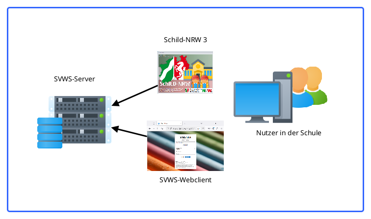
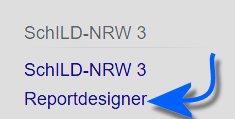

# SchILD-NRW 3

## Das Programm SchILD-NRW 3

::: warning

SchILD-NRW 3 hat mit der der Version 3.2 und dem
SVWS-Server Version 1.1.1 die Beta verlassen und ist damit für den
Produktivbetrieb freigegeben. Wenn Sie von der Beta umsteigen, beachten
Sie bitte, dass auch die Reportsammlung in der Version 1.0 vorliegt.
Diese wird beim Update nicht automatisch aktualisiert, bitte laden Sie
die aktuelle Reportsammlung auf <https://svws.nrw.de>
herunter.

:::

## Was ändert sich im Vergleich zu SchILD-NRW 2

## Installation SchILD-NRW 3In diesem Abschnitt stehen technische Hintergründe zu Installation und
Administration von SchILD-NRW 3.

Die Dokumentation des SVWS-Servers und zur Benutzung des SVWS-Clients
inklusive der Installation finden Sie auf <https://doku.svws-nrw.de>.

  

## Einführung in wesentliche Funktionen von SchILD-NRW 3In diesem Abschnitt finden sich prägnante Erläuterungen zum Aufbau von
SchILD-NRW 3, um den Einstieg zu erleichtern.

## KarteireiterIn diesem Abschnitt werden alle Karteireiter von SchILD-NRW 3
detailliert erklärt. Neben diesen rein auf den Reiter bezogenen Inhalten
finden sich gegebenenfalls Erklärungen zu den mit den Reitern
verbundenen Arbeitsprozessen sowie Beispiele, Hinweise und Tipps.
Prozesse, die sich aufgrund ihrer Art oder Komplexität nicht einem
einzigen Reiter zuordnen lassen, finden Sie bei den *Tutorials*.

### Karteireiter Verwaltung------------------------------------------------------------------------

### Karteireiter Lehrkräfte------------------------------------------------------------------------

### Karteireiter Schüler------------------------------------------------------------------------

### Karteireiter Auswahl

### Karteireiter GruppenprozesseIn diesem Abschnitt werden alle Gruppenprozesse aufgeführt. Je nach
Schulform, Jahrgang oder anderen Kriterien werden für die jeweils
gewählte Schülergruppe nicht zutreffende Gruppenprozesse ausgeblendet.
Weitere Arbeitsprozesse finden Sie bei den *Tutorials*.

### Karteireiter KatalogeIn diesem Abschnitt werden die diversen Kataloge von SchILD-NRW 3
erklärt. Weiterhin finden sich Hinweise, Beispiele und Tipps zum Aufbau
der Kataloge in der Praxis.

### Karteireiter Reportverwaltung

In diesem Abschnitt wird die Reportverwaltung erläutert. Nehmen Sie für
den Zeugnisdruck die Artikel unter den allgemeinen *Tutorials* weiter
unten zur Kenntnis.-   [Menüband](../../Verwaltung_Administration/Menüband_(Reportverwaltung).md)
-   

WIKILINK: Die_Ordnerstruktur_der_ReportverwaltungVertiefende Informationen zur Reportverwaltung und zum Reportdesigner
finden den Sie [hier](Reportdesigner.md).  

## Tutorials

::: warning

In diesem Abschnitt finden sich zum einen knappe Artikel
dazu, wie einige sehr spezielle Prozesse umsetzen sind, etwa die
Aufnahme von Flüchtlingskindern. Zum anderen finden sich auch teils sehr
umfangreiche Anleitungen, zum Beispiel zum Zeugnisdruck.

:::

Folgende Artikel verfügen über

**

DEADLINK: Videotutorials - :Kategorie:Video.md

**.

### Allgemeine Tutorials------------------------------------------------------------------------

### Schulformenspezifische Tutorials------------------------------------------------------------------------

### Fächer und Leistungsdaten------------------------------------------------------------------------

### Versetzung, Abschlüsse und Zeugnisdruck