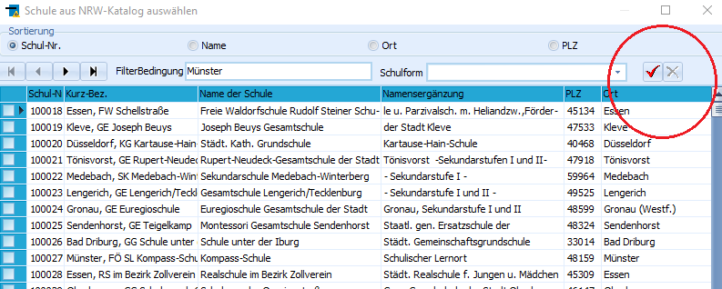

# Schulen in NRW (Allgemeine Kataloge)

Über diesen Katalog wird eine Liste der Schulen aus NRW erstellt, die
nach den schulspezifischen Bedürfnissen ausgewählt und sortiert
angezeigt werden kann.In diese Liste werden in der Regel die Nachbarschulen und die Schulen im
Einzugsbereich der eigenen Schule eingetragen beziehungsweise sind hier
Schulen aufgelistet, mit denen die eigene Schule schon einmal durch
Aufnahme beziehungsweise Abgabe einer Schülerin oder eines Schülers
Verbindung hatte (oder z.B. bei Abordnungen mit Kolleginnen und
Kollegen).

Die Sortierung kann oben über *Sortierung* gewählt werden (Bezeichnung,
PLZ, Ort, Schulnummer oder benutzerdefiniert).Klickt man auf das Plus **+**, wird eine Liste aller Schulen in NRW
angezeigt, aus der man weitere gewünschte Schule übernehmen kann. Man
kann an dieser Stelle nach Schulnummer, Name, Ort oder PLZ filtern.

::: warning

Beim Nutzen dieser Filterbedingung und nach Eingabe
eines Ortes, Schulnummer o.ä. bitte nicht unten auf den Button
*Übernehmen* klicken, sondern auf den roten Haken neben den
Eingabefeldern. Danach die Schule auswählen und dann mit *Übernehmen*
dem Katalog hinzufügen.

:::