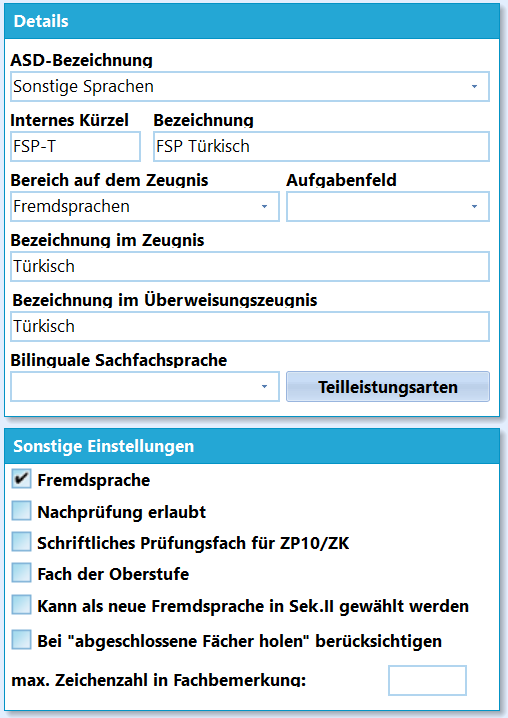
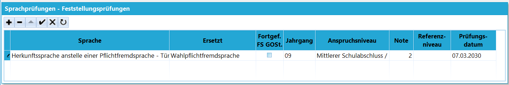
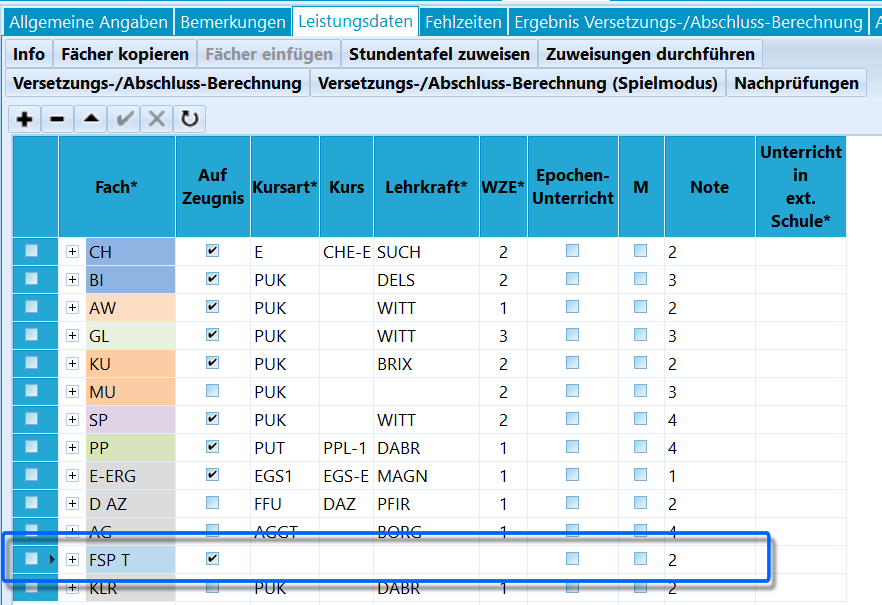

# Sprachprüfung Feststellungsprüfung anstelle von Pflicht- oder Wahlpflichtfremdsprachen (Tutorial)

Dieser Artikel behandelt die **Sprachprüfung (Feststellungsprüfung)
anstelle von Pflichtfremdsprachen oder Wahlpflichtfremdsprachen nach
BASS 13-61 Nr. 1**.**Zielgruppe:**-   Die Sekundarstufe I der deutschen Schule wurde nicht von Beginn an
    besucht und
-   eine Eingliederung in das Sprachenangebot der Schule konnte nicht
    erfolgen und
-   die Amtssprache des Herkunftslandes konnte nicht anstelle einer
    Pflicht- oder Wahlpflichtfremdsprache weitergeführt werden.**Ersatz:** Die Sprachprüfung ersetzt-   die erste Pflichtfremdsprache (Englisch) oder
-   die zweite Pflichtfremdsprache oder
-   die dritte Wahlpflichtfremdsprache.

Das Ergebnis ist vollumfänglich versetzungs- und abschlussrelevant.

## Anstelle der 1. Fremdsprache EnglischSoll eine Amtssprache Englisch ersetzen, so nehmen die Schülerinnen und
Schüler im Rahmen der Möglichkeiten am Regelunterricht oder an einem den
Regelunterricht ergänzenden Unterricht im Fach Englisch teil.

Die Teilnahme am Englischunterricht wird auf den Zeugnissen der
Sekundarstufe I unter Bemerkungen dokumentiert.

### Zeugnisbemerkungen

#### Zeugnisse innerhalb der SI bei ergänzender Teilnahme am Englischunterricht

Das Fach Englisch kann auf dem Zeugnis aufgenommen werden.Als Note wird dann *"Teilgenommen"* eingetragen.Als Zeugnisbemerkung wird zum Beispiel folgendes eingetragen:` `***`"$Vorname$ hat am Unterricht im Fach Englisch teilgenommen."`***

#### Abschlusszeugnis oder Versetzungszeugnis Ende der SI im Prüfungsjahr

Die Prüfungsnote wird von der Schule, der Einrichtung der Weiterbildung
beziehungsweise der besonderen Einrichtung des Schulwesens anstelle
der 1. Fremdsprache in das Abschlusszeugnis bzw. in das
Versetzungszeugnis übertragen.In der Spalte Bemerkungen ist aufzunehmen:` `***`"

Die Note in SPRACHE wurde aufgrund der Sprachprüfung gemäß RdErl. d. KM v. 10.03.1992 (BASS 13-61 Nr. 1) erteilt."`***

#### Abschlusszeugnis und Abgangszeugnis Ende der Sekundarstufe I

Das GER-Referenzniveau wird unter den Fremdsprachennachweisen mit
erreichten Niveau aufgenommen.In der Spalte Bemerkungen ist aufzunehmen:` `***`"

Das für SPRACHE ausgewiesene Niveau wurde durch eine Sprachprüfung auf dem Anspruchsniveau des Mittleren Schulabschlusses (Fachoberschulreife) in Klasse 10 erreicht."`***

#### Abschlusszeugnis oder Versetzungszeugnis Ende der EF im Prüfungsjahr (je nach Laufbahn)

Die Prüfungsnote wird von der Schule, der Einrichtung der Weiterbildung
bzw. der besonderen Einrichtung des Schulwesens anstelle der 2. oder 3.
Wahlpflichtfremdsprache in das Abschlusszeugnis bzw. in das
Versetzungszeugnis übertragen.In der Spalte Bemerkungen ist aufzunehmen:` `***`"

Die Note in SPRACHE wurde aufgrund der Sprachprüfung gemäß RdErl. d. KM v. 10.03.1992 (BASS 13-61 Nr. 1) erteilt."`***

#### Abiturzeugnis

Das GER-Referenzniveau wird unter Fremdsprachen auf Seite 4 des
Abiturzeugnisses mit dem Niveau B1 aufgenommen.In der Spalte Bemerkungen ist aufzunehmen:` `***`"

Das für SPRACHE ausgewiesene Niveau wurde durch eine Sprachprüfung in Klasse 10 erreicht."`***

### PrüfungsbescheinigungSchülerinnen und Schüler, die sich der Sprachprüfung unterzogen haben,
erhalten eine Bescheinigung nach dem Muster der Anlage 1 BASS 13-61
Nr. 1. Dort ist dokumentiert, an welche Stelle die geprüfte Sprache
tritt.-   Die Prüfungsnote **"ausreichend" (Niveau EESA)** führt zur
    Bescheinigung des Referenzniveaus **A2/B1** unter "Bemerkungen"
    (s.o.)
-   Die Prüfungsnote **"ausreichend" (Niveau MSA)** führt zur
    Bescheinigung des Referenzniveaus **B1** unter "Bemerkungen" (s.o.)
-   Die Prüfungsnote **"ausreichend" (Niveau MSA)** berechtigt zur
    Teilnahme am Unterricht im Fach Englisch als fortgeführte
    Fremdsprache in der gymnasialen Oberstufe.

### ZP10Am Ende der Sekundarstufe I ermöglicht die Schule diesen Schülerinnen
und Schülern, gegebenenfalls durch Nutzen von Prüfungsunterlagen
benachbarter Schulen anderer Schulformen, an der Zentralen Prüfung
Englisch zum Mittleren Schulabschluss (Fachoberschulreife) oder zum
Erweiterten Ersten Schulabschluss teilzunehmen.

Die in der Zentralen Prüfung erreichte Note wird nicht in die
Entscheidung über die Versetzung oder die Vergabe der Berechtigung zum
Besuch der gymnasialen Oberstufe einbezogen.

## Anstelle der 2./3. Fremdsprache

### Zeugnis: Abschlusszeugnis oder Versetzungszeugnis Ende der SI

Die Prüfungsnote wird von der Schule, der Einrichtung der Weiterbildung
bzw. der besonderen Einrichtung des Schulwesens anstelle der 2. oder 3.
Fremdsprache in das Abschlusszeugnis bzw. in das Versetzungszeugnis
übertragen. In der Spalte Bemerkungen ist aufzunehmen:`  `***`"

Die Note in _________ wurde aufgrund der Sprachprüfung gemäß RdErl. d. KM v. 10.03.1992 (BASS 13-61 Nr. 1) erteilt."`***

### Zeugnis: Abschlusszeugnis und Abgangszeugnis Ende der Sekundarstufe I

Die GER-Referenzniveau wird unter den Fremdsprachennachweisen mit
erreichten Niveau aufgenommen. In der Spalte Bemerkungen ist
aufzunehmen:`  `***`"

Das für SPRACHE ausgewiesene Niveau wurde durch eine Sprachprüfung auf dem Anspruchsniveau des Mittleren Schulabschlusses (Fachoberschulreife) in Klasse 10 erreicht."`***

### Zeugnis: Abiturzeugnis

Die GER-Referenzniveau wird unter Fremdsprachen auf Seite 4 des
Abiturzeugnisses mit dem Neviau B1 aufgenommen. In der Spalte
Bemerkungen ist aufzunehmen:`  `***`"

Das für SPRACHE ausgewiesene Niveau wurde durch eine Sprachprüfung in Klasse 10 erreicht."`***

### PrüfungsbescheinigungSchülerinnen und Schüler, die sich der Sprachprüfung unterzogen haben,
erhalten eine *Bescheinigung nach dem Muster der Anlage 1 BASS 13-61 Nr.
1*.Dort ist dokumentiert, an welche Stelle die geprüfte Sprache tritt.-   Die Prüfungsnote **"ausreichend" (Niveau EESA)** führt zur
    Bescheinigung des Referenzniveaus **A2/B1** unter "Bemerkungen"
    (s.o.).
-   Die Prüfungsnote **"ausreichend" (Niveau MSA)** führt zur
    Bescheinigung des Referenzniveaus **B1** unter "Bemerkungen" (s.o.).
-   Die Prüfungsnote **"ausreichend" (Niveau MSA)** berechtigt zur
    Teilnahme am Unterricht im Fach Englisch als fortgeführte
    Fremdsprache in der gymnasialen Oberstufe.

## AusnahmenAuf eine Sprachprüfung bei Schülerinnen und Schülern kann verzichtet
werden, wenn das entsprechende Referenzniveau des Gemeinsamen
europäischen Referenzrahmens (GeR) durch ein von einem anerkannten
Bildungsträger abgenommenes **Fremdsprachenzertifikat** nachgewiesen
wird.-   A2 für den Ersten Schulabschluss (ESA),
-   A2/B1 für den Erweiterten Ersten Schulabschluss (EESA) und
-   B1 für den Mittleren Schulabschluss (Fachoberschulreife - MSA), der
    mit der Berechtigung zum Besuch der gymnasialen Oberstufe (MSAQ-E)
    verbunden sein kann.Für den Erwerb des Ersten Schulabschlusses (ESA) und des Erweiterten
Ersten Schulabschlusses (EESA) ist die Sprachprüfung in den folgenden
Fällen entbehrlich:-   Für Schülerinnen und Schüler, die aus der Klasse 9 oder der Klasse
    10 einer Schule des Herkunftslandes unmittelbar in die deutsche
    Schule eintreten, wird für die Vergabe der vorgenannten Abschlüsse
    die im Herkunftsland zuletzt erteilte Note für den Unterricht in der
    Amtssprache des jeweiligen Herkunftslandes übernommen
-   Für Schülerinnen und Schüler, die die deutsche Schule erst ab der
    Klasse 7 oder der Klasse 8 besuchen und bis zum Schulabschluss an
    einem den Regelunterricht ergänzenden Unterrichtsangebot in der
    Amtssprache des Herkunftslandes im Umfang von mindestens drei
    Wochenstunden regelmäßig teilgenommen haben, wird für die Vergabe
    der vorgenannten Abschlüsse die in diesem Unterricht zuletzt
    erteilte Note übernommen

### Abschlusszeugnis ESA und EESA Ende der SI

Die Noten werden in diesen entbehrlichen Fällen von der Schule anstelle
von Englisch in das Abschlusszeugnis übertragen. In die Spalte
Bemerkungen ist aufzunehmen:`  `***`"

Die Note in _________ wurde aufgrund einer Leistung erteilt, die im Herkunftsland / in einem den Regelunterricht ergänzenden Unterrichtsangebot des Landes Nordrhein-Westfalen erbracht wurde."`***

## Einstellungen in SchILD-NRW

### Unterrichtsfächer

 Legen Sie ein Fach für die Prüfungssprache an. Gehen Sie
hierzu über *Kataloge* ➜ **Unterrichtsfächer** und legen Sie über das
**+** ein Fach mit den folgenden Daten an. Hierbei wird mitunter die
Abkürzung FSP genutzt, um die Feststellungsprüfung deutlich zu machen.Im Beispiel für die Sprache Türkisch verwendet und die konkreten
Einträge sollen auch als Beispiel verstanden werden.-   **ASD-Bezeichnung**: SR - Sonstige Sprache
-   **Internes Kürzel**: FSP-T
-   **Bezeichnung**: FSP Türkisch
-   **Bereich auf dem Zeugnisdruck**: Fremdsprachen
-   **Bezeichnung im Zeugnis**: Türkisch
-   **Bezeichnung im Überweisungszeugnis**: Türkisch
-   Sonstige Einstellungen zum Anhaken: Haken Sie **Fremdsprache** im
    Detailbereich an. Dann stellen Sie sicher, dass **auf Zeugnis** und
    **sichtbar** in der Fachübersichtsliste ebenfalls angehakt sind.
    Diese beiden Haken sollten aber bei der Facherstellung gesetzt
    werden.
-   Sollte die Feststellungsprüfung in einem Jahrgang vor dem
    Abschlussjahrgang stattfinden, sollte der Haken bei *Abgeschlossene
    Fächer holen* gesetzt werden.Legen Sie das Fach mit dem Haken in der Kopfzeile über den Fächern an.

::: warning

Nach Anlegen des Faches sollte SchILD-NRW neu gestartet
werden, damit die Kataloge vollständig neu eingelesen
werden.

:::  

### SprachenfolgeTragen Sie das Fach in die Sprachenfolge auf dem Reiter *Schüler* ➜
**Laufbahninfo** unter **Sprachprüfungen - Feststellungsprüfungen** ein.Fügen Sie die Prüfung mit einem **+** hinzu und wählen Sie
*Herkunftssprache anstelle einer Pflichtsprache - SPRACHE* aus.Dann ist anzuwählen, welche der nach der APO vorgesehenen Fremdsprachen
ersetzt wird, also die *1.* oder *2. Pflichtfremdsprache* oder die
*Wahlpflichtfremdsprache*.Wählen Sie mit dem Haken an, ob es sich um eine in der *Gymnasialen
Oberstufe fortgeführte Sprache* handelt, dann geben sie den **Jahrgang**
an, in dem die Sprachprüfung das Niveau festgestellt hat.Unter **Anspruchsniveau** ist das Niveau anzugeben, für welchen
Abschluss die Sprachprüfung mit der erreichten Note/Jahrgang/Qualität
steht. Relevant ist dies besonders, wenn es um das Erreichen des Qs zum
Besuch der gymnasialen Oberstufe geht oder um ein Erfüllen anderer
Versetzungskriterien.Unter **Note** und **Datum** sind die Ergebnisse dieses Prüfungstages
abzulegen. Es sind Noten ohne Tendenzen vorgesehen.Schlussendlich sind noch das **Referenzniveau** zu erfassen, wenn die
Prüfung in einer Sprache abgelegt wird, der im gemeinsamen europäischen
Referenzrahmen (GER) enthalten ist (Stand 2025: English, Französisch,
Spanisch, Deutsch). Ansonsten bleibt das Feld frei.

  

### Leistungsdaten für Abschluss- und Versetzungszeugnis

Zuerst muss das Fach, mit dem eine Feststellungsprüfung ausgewiesen
wird, im *Katalog* ➜ **Unterrichtsfächer** angelegt sein. Dieser Punkt
wurde weiter oben in dieser Anleitung schon beschrieben.Nun gilt es, dem Schüler dieses Fach auch in den Leistungsdaten des für
den Abschluss relevanten aktuellen Halbjahrs auszuweisen.Fügen Sie also das im Katalog definierter Fach den Leistungsdaten des
Schülers unter *Schüler ➜ Akt. Halbjahr ➜ Leistungsdaten* ein
Unterrichtsfach hinzu.Es werden nur **Fach** und **Note** gesetzt, die Daten zum Unterricht
wie **Kursart**, **Lehrkraft** oder **Wochenzeiteinheiten** bleiben
*leer*, da kein Unterricht stattfand.Setzen Sie auch die **Zeugnisbemerkung**:` `***`

Die Note in Türkisch wurde aufgrund der Sprachprüfung gemäß RdErl. d. KM v. 10.03.1992 (BASS 13-61 Nr. 1) erteilt.`***

Das Beispielfach hier wäre etwa *FSP-T* oder *FSP Türkisch*.