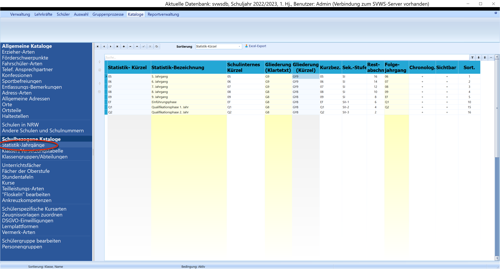

# Statistik-Jahrgänge (Schulbezogene Kataloge)

Bei den Statistik-Jahrgängen handelt es sich um eine entscheidende
Tabelle in Schild-NRW. Hier wird festgelegt, welche Jahrgänge in den
Bildungsgängen zur Verfügung stehen und wie diese an die Statistik
übermittelt werden.Dabei gibt es folgende Einstellungsmöglichkeiten:-   **Statistik-Kürzel** und **Statistik-Bez.**: Hier wählen Sie den
    Jahrgang aus, der an die Statistik (ASDPC32) übermittelt werden
    soll. Sie können hier nur aus Optionen, die für Ihre Schulform
    vorgegeben sind!
-   **Schulinternes Kürzel**: An dieser Stelle können Sie dem Jahrgang
    eine eigene individuelle Bezeichnung geben. Diese Bezeichnung wird
    an den meisten Stellen in Schild-NRW angezeigt und steht i.d.R. als
    ASD-Jahrgang zur Verfügung.
-   **Gliederung (Klartext)**: Hier tragen Sie die Gliederung für den
    Bildungsgang ein. An den meisten Schulen steht hier nur *"Standard
    für diese Schulform"* zur Verfügung. Es werden alle Gliederungen
    angezeigt, die unter "Verwaltung" ➜ "Schule" ➜ "Allgemeine Angaben"
    eingetragen sind.

::: warning

An Grundschulen kann es z.B. die Gliederung für kath.
oder ev. Bekenntnisschulen oder die Gemeinschaftsschule geben, während
an Sekundarschulen häufig auslaufende Gliederungen für Realschule oder
Hauptschule auftreten. An Gesamtschulen kann z.B. eine zusätzliche
Gliederung für einen gymnasialen Bildungsgang vorhanden sein. Bitte
informieren Sie sich bei Ihrer Bezirksregierung oder bei IT.NRW, welche
Gliederungen bei Ihrer Schule eingetragen werden müssen, wenn Sie sich
nicht sicher sind. An Berufskollegs müssen hier alle vorhandenen
Bildungsgänge eingetragen werden, so dass für jeden Jahrgang in jeder
Gliederung ein Statistikjahrgang zur Verfügung steht.

:::

-   **Gliederung (Kürzel)**: Hier steht ein dreistellige

s
    Statistikkürzel. (\*\*\* bei Standard-Gliederung)
-   **Kurzbez.**: Hier können Sie eine Kurzbezeichnung vergeben, die zum
    Beispiel im Listendruck mit dem Reportbaukasten verwendet werden
    kann.
-   **Sek.-Stufe**: Hier werden die Jahrgänge der Primarstufe (Pr), der
    Sekundarstufe I oder der Sekundarstufe II zugeordnet.

::: warning

Bei der Sek-II sind in der gymnasialen Oberstufe und bei
den BKs "SII-1" bis "SII-3" einzutragen, so dass SchILD bei Bedarf die
Karteireiter "Abitur" und "FHR" einblenden kann. Alle weiteren Jahrgänge
am BK werden mit SII-BK gekennzeichnet.

:::

-   **Restabschn.**: Dies sind die Abschnitte bis zum Abschluss de

r
    Schulform. Zum Beispiel an der Grundschule: für 1. Schulbesuchsjahr
    8, bei E2 und E3 jeweils 6, Klasse 4 noch 2 Restabschnitte) oder im
    Gymnasium wären in der Q2 noch zwei Restabschnitte einzutragen.
    Beachten Sie daher bitte, ob Sie für Ihre Schule pro Schuljahr zwei
    Halbjahre oder vier Quartale konfiguriert haben, denn somit hätte
    jedes Schuljahr jeweils zwei Halbjahre oder vier Quartale als
    Restabschnitte.

::: warning

Diese Spalte sollte ausgefüllt werden, denn mit diesen
Angaben wird das Datum des voraussichtlichen Abschlusses berechnet. Im
Nachhinein kann die Berechnung über einen Gruppenprozess angestoßen
werden.

:::

-   **Folgejahrgang**: In dieser Spalte können Sie für jeden Jahrgan

g
    einen Folgejahrgang definieren. Schild-NRW richtet sich dann bei der
    Versetzung ins neue Schuljahr nach diesem Katalog. Sollten Sie
    ungewöhnliche Jahrgangsfolgen haben oder verschiedene Bildungsgänge
    von denen in einem Jahrgang dann in eine andere Gliederung (BK)
    gewechselt werden muss, so können Sie diese Spalte verwenden. Bei
    Abschlussjahrgängen bleibt die Spalte leer.

::: warning

Wenn ein Folgejahrgang eingetragen ist, dann muss dies
für alle bestehenden Jahrgänge gemacht werden. Sind alle Folgejahrgänge
leer, richtet sich Schild-NRW nach der Klassen-/Versetzungstabelle.
Diese Spalte ist also optional.

:::

-   **Chronol.**: Hier wird festgelegt, ob die Jahrgänge in eine

r
    Schulgliederung chronologisch aufeinander folgen. Diese Chronologie
    sollte dann über die Sortierung mit den "roten Pfeilen" eingestellt
    werden. Die chronologische Sortierung ist immer dann wichtig, wenn
    in der Klassen-/Versetzungstabelle kein Folgejahrgang eingestellt
    ist. Dann richtet sich SchILD-NRW bei der Versetzung hier nach dem
    "Folgejahrgang". Aus Übersichtsgründen sollten aufeinander folgende
    Jahrgänge auch chronologisch sortiert werden.<!-- -->-   **Sichtbar**: In dieser Spalte kann eingestellt werden, ob ein
    Jahrgang bei der Arbeit in Schild-NRW sichtbar ist. Sollte einmal
    ein Jahrgang in Ihrer Schulform wegfallen, so kann dieser auf
    unsichtbar geschaltet werden, wenn die Anzeige nicht mehr benötigt
    wird. Ein Beispiel wäre der Jahrgang 10 der Sek1 am Gymnasium mit
    G8. Bitte achten Sie aber darauf, dass Sie diesen Jahrgang erst
    unsichtbar markieren, wenn keine Schüler mehr aktiv sind, die diesen
    Jahrgang noch benötigen, z.B. in vergangenen Abschnitten!<!-- -->-   **Sortierung**: Hier kann, wie in allen Katalogen, die Reihenfolge
    der Anzeige bestimmt werden. Bitte beachten Sie in diesem Sonderfall
    den Zusammenhang mit der Spalte "chronologisch".