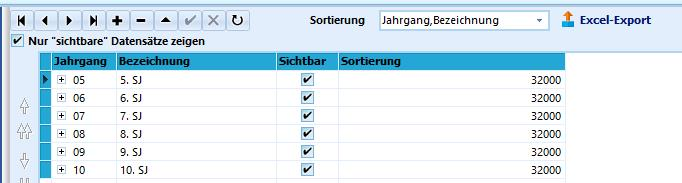
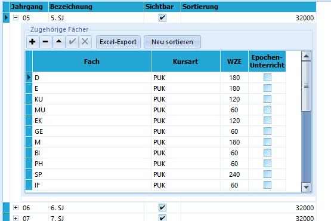

# Stundentafel (Schulbezogene Kataloge)

 Die Stundentafeln werden genutzt, um ganzen Klassen,
Jahrgängen oder Schülergruppen auf einmal einen bestimmten Satz von
Unterrichtsfächern zuzuordnen.Typischerweise ist dies der Klassenunterricht. Diese Fächerzuordnung
findet ohne Kursbezeichnung nur mit einer bestimmten Kursart statt:
PUK - Pflichtunterricht für die (gesamte) Klasse.Zunächst legt man im oberen Teil des Dialogfensters über das Plussymbol
**+** eine neue Stundentafel an.Geben Sie dieser einen **Jahrgang**, für den die Stundentafel gelten
soll. Bleibt das Jahrgangsfeld leer, gilt ist die Stundentafel
jahrgangsübergreifend.In der Schulform *Berufskolleg* kann für die Stundentafel noch die
Fachklasse gewählt werden, für die die Stundentafel gelten soll.  

 Ist die Stundentafel angelegt, können im unteren Bereich
des Fensters die einzelnen Fächer hinzugefügt werden.

Die Fächer können mit **Kursart** und **Wochenstundenzahl** angelegt
werden.Im Beispiel finden sich bei **WZE** so hohe Zahlen, da die Schule die
WZE in *Minuten* erfasst. Üblicherweise werden hier 45-Miunuten-Blöcke
eingetragen.Sollte die Anzahl der Wochenstunden zum Beispiel in einem Jahrgang
variieren, so kann man diese weglassen oder einen Standardwert nehmen,
den man später noch ändern kann.

Das Anlegen von Stundentafeln kann als Vorbereitung zur Zuweisung von
Klassenunterricht gesehen werden.

::: warning

Die Einrichtung der Stundentafeln legt noch keine
Datensätze in den Leistungsdaten der Schüler an. Diese Zuordnung wird
später über Gruppenprozesse vorgenommen.

:::  ::: warning

Erst mit dem Gruppenprozess Stundentafeln zuweisen
werden diese bei den Schülern aktiviert. In aller Regel werden dann die
fehlenden Angaben zum unterrichtenden Lehrer über den Gruppenprozess
Klassenunterrichte bearbeiten vervollständigt.

:::