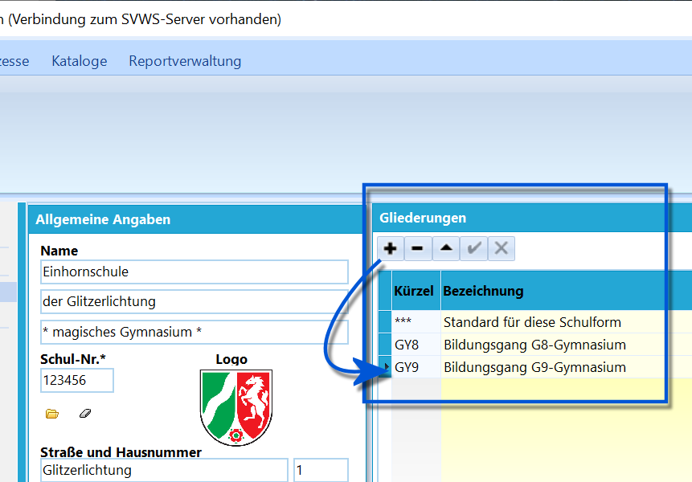
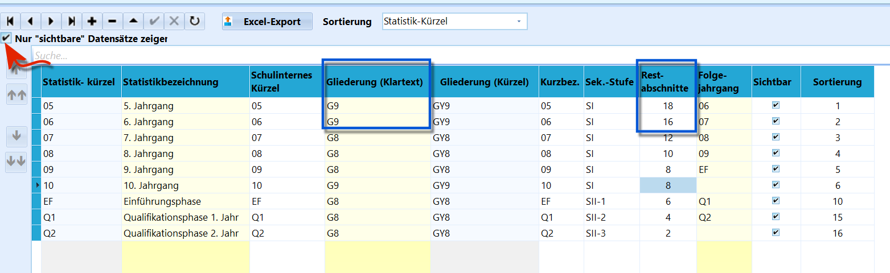
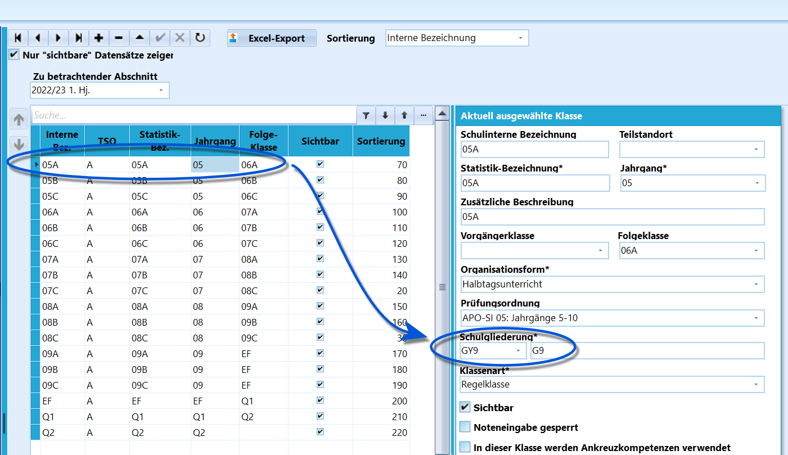
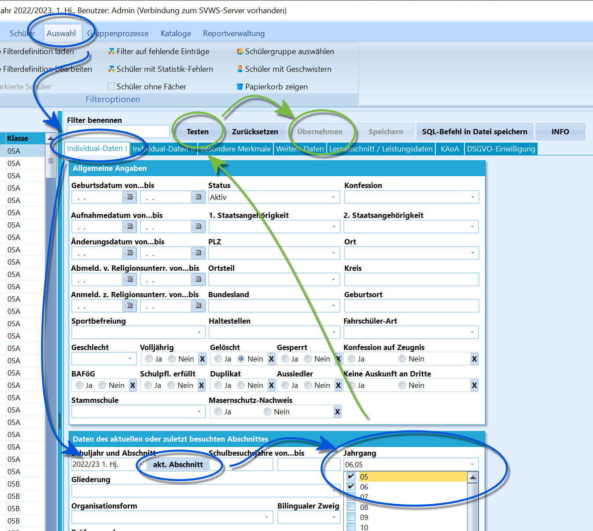
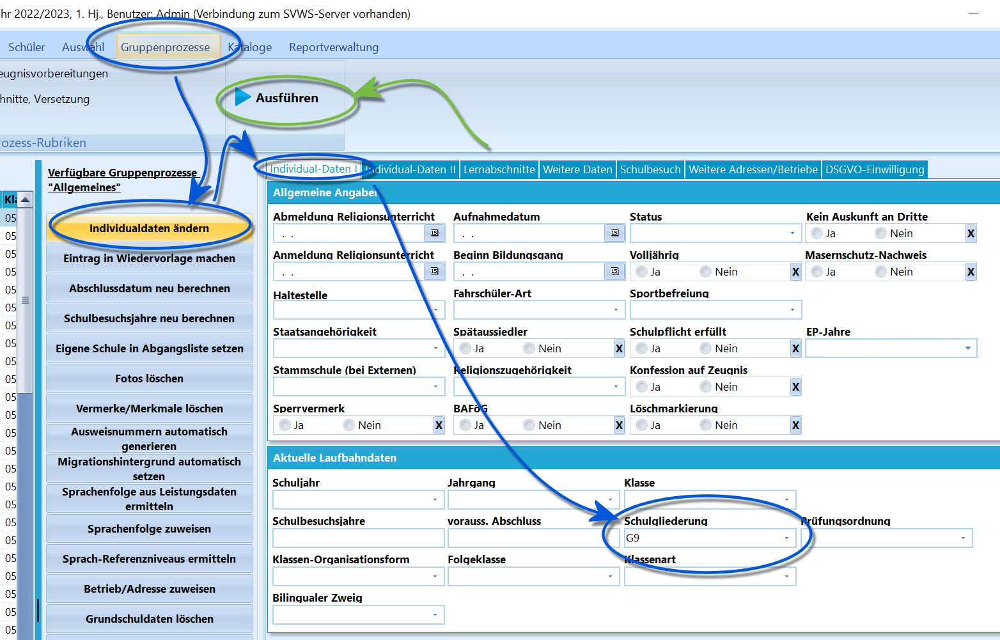
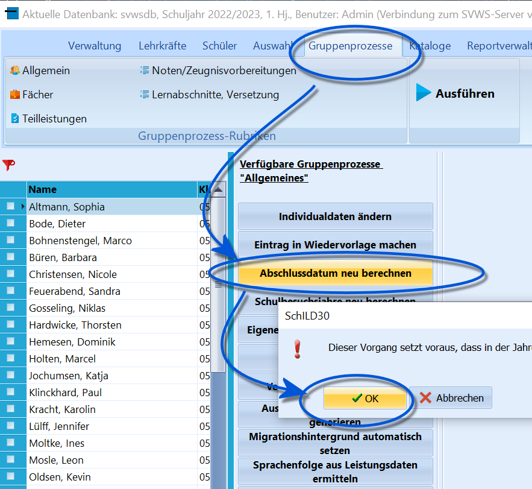

# Umstellung der Gymnasien von G8 auf G9 (Tutorial)

Diese Anleitung führt schrittweise durch die Umstellung eines Gymnasiums
von G8 zu G9. Hierbei ist zu beachten, dass für die Umstellung jedes
Jahr eine Anpassung vorzunehmen ist, bis alle Jahrgänge in G9 laufen.

Die Maßnahmen zur Umstellung werden im Rahmen eines Schuljahreswechsels
vorgenommen.

### 1. Update auf die aktuelle Version von SchILD-NRWAchten Sie darauf, vor der ersten Umstellung auf eine aktuelle Version
von SchILD-NRW zu installieren.

### 2. Führen Sie die Versetzung ins neue Schuljahr durchBevor Umstellungen vorgenommen werden, wird die Schule in das neue
Schuljahr versetzt und alle Prozesse, die mit Klassen und Jahrgängen in
diesem Zuge vorgenommen werden, sind abzuschließen.

### 3. Fügen Sie der Schule die Gliederung G9 hinzu

 Gehen Sie über *Verwaltung ➜ Schule ➜ Allgemeine Angaben*
und fügen Sie die Gliederung GY9 der Schule hinzu, so dass diese für
Jahrgänge und bei den Schülern gesetzt werden kann.  

### 4. Anpassen der Statistikjahrgänge

 Öffnen Sie *Kataloge* ➜ **Statistik-Jahrgänge**.Ändern Sie in der Spalte **Gliederung Klartext** mit Hilfe des
Auswahlmenüs die Einträge der Jahrgangsstufen 5 und 6 von "**\*\*\***"
auf "**GY9**". Der alte Jahrgang 5, nun nach der Versetzung Jahrgang 6,
läuft als GY9 weiter. Die neuen 5er werden als GY9 aufgenommen.Korrigieren Sie in der *Jahrgangsstufe 5* die Spalte **Restabschnitte**
auf den Wert *18* und in der *Jahrgangsstufe 6* auf den Wert *16*, also
jeweils 2 mehr.Sofern sie in Schild-NRW keinen Halbjahresbetrieb, sondern den
Quartalsbetrieb eingerichtet haben, müssen hier die Restabschnitte 36
und 32 eingetragen werden, also jeweils 4 mehr.Ändern Sie anschließend auf gleiche Weise in der Spalte "Gliederung
Klartext" mit Hilfe des Auswahlmenüs die Einträge der *Jahrgangsstufen 7
bis Q2* von "**\*\*\***" auf "**GY8**".Bestätigen Sie eventuelle Änderungen mit dem Haken ✔.

::: warning

Der Schritt, dass schrittweise G9 und die Restabschnitte
angepasst werden, ist jedes Schuljahr zu wiederholen, bis der erste
G9-Jahrgang komplett bis zum Abitur durchgewandert ist. Fügen Sie bei
Bedarf den *Jahrgang 10* als *GY9-Jahrgang* hinzu, in den der erste
*GY9-Jahrgang 9* hineinwachsen wird.

:::  

### 5. Anpassen der Klassen- und Versetzungstabelle

 Öffnen Sie *Kataloge ➜ Klassen/Versetzungstabelle*.Wechseln sie in der *Aktuell ausgewählten Klasse*, hier im Beispiel die
05A, **Schulgliederung** auf *"GY9"*. Wiederholen Sie dies für alle
Klassen des 5. und 6. Jahrgangs.Korrigieren Sie für die Klassen 07A bis Q2 deren **Schulgliederung** auf
den Eintrag *"GY8"*.    

### 6. Anpassen der Gliederung bei den Schülern

 Nachdem die Schule auf G9 umgestellt wurde und auch die
Klassen angepasst wurden, sind noch die Schüler auf die korrekte
Gliederung umzustellen.Öffnen Sie *Auswahl ➜ Schülerfilter* und wählen Sie auf dem Reiter
*'Individual-Daten I* die Jahrgänge 5 und 6 aus, indem Sie bei
*Schuljahr und Abschnitt* auf **Akt. Abschnitt** klicken und dann bei
*Jahrgang* in der Liste die Jahrgänge 5 und 6 aktivieren.Klicken Sie auf **Testen**, es wird ein Fenster angezeigt, wie viele
Personen gefunden wurden.Klicken Sie auf **Übernehmen**, um mit der Auswahl weiterarbeiten zu
können.  

 Öffnen Sie nun *Gruppenprozesse ➜ Allgemein*.Klicken Sie auf die Schaltfläche **Individualdaten ändern** und tragen
Sie im folgenden Fenster auf dem Reiter *"Individual-Daten I"* im
Bereich *"Aktuelle Laufbahndaten"* unter **Schulgliederung** den Wert
*"GY9"* ein.Klicken Sie auf die Schaltfläche **Ausführen**.    
Wenn alle Einträge umgestellt und übertragen wurden, ist bei allen
Schülerinnen und Schülern der Klassen 5 und 6 auf dem Reiter
*"Individual-Daten I"* im Bereich *"Aktuelle Laufbahndaten"* die neue
Gliederung *"GY9"* zu sehen. Bei allen Schülern der Klassen 7 bis Q2
steht an dieser Stelle nun der Eintrag *"GY8"*.Auch auf dem Unterreiter *"Allgemeine Angaben"* des Reiters *"Akt.
Halbjahr"* ist die neue Schulgliederung für das Halbjahr zu erkennen.

### 7. Abschlussdatum neu berechnen

 Da mitunter die Restabschnitte bei Jahrgängen angepasst
wurden, empfiehlt es sich, das **Abschlussdatum** über den
entsprechenden Gruppenprozess neu zu berechnen.  

### 8. Wiederholung in folgenden SchuljahrenIn den zukünftigen Schuljahren müssen Sie nach der Versetzung die Punkte
4, 5 und 6 für die hochwachsenden Jahrgänge sukzessive wiederholen, da
diese durch die Versetzung zunächst in die Gliederung *"GY8"* rutschen.Der neue Jahrgang kann vor der Versetzung noch nicht angepasst werden,
denn beinhaltet er ja die SuS mit der auslaufenden Gliederung *"G8"*.