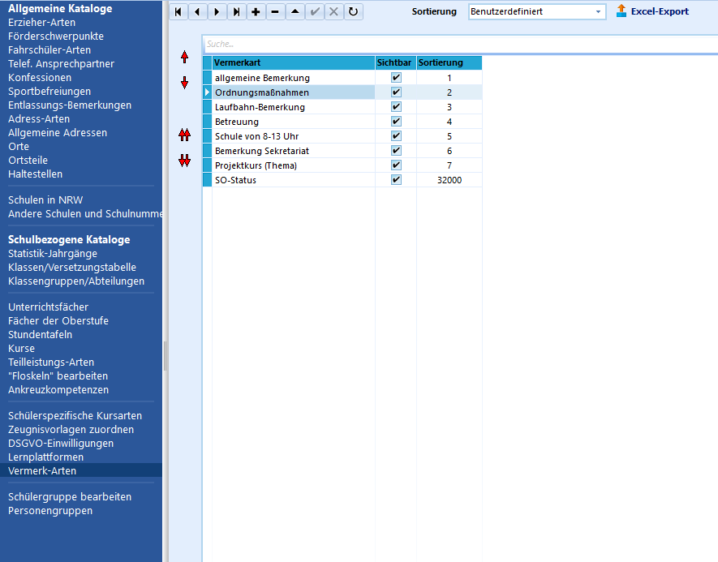
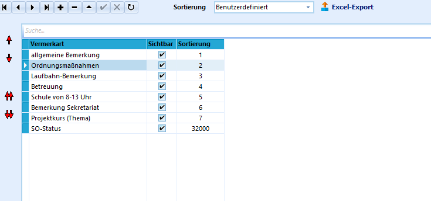

# Vermerk-Arten (Schulbezogene Kataloge)**Vermerk-Arten** dienen dazu, Bemerkungen, Eigenschaften,
Zugehörigkeiten zu bestimmten Schülergruppen o. ä. in SchILD zu
dokumentieren oder zu speichern.

Die jeweiligen Arten von Vermeken können dabei für die jeweilige Schule
**individuell** festgelegt werden, z. B. Versäumnisse von
Klassenarbeiten, Ordnungsmaßnahmen, Herkünfte der Schülerinnen und
Schüler usw.Nach Festlegung der an der Schule verwendeten Vermerk-Arten in diesem
Katalog können die jeweiligen Vermerke für die entsprechenden
Schülerinnen und Schülern unter Schüler ➜ Laufbahninfo ➜ Vermerke
zugewiesen bzw. **verwaltet** werden.  

## Anlegen neuer Vermerk-Arten

 Durch Klick auf das "+" kann eine neue Vermerkart
**angelegt** werden. In der Spalte "Vermerkart" wird die entsprechende
Bezeichnung eingetragen. Die Einträge in der Spalte "Sortierung" sollten
nicht manuell verändert werden, da es sonst zu ungewünschten bzw.
unerwarteten Sortierungen kommt. Eine individuelle Sortierung wird im
nächsten Abschnitt erläutert.  

## Sortierung der Vermerk-ArtenBei Verwendung der **Sortierung** "Vermerkart" sortiert das Programm
alphabetisch, wobei alle Großbuchstaben vor den Kleinbuchstaben
einsortiert werden. In dieser Reihenfolge werden die Vermerk-Arten auch
in der entsprechenden Auswahl im Programm sortiert.

 Ist eine **individuelle Sortierung** gewünscht, so kann
dies eingestellt werden. Die Pfeile am linken Rand werden damit
aktiviert und erlauben eine individuelle Reihenfolge. Im Beispiel
dargestellt ist die Verschiebung der Vermerkart "Ordnungsmaßnahmen".  

## Bearbeiten von Vermerk-ArtenDurch einen Doppelklick in das entsprechende Feld in der Spalte
"Vermerkart" kann die Bezeichnung bereits angelegter Vermerk-Arten
**geändert** werden.Der Haken in der Spalte "Sichtbar" schaltet die Sichtbarkeit in den
Auswahlmenüs ein oder aus. Dies bietet sich an, wenn bestimmte
Vermerk-Arten nicht in jedem Schuljahr benötigt werden.Ein Klick auf das "-" **löscht** die angelegte Vermerkart nach
Bestätigung einer Dialogabfrage.  

## Export in eine Excel-TabelleDurch Klick auf "Excel-Export" und "Speichern" im folgenden Fenster kann
die aktuelle Ansicht in eine **Excel-Tabelle** exportiert werden.