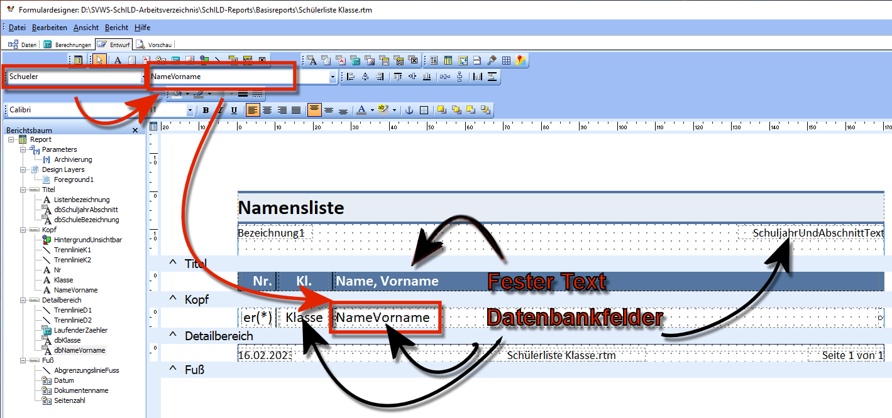
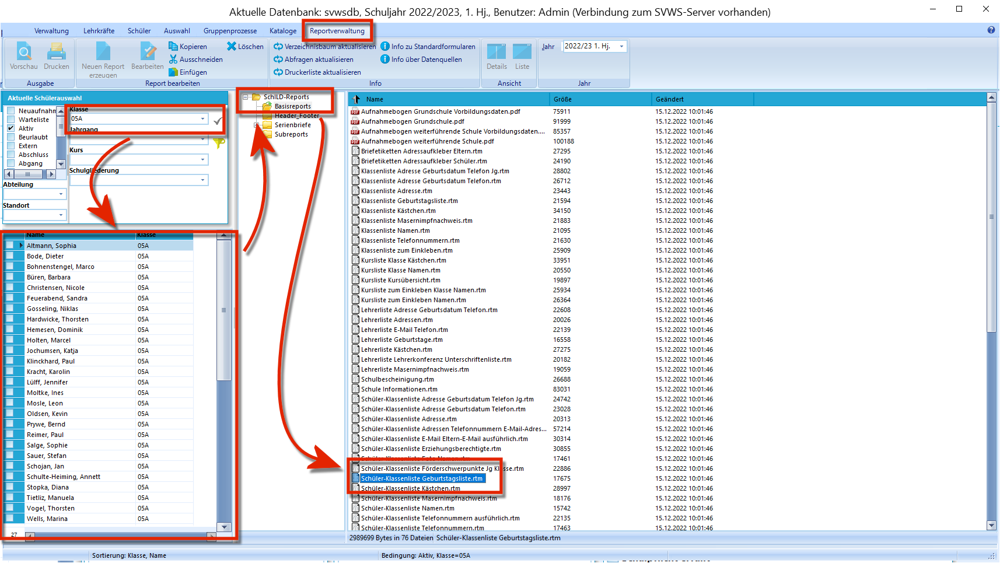
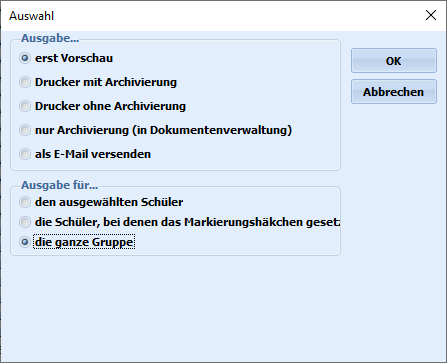
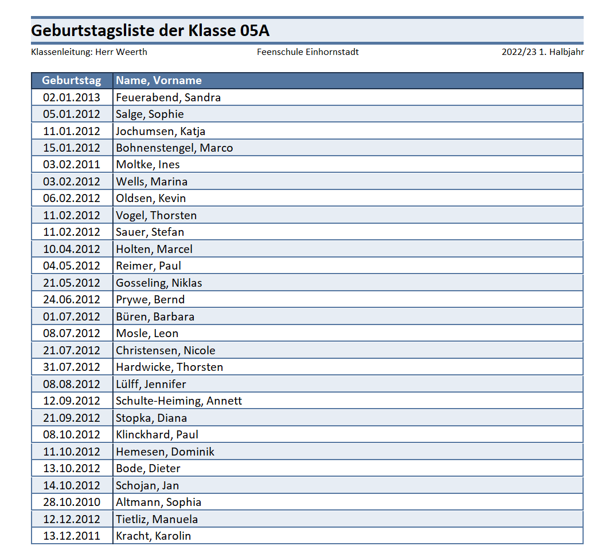
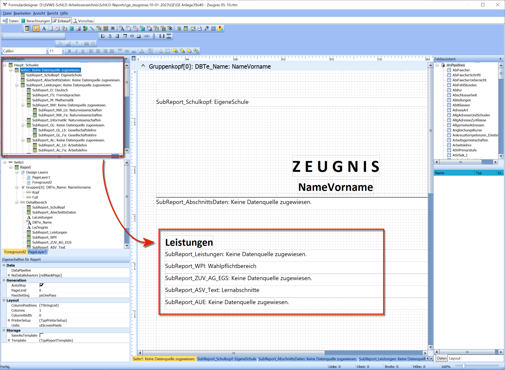
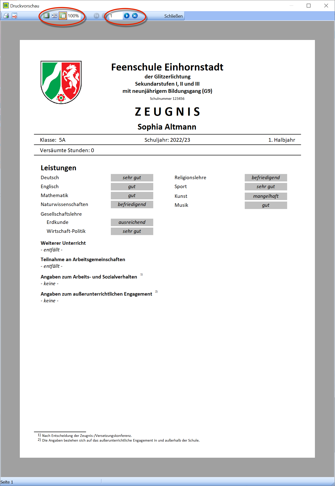
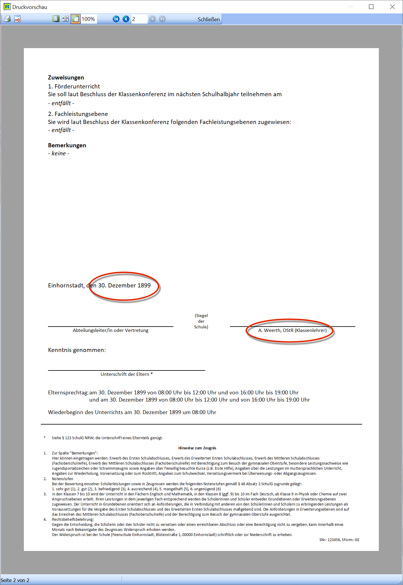

# Was leistet ein Report in SchILD-NRW 3?

## Was leistet ein Report in SchILD-NRW 3?Ein **Report** in **SchILD-NRW 3** ist eine Vorlage, die beschreibt, wie
Daten aus der Datenbank zu einem Dokument zusammengesetzt und ausgegeben
werden sollen.Ein Report enthält daher sowohl-   **Datenfelder** (z. B. Vorname, Nachname, Geburtsdatum)als auch-   **Formatierungsanweisungen** (z. B. Reihenfolge, Zeilenumbrüche,
    Schriftstile)Zum Beispiel könnte ein Report folgende Anweisung enthalten:        [VORNAME] [NACHNAME], [GEB_DATUM]

Die Begriffe in den eckigen Klammern stehen beispielhaft für
**Datenbankfelder**. Beim Ausführen des Reports werden diese Felder für
jeden ausgewählten Schüler mit den tatsächlichen Daten gefüllt.Sind beispielsweise die Schüler „Simon Müller“ und „Lisa Heinz“
ausgewählt, würde das Ergebnis wie folgt aussehen:        Simon Müller, 09.08.2019
        Lisa Heinz, 23.07.2019

## Beispiel: KlassenlisteAls Beispiel soll eine Klassenliste analysiert werden.

### Der Report „Klassenliste“

In der Kopfzeile wird die Darstellung der Klassenliste festgelegt. Diese
Kopfzeile ist farblich formatiert (blau/weiß) und bleibt bei der Ausgabe
unverändert.In der Zeile darunter befinden sich **Datenfelder**. Im Beispiel ist das
Feld **NameVorname** hervorgehoben.Jedes **Datenfeld** gehört zu einer **Datenquelle**. Die Datenquelle
**Schueler** enthält z. B. Informationen wie-   Name
-   Geburtsdatum
-   aktuelle Klasse
-   Jahrgang
-   Bildungsgangund weitere Stammdaten.Im Bild ist die Datenquelle **Schueler** oben links ausgewählt. Wurde
eine Datenquelle ausgewählt, kann im danebenliegenden Dropdown ein
konkretes **Datenfeld** gewählt werden, hier im Beispiel
**NameVorname**.Der Report ruft zusätzlich weitere Felder ab, u. a.-   die Klasse des jeweiligen Schülers
-   das aktuelle Schuljahr
-   den aktuellen Abschnitt (oben rechts)  

### Klassenliste drucken

Zunächst wird im Container die Gruppe ausgewählt, auf die der Report
angewendet werden soll. Im Beispiel ist dies die Klasse **5a**.Anschließend wird der Karteireiter **Reportverwaltung** geöffnet und in
der Ordnerstruktur der gewünschte Report ausgewählt. Im Beispiel wird
der Report **Schüler-Klassenliste Geburtstagsliste** mit einem
Doppelklick gestartet.  

Über die Auswahl **Ausgabe** kann nun festgelegt werden, ob der Report
sofort gedruckt oder zunächst als Vorschau angezeigt werden soll. Im
Beispiel wird die Option **Vorschau** gewählt.  

In der Vorschau ist zu sehen, wie die festen Elemente des Reports (z. B.
Kopfzeile) unverändert erscheinen, während die darunterstehenden Zeilen
für jeden Schüler individuell aus der Datenbank befüllt werden.Zusätzlich kann ein Report so konfiguriert werden, dass u. a. ausgegeben
werden:-   Klassenleitungen
-   aktueller Abschnitt
-   automatische Nummerierungen
-   Seitenzahlen
-   Druckdatum und Uhrzeit
-   Dateiname des Reports  

## Komplexe Reports – zum Beispiel Zeugnisse

Bei komplexen Reports wie Zeugnissen ist der Aufbau mehrstufig. Ein
Hauptreport kann dabei weitere **Unter-Reports** aufrufen. Über
Berechnungen und unterschiedliche Datenquellen wird das endgültige
Dokument erzeugt.  

Ein Zeugnis besteht mindestens aus zwei Seiten (Vorder- und Rückseite).
Auf der ersten Seite erscheinen in der Regel die Leistungsdaten der
Fächer, die für den Druck konfiguriert sind. SchILD-NRW 3 berücksichtigt
darüber hinaus Besonderheiten, z. B. im Jahrgang 10 unterschiedliche
Abschlussregelungen oder Lernbereichsnoten.Über die Kopfzeile des Vorschaufensters können Zoomfaktor und
Seitenwechsel gesteuert werden.  

Auf der zweiten Seite werden im **aktuellem Halbjahr** gesetzte
Bemerkungen oder Zuweisungen ausgegeben. Weiterhin lässt sich
konfigurieren, wie die Unterschriften dargestellt werden sollen (z. B.
mit Amtsbezeichnungen oder Vor-/Nachnamen). Diese Einstellungen werden
über eine separate **.ini-Datei** gesteuert, die mit den Zeugnissen
ausgeliefert wird.