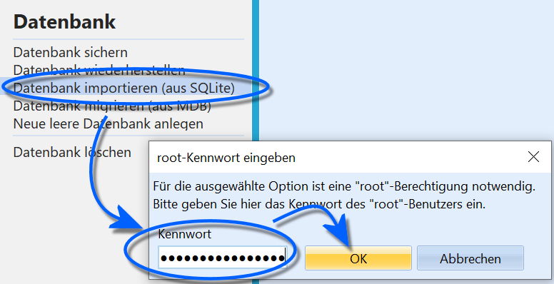
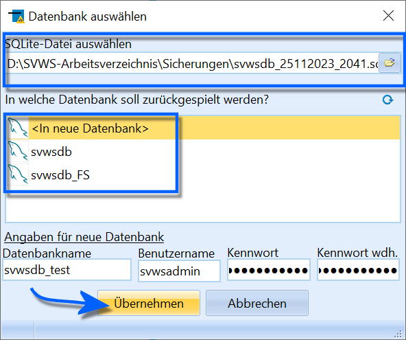
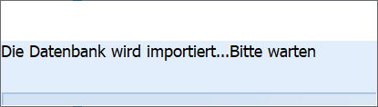
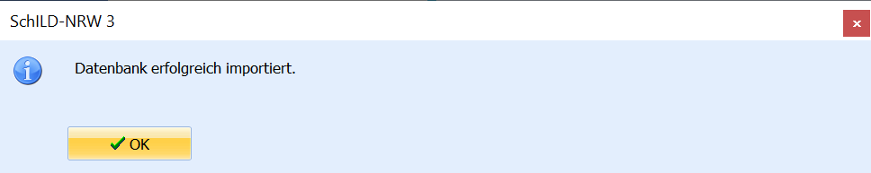
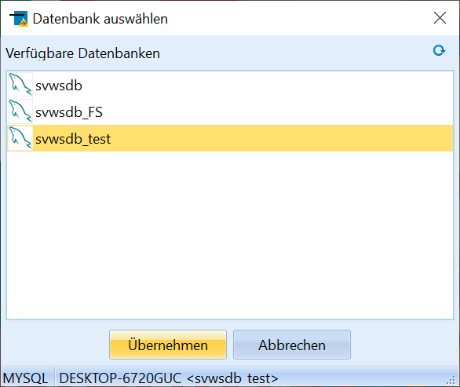

# Datenbank importieren (aus SQLite) (Verwaltung Datenbank)Liegt eine SQLite-Datenbank für SchILD-NRW3 vor, kann diese in das
aktuelle, ein anderes oder auch ein neues Schema importiert werden.Hierzu wird das Root-Password des MariaDB-Servers benötigt. Diese Option
erlaubt es zum Beispiel, eine existierende Datenbank auf in einen neuen
MariaDB-Server einzuspielen oder ein System mit mehreren Datenbanken
aufzusetzen.

::: warning

Nutzen Sie zum Wiederherstellen der aktiven Datenbank
die Funktion Datenbank **Datenbank wiederherstellen**. Damit lässt sich
eine Datenbank-Sicherung wieder in eine gleichbenannte Datenbank
einspielen. Das Root-Kennwort der MariaDB wird hierbei nicht benötigt
und somit ist ein SchILD-Nutzer mit SchILD-Administrationsrechten
ausreichend.

:::

 Starten Sie den Prozess, indem Sie in *Verwaltung ➜
Datenbank* auf `Datenbank importieren (aus SQlite)` klicken.Geben Sie das Root-Kennwort der MariaDB an.Bestätigen Sie mit `OK`.  

 Im folgenden Fenster ist eine SQLlite-Quelldatenbank zu
wählen.Als Ziel kann eine existierende oder eine neue Datenbank angegeben
werden.Wird, wie im Beispiel auf dem Screenshot, eine neue Datenbank gewählt,
ist weiterhin der neue Name, ein Datenbankadministrator und das Passwort
für diesen Admin anzugeben.Hier im Beispiel wird der existierende Admin für den Namen *svwsadmin*
mit dessen existierendem Passwort gewählt. Es kann auch für die neue
Datenbank ein neuer Admin mit neuem Passwort erstellt werden.

::: warning

In den FAQ findet sich eine Erläuterung zu dem
Super-Administrator der MariaDB, dem Administrator für ein
Datenbankschema und einem SchILD-NRW-Administrator.

:::  ::: warning

**Wird eine existierende Datenbank gewählt, wird diese
hierbei überschrieben!**Klären gegebenenfalls Sie auch mit anderen möglichen Datenbanknutzern,
dass nun die existierende Datenbank neu aufgesetzt wird.

:::

Klicken Sie auf `Übernehmen` um den Import zu starten.Wollen Sie in eine existierende und laufende Datenbank importieren,

werden Sie darauf hingewiesen, dass SchILD-NRW und eventuell noch andere
laufende Prozesse zu schließen sind.  

 Es erscheint eine Information, der Import laufe... Bitte
warten.  

 Bestätigen Sie die Erfolgsmeldung mit `OK`.  

 Beenden Sie SchILD-NRW.