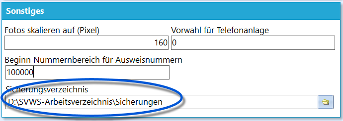

# Datenbank sichern (Verwaltung Datenbank)

Stellen Sie das Sicherungsverzeichnis über *Verwaltung ➜ Einstellungen*
in den *Globalen Einstellungen* unter *Sonstiges* ein. Da der
Windows-Nutzer zum Einlesen Zugriff auf dieses Verzeichnis benötigt,
bieten sich die Verzeichnisse des SVWS-Servers nicht an.Hier im Beispiel wurde der Ordner *"Sicherungen"* im
*SVWS-Arbeitsverzeichnis* gewählt, so dass Nutzer die Sicherungsdateien
verwalten und einlesen können.  
Ein Klick auf *Verwaltung ➜ Datenbank* ➜ **Datenbank sichern** stößt den
Prozess an, mit dem die aktuelle Datenbank im Daten-Ordner des
SVWS-Servers im eingestellten Unterordner als Kopie abgelegt wird.Hierbei werden die Dateien mit einem Dateinamen nach dem Schema` [DB Name]_TTMMJJJ_HHMM.slite `gespeichert. Eine Datei aus der Datenbank *svwsdb*, die am 23.11.2024 um
12:03 gespeichert wird, hieße also` svwsdb_23112024_1203.sqlite`

Diese Kopien können dann im Menüpunkt *Datenbank wiederherstellen*
erneut eingelesen werden.

::: warning

Es handelt sich um Sicherungen in der gleichen
Ordnerstruktur, in der auch die übrigen Daten des SVWS-Servers liegen.
Demnach handelt es sich um **kein** echtes Backup, das vor Datenverlust
im Falle eines Soft- oder Hardwarefehlers auf dem Server schützt, wie
etwa Brand, Diebstahl, Überspannungsschäden, Wasserschäden, absichtliche
und unabsichtliche (Fehl-)Löschungen, Hardwarefehler,
Konfigurationsfehler, Vollverschlüsselungen des Schulträgers durch
Hacker und so weiter.Es empfiehlt sich darüber nachzudenken, mit den IT-Verantwortlichen eine
modernen Standards entsprechende Backup-Strategie für die verwendete
IT-Infrastruktur zu klären.

:::

::: warning

**Technische Hintergrundinformation:** Bei den
Funktionen *Datenbank sichern* und *Datenbank wiederherstellen* handelt
es sich technisch um eine Migration, nicht um einen reinen
Datenbankdump. Daher kann der Prozess auch ein paar Minuten dauern,
anstatt wie bei einem reinen DB-Dump in Sekunden abzulaufen. Haben Sie
einen Moment Geduld.

:::