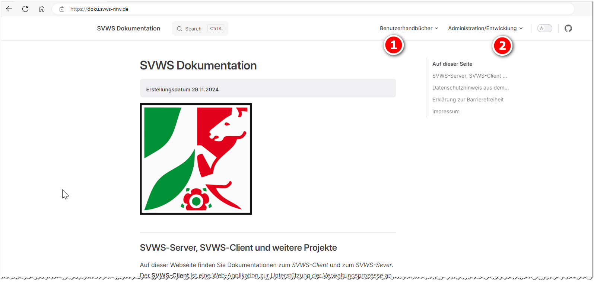

# SVWS-Server

## Dokumentation und Installationsanleitung

\]Sie finden eine ausführliche Installationsanleitung und wachsende
Dokumentation und Informationen zu weiteren Projekten wie dem
WebNotenmanager oder WebLuPO auf der [Internetseite SVWS-Dokumentationdes MSB](https://doku.svws-nrw.de/).Sie finden in der Dokumentation Benutzerhandbücher zum SVWS-Webclient.
Sie finden dort ebenfalls Informationen für Administratoren in Bezug auf
die Installation und Migration und Entwickler wie auch zu den weiteren
Projekten des MSB.Dort finden Sie auch Installationsanleitungen für verschiedene
Szenarien.  

## Installationsanleitungen SVWS-Server hier im Wiki

::: warning

In diesem Abschnitt finden Sie einige Informationen zur
Installation des SVWS-Servers. Die Anleitungen stammen aus der nicht
öffentlichen Betaphase. Wir empfehlen die offizielle Dokumentationsseite
zu nutzen.

:::