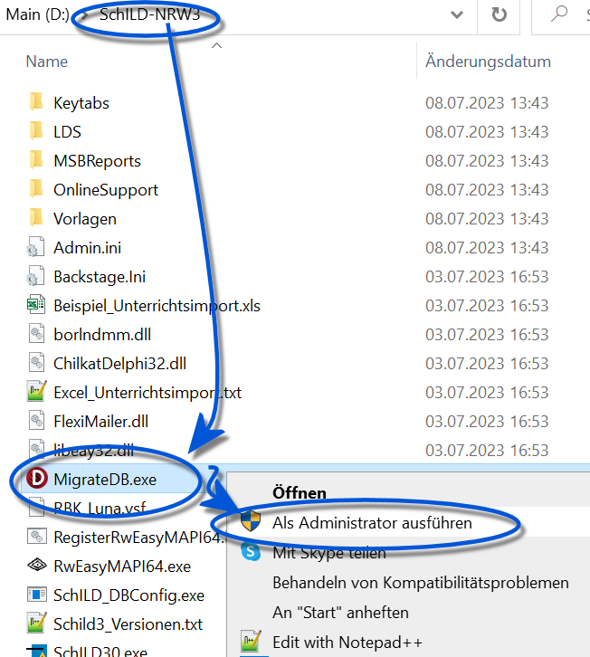
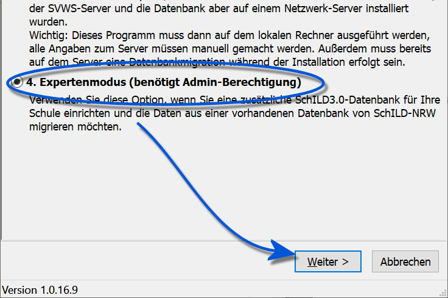
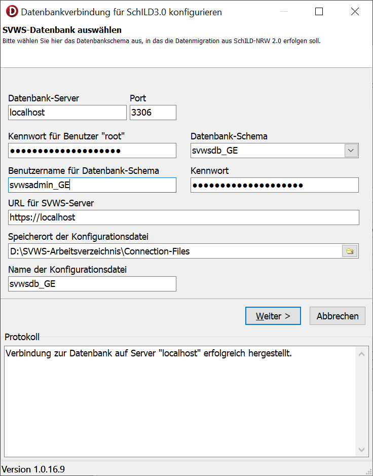
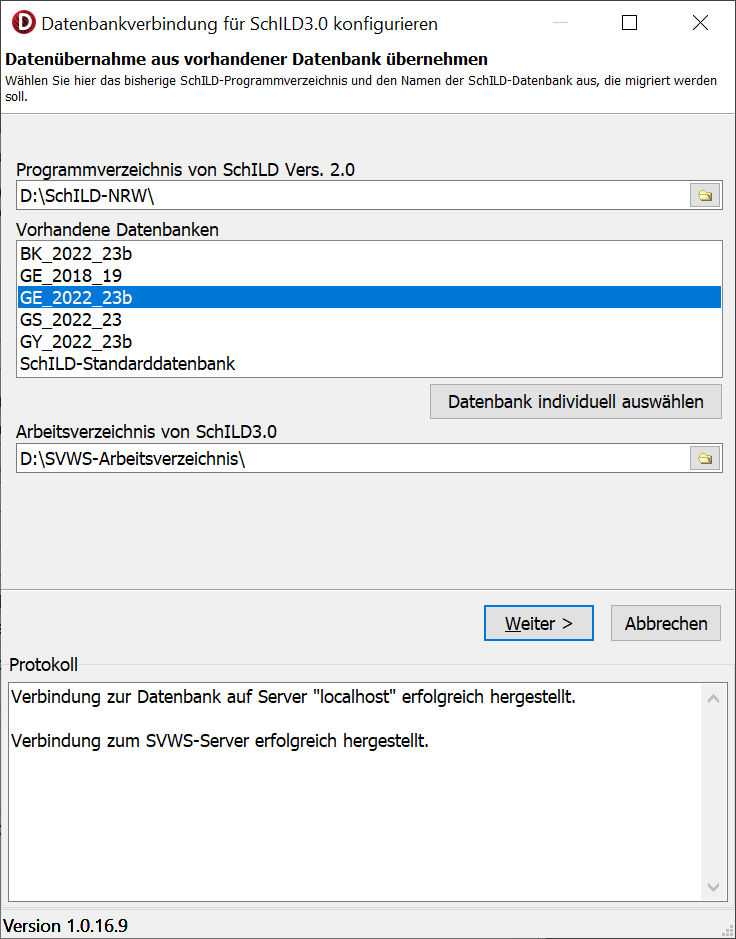
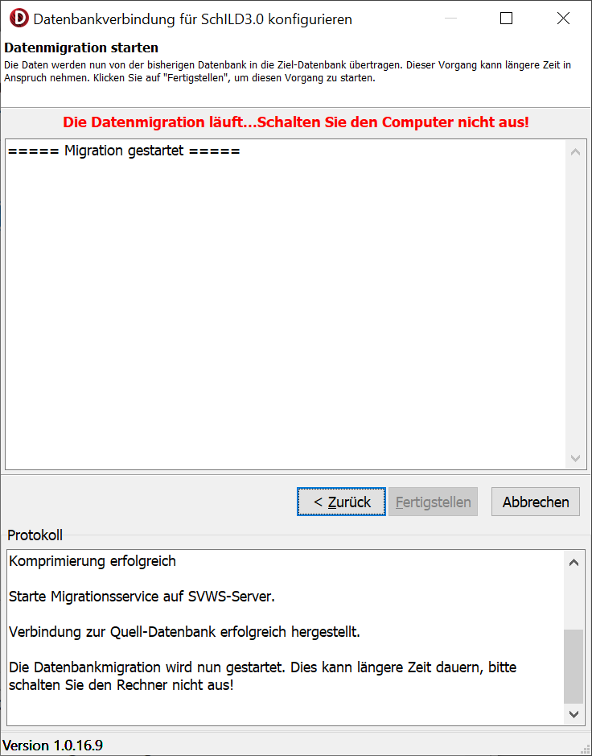
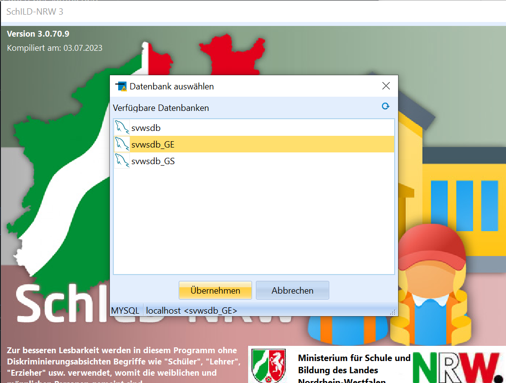
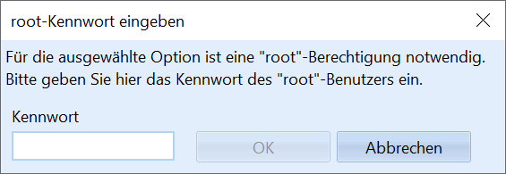
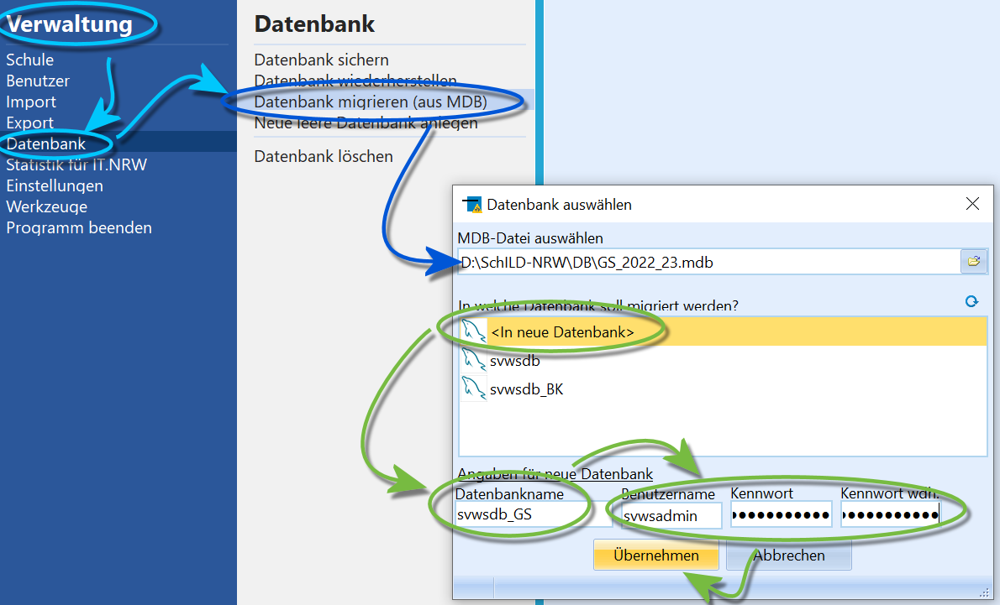
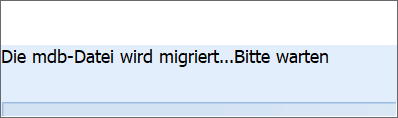
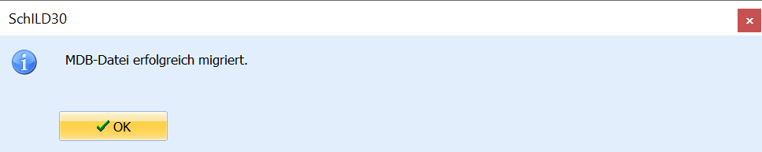

# Schild-NRW-Daten in eine andere Datenbank übertragen (migrieren) (Tutorial)

::: warning

Starten Sie die Datenbank vor einer Migration mit einer
aktuellen Version von SchILD2, damit das technische Datenbankschema bei
Bedarf auf den aktuellsten Stand gebracht werden kann.Weitere Möglichkeiten zur Migration finden Sie im AdminClient des
SVWS-Webclients. Dessen Dokumentation finden Sie auf
<https://doku.svws-nrw.de.

:::

>

::: warning

Eine Migration dauert je nach verwendeter CPU und Umfang
der Datenbank "einige mitunter lange Minuten". Wenn Sie eine Schule
migrieren, die sich bisher im Quartalsbetrieb befand, werden die alten
Quartale in Halbjahre und Quartalsnoten umgeschrieben. Dieser Prozess
kann im Vergleich zu anderen Migrationen viel länger dauern und je nach
Datenbank und CPU mitunter 30 bis ~60 Minuten zusätzlich in Anspruch
nehmen.In diesem Kontext wäre eventuell darüber nachzudenken, die Datenbank
noch in SchILD2 auf abgelaufene Löschristen zu prüfen und nicht mehr
aufzubewahrende Schuljahre mit den Leistungsdaten löschen zu lassen.Über die Datei *svws_server_service.out.log* im
*SVWS-Daten-Verzeichnis\logs\\* lässt sich die Migration nachvollziehen.
In diesem Verzeichnis finden sich noch weitere logs, z.B. zu Fehlern des
Servers.

:::

## Migration über die externe MigrateDB.exe

Die Migration von Datenbanken wird über das externe Programm
`MigrateDB.exe` durchgeführt. Dieses wird bei der Installation von
SchILD-NRW mit ausgeliefert und liegt im
SchILD-Installationsverzeichnis.Um eine Datenbank zu migrieren ist das Programm zwingend als
*Windows-Administrator* auszuführen, da ansonsten der benötigte
Menüpunkt nicht angewählt werden kann.  

Wählen Sie den Expertenmodus an, dann klicken Sie auf `Weiter`.

::: warning

Um aus anderen Quellen zu migrieren, schauen Sie bitte
in die [Dokumentation zum SVWS-Client undSVWS-Server](https://doku.svws-nrw.de), wie mit dem AdminClient aus
laufenden Datenbankservern migriert werden kann.

:::

 Im folgenden Fenster sind die notwendigen Daten einzugeben.-   **Datenbank-Server** ist der Server, auf dem die Datenbank läuft.
    Dieser befindet sich mitunter im Netzwerk. Hier im Beispiel läuft
    der Server auf dem aktuellen Rechner, daher kann *localhost* gewählt
    werden.
-   **Port**: wurde nichts verändert, wird der Standard beibehalten.
-   **Kennwort für Benutzer "root"** erfordert das Root-Kennwort für den
    Datenbankserver. Hier ist nicht das Kennwort für einen SchILD-Nutzer
    oder eine existierende Datenbank gemeint.<!-- -->-   **Datenbank-Schema** lässt den Namen setzen, unter dem die neue
    Datenbank erreichbar sein soll. Achten Sie darauf, keine
    existierende Datenbank zu überschreiben. Hier im Beispiel wird der
    Standard "svwsdb" übernommen und mit "\_GE" wird kenntlich gemacht,
    dass hier noch eine weitere Gesamtschul-Datenbank migriert werden
    soll.
-   **Benutzername für Datenbank-Schema** hier kann der Standard
    *svwsadmin* gelassen werden - in diesem Fall müssen Sie das
    existierende Kennwort für diesen Benutzer angeben. Hier im Beispiel
    legen wir einen neuen Nutzer "svwsadmin_GE" nur für dieses
    Datenbankschema an, der ein neues Kennwort erhält. Dieses wäre
    ebenfalls sicher abzulegen.
-   **Kennwort**: vergeben Sie ein sicheres, modernen Standards
    entsprechendes Kennwort für das Datenbank-Schema und dokumentieren
    Sie es sicher.
-   **URL für SVWS-Server**: Geben Sie an, wo der SVWS-Server erreichbar
    ist.
-   **Speicherort der Konfigurationsdatei** und **Name der
    Konfigurationsdatei** ist nicht frei wählbar. Geben Sie hier den
    Ordner *Connection-Files* in ihrem *SVWS-Arbeitsverzeichnis* an. Der
    Name sollte dem DB-Schema entsprechen.Klicken Sie auf `Weiter`.  

Wählen Sie die Datenbank an, aus der migriert werden soll. Hier stehen
die Datenbanken aus einer existierenden SchILD2-Installation zur
Verfügung.Über *Datenbank individuell anwählen* können Sie Ihre
Windows-Verzeichnisstruktur nutzen, um eine beliebige Datenbank
anzugeben.Es ist weiterhin das SchILD3-Arbeitsverzeichnis zu wählen.Klicken Sie auf `Weiter`.  
Im nächsten Fenster wird noch einmal die gewählte Datenbank-Datei
gezeigt. Bestätigten Sie mit `Weiter`.

Sofern die Migration nicht direkt beginnt, klicken Sie auf
`Fertigstellen`, die Migration startet.Haben Sie nun Geduld. Je nach Datenbank und verwendetem Computer kann
die Migration wenige Minuten bis "eine längere Weile" dauern.

Das Ende der Migration wird durch die Zeile` ===== Migration beendet =====`anzeigt.Klicken Sie dann auf `Beenden`.Sind Fehler aufgetreten, werden diese im Protokollfenster ausgegeben.  

Nach der Migration steht das neue Datenbank-Schema zur Auswahl beim
Starten von SchILD-NRW zur Verfügung.Wählen Sie das Schema aus und melden Sie sich mit einem für diese
Datenbank passenden SchILD-Benutzer an.  

## Migration über *Verwaltung ➜ Datenbank*

Diese Form der Migration bietet sich an, wenn schon eine vorhandene
SchILD-Umgebung läuft und Sie weitere Datenbanken migrieren möchten.
Hier kann auch die existierende Datenbank mit einer Neumigration
überschrieben werden.Navigieren Sie zu *Verwaltung ➜ Datenbank* und klicken Sie auf
`Datenbank migrieren`.  

::: warning

An dieser Stelle ist nun zwingend das *Root-Kennwort des
Datenbankservers* anzugeben. Es handelt sich hier nicht um ein
Admin-Kennwort von SchILD oder das Kennwort als
Schema-Admin.

:::  

Nun ist die SchILD2-Quelldatenbank, eine MS Access .mdb-Datei zu wählen.
Weiterhin sind die Daten für das neue Schema anzugeben. Hier im Beispiel
wird als **Datenbankname** das Schema *svwsdb_GS* für eine zusätzliche
Grundschuldatenbank gewählt.Als **Benutzername** wird hier im Beispiel der hier für alle Datenbanken
verwendete *svwsadmin* genutzt mit dem existierenden Kennwort genutzt.
Sie können auch für jedes Schema, also für jede Datenbank, einen neuen
Namen mit neuen Kennwörtern vergeben.

::: warning

**Zur Erklärung**SchILD und der SVWS-Server kennen drei Typen von Kennwörtern: Zuerst der
Root-Zugriff auf den kompletten Datenbankserver. Zweitens wird jedes
Schema von einem Admin-Zugang gesteuert, der für den technischen Zugriff
des SchILD-NRW-Programms hinterlegt wird. Schlussendlich gibt es die
unterschiedlichen Nutzer in SchILD-NRW selbst mit ihren jeweiligen
Berechtigungen.

:::

Klicken sie anschließend auf `Übernehmen`

.

::: warning

Migrieren Sie in ein existierendes Schema, wird die dort
vorhandene Datenbank überschrieben!

:::

 Es erscheint während der Migration ein Fenster, in dem zum
Warten angehalten wird.  

 Bei Erfolg der Migration werden Sie benachrichtigt.  

0 Nach einem Neustart von SchILD-NRW steht die migrierte
Datenbank zur Verfügung.

::: warning

Beachten Sie, dass in diesem Modus kein Fenster mit
weiteren Informationen und eventuellen Fehlern zum Migrationsprozess
anzeigt wird.

:::