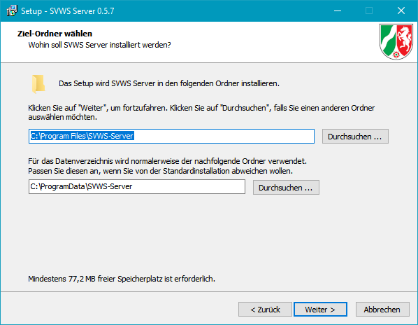
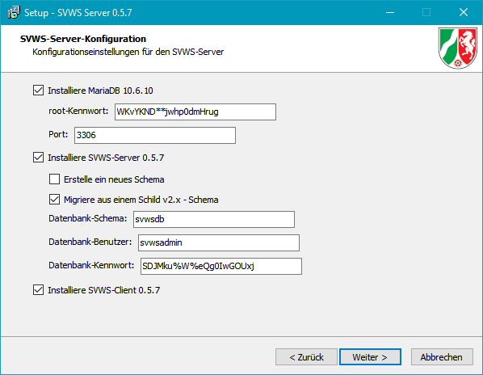
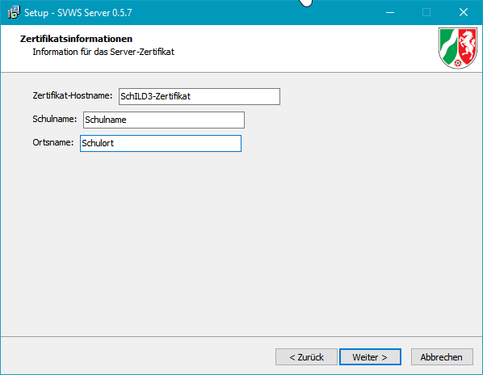
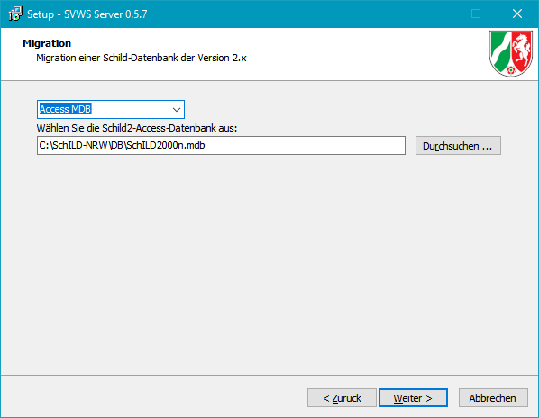
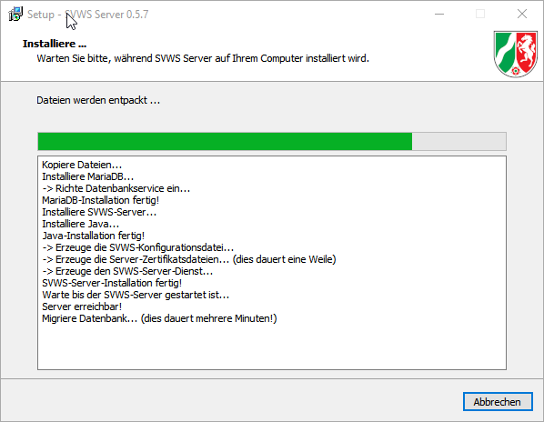
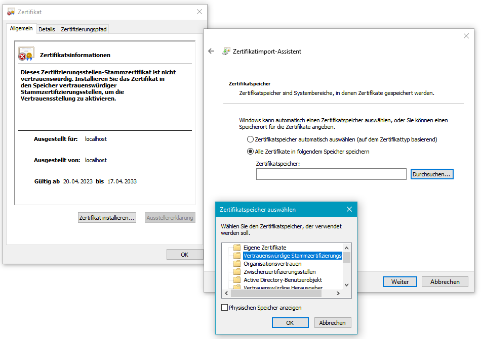
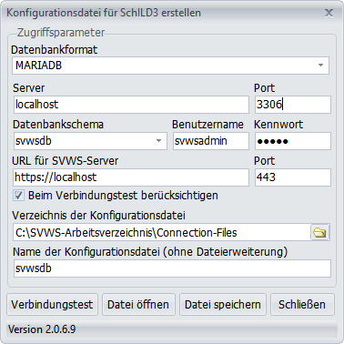
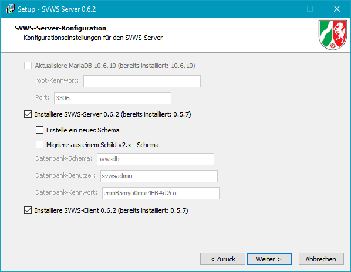

# Installation SVWS-Server und SchILD-NRW 3

::: warning

Die Versionen des SVWS-Servers und von SchILD-NRW 3
müssen zusammenpassen. Kontrollieren Sie vor Beginn der Installation,
dass Sie die korrekten Installer vorliegen haben.

:::

Der folgenden Artikel beinhaltet Hinweise zur Installation des

SVWS-Servers und von SchILD-NRW 3.

## Übersicht über die Programmbausteine

 Die neue SchILD-Version besteht nicht mehr aus zwei,
sondern aus vier Programmbausteinen. Der SVWS-Server fungiert als
Dienstprogramm, welches logische Aufgaben übernimmt und den Zugriff auf
eine MariaDB-Datenbank regelt.SchILD-NRW 3 dient als Anzeigeoberfläche der Datenbankdaten und übernimmt ebenfalls logische Aufgaben, die noch nicht im SVWS-Server implementiert wurden. SchILD-NRW 3 greift deshalb teilweise über den SVWS-Server und teilweise direkt auf die MariaDB zu.Der SVWS-Client stellt die Technologie zur Anzeige der Datenbankdaten in
einem Browserfenster zur Verfügung. Der SVWS-Client ist Bestandteil des
SVWS-Servers und kann nur auf die logischen Aufgaben des SVWS-Servers
zurückgreifen. Der SVWS-Server und SchILD-NRW 3 arbeiten ausschließlich
mit einer MariaDB zusammen. Für den Zugriff auf die MariaDB ist kein
ODBC-Treiber notwendig.Es werden zwei Installationsdateien ausgeliefert:-   Das eine Installationsprogramm installiert den SVWS-Server mit der
    MariaDB, dem SVWS-Client und benötigten Komponenten. Während der
    Installation des SVWS-Clients können bestehende SchILD-NRW 2
    Datenbanken (Access MDB, MariaDB, MySQL, Microsoft SQL-Server) in
    die neue MariaDB migriert werden. Zudem wird eine Zertifikatsdatei
    erzeugt, welche im Zertifikatsspeicher des Betriebssystems
    hinterlegt werden muss.
-   Das andere Installationsprogramm installiert SchILD-NRW 3 und stellt
    eine Verknüpfung zwischen SchILD-NRW 3 und der MariaDB her.

## Datenbank und Installation

### Datenbank-SchemataUnter Datenbank-Schema versteht man eine vorstrukturierte, leere
Datenbank. In der leeren Datenbank sind also schon alle Tabellen und
deren Abhängigkeiten angelegt, jedoch noch keine Daten enthalten.In einer MariaDB können mehrere Schemata liegen, die dann einer
einzelnen SVWS-Datenbank einer Schule entsprechen, auf die dann mit dem
SchILD-Client zugegriffen werden kann.In großen Systemen, etwa kommunalen Rechenzentren oder kommerziellen
Rechenzentren, könnten noch weitere Schemata in der MariaDB laufen, die
dann anderen Schulen gehören oder gar nichts mit Schulen zu tun haben.

### Die unterschiedlichen Nutzer 
 
Ein *Root-Benutzer** ist ein Super-Administrator-Zugang auf den
MariaDB-Server. Er hat Zugriffsrechte auf alle Datenbanken, kann
  diese anlegen und löschen. Er kann beliebige weitere
   Datenbank-Benutzer anlegen. Geht das Root-Kennwort für die MariaDB
   verloren, kann dieses Passwort nicht mehr angezeigt oder verändert
   werden und neue Schemas können nicht mehr angelegt werden.

-   Ein *Datenbank-Benutzer* oder auch *Schema-Benutzer* ist ein
    Administrator-Zugang mit vollen Zugriffsrechten auf ein Schema, d.h.
    eine einzelne "Datenbank". Ein Datenbank-Benutzer kann auch mit
    gleichem Namen und Passwort für mehrere Schemata/Datenbanken gelten.
    Er kann diese Datenbank nicht löschen, aber jede Veränderung
    innerhalb des Schemas/der Datenbank vornehmen. SchILD-NRW 3 nutzt
    die Zugangsdaten dieses Benutzers, um auf die Datenbank zuzugreifen.
    In den Beispielen dieses Wikis wird in der Regel der Name
    *svwsadmin* für diesen Benutzer verwendet.

-   Ein *SchILD-NRW-3-Benutzer* ist (meistens) eine reale Person mit
    eingeschränkten Zugriffsrechten auf die Datenbank über SchILD-NRW
    oder das Webinterface. SchILD-NRW regelt diese Rechte in der
    Benutzerkontensteuerung des Clients. Dies sind die Benutzer, über
    die mit SchILD-NRW gearbeitet wird. Einem solchen Benutzer können
    SchILD-NRW-Administrationsrechte zugewiesen werden, so dass über die
    Benutzeroberfläche von SchILD-NRW bereitgestellte
    Datenbankoperationen ausgeführt werden können.

### Die Ordnerstruktur

Um die Sicherheit des Betriebssystems zu gewährleisten, stattet Windows
die unterschiedlichen Ordner mit unterschiedlichen Rechten aus. Der
SVWS-Server und SchILD-NRW 3 fügen sich hier in diesem Sinne korrekt
ein. Für die Benutzung des SVWS-Servers und SchILD-NRW werden vier
unterschiedliche Verzeichnisse verwendet.-   Das Verzeichnis, in dem der SVWS-Server *installiert* wird. In
    diesem Verzeichnis sollen Nutzer nichts ablegen können und keinen
    Zugriff darauf haben.
-   Das Verzeichnis, in dem der SVWS-Server die Datenbanken ablegt. In
    diesem Verzeichnis hat nur der Server Zugriff, Nutzer sollen hier
    nichts lesen oder verändern können.
-   Das Verzeichnis, in dem das reine Programm SchILD-NRW3 installiert
    wird. Nutzer haben hier keine Schreibrechte und es werden hier keine
    Arbeitsdaten erstellt.
-   Das SVWS-Arbeitverzeichnis, in dem die Daten der Nutzer liegen, zum
    Beispiel die Reports oder die Export- und Importdateien. Hier haben
    Nutzer für die tägliche Arbeit Zugriff.

## Einzelplatzinstallation

Im Folgenden wird die Installation von SchILD-NRW 3 und dem SVWS-Server
auf einem Einzelplatzrechner vorgestellt. In produktiven Schulumgebungen
wird diese Form der Installation eher selten vorkommen.Insbesondere in der Entwicklungsphase bietet diese Installation eine
einfache und schnelle Möglichkeit, das Programm zu testen. Die neusten
Versionen können in der Fachberater-Cloud heruntergeladen werden. Für
die Installation der Komponenten sind Administrationsrechte am
Arbeitsplatz-PC notwendig.

### Installationsanleitungen als Video-Tutorials

Derzeit werden im Video Standardordner genannt, die nicht mehr dem
aktuellen Stand des Installers entsprechen. Ebenso hat sich der
Dateiname der Zugangs-Datei verändert. Die Informationen zum
grundsätzlichen Vorgehen sind davon abgesehen korrekt! Das Video wird
zum Abschluss der Beta-Entwicklungsphase des Servers und von SchILD-NRW
auf den aktuellen Stand gebracht.

### Was wird installiert?

Die neuste Version kann hier heruntergeladen werden:

<https://github.com/SVWS-NRW/SVWS-Server/releases>

Installiert werden
1.  Ein Maria-Datenbankmanagementsystem
    -   Das Datenbankmanagementsystem steuert den Multiuserzugriff auf
        die Datenbanken
    -   Das Programm wird im Ordner `C:\Programme\SVWS-Server\db`
        gespeichert
    -   Die Datenbankdateien werden im Verzeichnis
        `C:\ProgramData\SVWS-Server\data` gespeichert
    -   Die Kennwörter für den Zugriff auf die Datenbanken werden in der
        Datei `C:\ProgramData\SVWS-Server\res\svwsconfig.json`
        gespeichert
2.  Eine Java-Laufzeitumgebung
    -   Dieses Programm ist notwendig, um den SVWS-Server auszuführen.
    -   Die Laufzeitumgebung wird im Ordner
        `C:\Programme\SVWS-Server\java` gespeichert
3.  Der SVWS-Server
    -   Der SVWS-Server fungiert als Dienstprogramm, welches logische
        Aufgaben übernimmt und den Zugriff auf die MariaDB-Datenbank
        regelt.
    -   Das Programm wird im Ordner
        `C:\Programme\SVWS-Server\svws-server` gespeichert.
    -   Log-Dateien werden im Ordner `C:\ProgramData\SVWS-Server\logs`
        gespeichert. Die Log-Dateien enthalten Informationen zu Fehlern
        bei der Ein- und Ausgabe des SVWS-Servers.
4.  Der SVWS-Client
    -   Der SVWS-Cient ermöglicht den browserbasierten Zugriff auf die
        Datenbanken und greift auf logische Aufgaben des SVWS-Servers
        zurück. Der SVWS-Client übernimmt die Aufgaben der Programme
        LuPO und Kurs42.
    -   Der Client wird im Ordner `C:\ProgramData\SVWS-Server\client`
        installiert.
5.  Eine SSL-Zertifikatsdatei
    -   Das Zertifikat muss später im System angemeldet werden, damit
        der SVWS-Client im Browser ohne Sicherheitswarnung gestartet
        werden kann.
    -   Die SSL-Zertifikatsdatei wird im Ordner
        `C:\Users\USERNAME\Dokumente\SVWS.cer` gespeichert.

### Installation des SVWS-Servers

Führen Sie die Datei win64-installer-version.exe aus.Es folgt ein Hinweisfenster der Benutzerkontensteuerung, dass durch die
Installation Änderungen am Gerät vorgenommen werden. Klicken Sie hier
auf die Schaltfläche `Weiter`.Im folgenden Fenster akzeptieren Sie die Lizenzvereinbarung für die
Installation des SVWS-Servers.Anschließend können Sie die Installationspfade für das Datenbanksystem
und das Programmverzeichnis auswählen. Für die lokale
Einzelplatzinstallation empfehlen wir dringend, die vorgeschlagenen
Pfade nicht zu ändern.

Es folgen die Konfigurationsangaben der SVWS-Server-Installation.
Aktivieren Sie hier das Auswahlfeld zu "Migriere aus einem Schild v2.x -
Schema", damit während des Installationsprozesses die Daten einer
SchILD-NRW 2 - Datenbank in die MariaDB migriert werden. Alle anderen
Auswahlfelder sollten Sie so belassen.Wenn die MariaDB installiert wird, wird automatisch ein Benutzer mit dem
Namen "root" erzeugt. Dieser Benutzer hat als Super-Admin volle
Zugriffsrechte auf alle Datenbanken, kann diese erzeugen und löschen.
Legen Sie das root-Kennwort für diesen Benutzer fest und notieren Sie
sich das Kennwort.Der Installer schlägt Ihnen bereits ein sehr sicheres Kennwort vor,
welches von einem Zufallsgenerator erzeugt wurde. Verwahren Sie dieses
Kennwort an einem sichern Ort.

::: warning

**Sollte das Kennwort verloren gehen, ist kein
Master-Zugriff mehr auf die Datenbank möglich! Der Zugriff kann in
diesem Fall nicht wiederhergestellt werden!**Jede Person mit Kenntnis des root-Kennworts kann sich als Super-Admin an
allen Datenbanken anmelden.

:::

Sie können zudem den Port für den Zugriff auf die MariaDB eingeben. Der

Port ergänzt eine IP-Adresse für den gezielten Zugriff der Anwendungen
auf die MariaDB (z.B. `https://localhost:3306` oder
`https://192.168.1.1:3306`).Als Standard ist hier der Port 3306 eingetragen. Sie müssen die
Portnummer nur dann ändern, wenn der Port 3306 bereits durch eine andere
Anwendung belegt wird. Dies kann z.B. dann der Fall sein, wenn Sie ein
anderes datenbankbasiertes Programm oder einen anderen
datenbankbasierten Dienst installiert haben. Erhöhen Sie in einem
solchen Fall die Portnummer z.B. auf 3307.Vergeben Sie einen Namen für das Datenbank-Schema. Bei dem
Datenbank-Schema handelt es sich um eine leere Datenbank, in der bereits
alle Notwendigen Tabellen angelegt wurden. Im Gegensatz zu SchILD-NRW 2
gibt es keine Standarddatenbank. Jede Datenbank in SchILD-NRW 3 muss
einen hier zu definierenden Namen erhalten.Vergeben Sie zudem einen Namen und ein Passwort für einen
Datenbank-Benutzer. Der Installer schlägt Ihnen bereits ein sehr
sicheres Kennwort vor, welches von einem Zufallsgenerator erzeugt wurde.
Der hier definierte Datenbank-Benutzer hat Admin-Rechte auf die hier
definierte Datenbank. Diesen Benutzeraccount nutzt SchILD-NRW 3 für den
Zugriff auf die Datenbank. Bei dem Benutzernamen muss es sich somit
nicht um den Namen einer realen Person handeln. Vielmehr wird über
diesen Benutzernamen der isolierte Zugriff auf die Datenbank (das
Schema) geregelt. Im Unterschied zum root-Benutzer hat dieser Benutzer
lediglich Zugriffsrechte auf die hier eingerichtete Datenbank (Schema),
was die Sicherheit erhöht. Notieren Sie sich auch diesen Benutzernamen
mit Passwort. Der root-Benutzer hat später auch die Möglichkeit, das
Kennwort dieses Benutzers zurückzusetzen, oder einen anderen Benutzer
mit Zugriffsrechten auf das Schema anzulegen. Insofern sind Benutzername
und Kennwort nicht existentiell wichtig.Klicken Sie auf die Schaltfläche `Weiter`.

Im folgenden Fenster geben Sie den Zertifikatsnamen, den Schulnamen und
den Schulort für die Zertifikatsdatei ein. Die Zertifikatsdatei wird
während des Installationsprozesses erzeugt und muss in einem späteren
Schritt im Betriebssystem installiert werden.

Wenn Sie das Auswahlfeld "Migriere aus einem Schild v2.x - Schema"
aktiviert hatten, folgt nun ein Fenster, in welchem Sie Angaben zur
Migration einer SchILD-NRW 2 - Datenbank vornehmen müssen. Wählen Sie
hier das Datenbankformat der SchILD-NRW 2-Datenbank aus (Access MDB,
MariaDB, MySQL, Microsoft SQL-Server).Bei der Migration einer Access MDB müssen Sie den Dateipfad zur Access
MDB angeben (z.B. schild200n.mdb). Bei der Migration einer MariaDB,
MySQL- oder Microsoft SQL-Server-Datenbank müssen Sie einen
Benutzernamen mit vollen Zugriffsrechten auf die Datenbank angeben.
Zudem das zugehörige Passwort, den Ort der Datenbank (z.B. localhost
oder IP 192.168.1.x) und den Namen des Schemas der Datenbank.

Im Anschluss können Sie die Installation starten. Während des
Installationsprozesses wird die MariaDB installiert, der SVWS-Server
installiert, die benötigte Java-Bibliothek installiert, die
Konfigurationsdatei mit den Zugangsdaten auf die MariaDB gespeichert,
die Zertifikatsdatei gespeichert und der SVWS-Server als Dienst
gestartet. Im Anschluss wird noch die SchILD-NRW 2-Datenbank in das
SchILD-NRW 3-Schema migrirert.Ein Anzeigefenster informiert Sie über den Fortschritt der Installation.
Insbesondere die Migration der Datenbank kann einige Zeit in Anspruch
nehmen.

### Installation des SSL-Zertifikats

Damit der SVWS-Client ohne störenden Sicherheitshinweis im Browser
gestartet werden kann, muss das SSL-Zertifikat, welches während des
Installationsprozesses des SVWS-Servers erzeugt und gespeichert wurde,
im Zertifikatsspeicher des Betriebssystems abgespeichert werden.Windows hält hierzu einen einfachen Zertifikatimport-Assistenten bereit,
welcher das SSL-Zertifikat in den Zertifikatsspeicher kopiert und am
System anmeldet.Navigieren Sie zum Windows-Systemordner "Dokumente". Dort finden Sie
eine Zertifikatsdatei mit dem Namen SVWS.cer. Führen Sie mit Hilfe eines
Doppelklicks den Zertifikatimport-Assistenten aus.Alternativ können Sie mit einem Rechtsklick den Kontextmenüeintrag
"Zertifikat installieren" wählen. Es öffnet sich ein Informationsfenster
mit Hinweisen zum Zertifikat. Klicken Sie auf die Schaltfläche
`Zertifikat installieren`.Aktivieren Sie im Feld Speicherort das Auswahlfeld "Lokaler Computer".
Für die Ablage auf dem lokalen Computer sind Administrationsrechte
notwendig. Klicken Sie dann auf die Schaltfläche `Weiter`. Aktivieren
Sie im folgenden Fenster "Alle Zertifikate in folgendem Speicher
speichern". Klicken Sie auf die Schaltfläche `Durchsuchen...`. Wählen
Sie dann den Ordner "Vertrauenswürdige Stammzertifizierungsstellen".
Bestätigen Sie die Auswahl mit der Schaltfläche `OK` und im
Ursprungsfenster mit der Schaltfläche `Weiter`.Schließen Sie den Prozess mit Klick auf die Schaltfläche
`Fertig stellen` ab. Ein Hinweisfenster informiert Sie über den
erfolgreichen Import des Zertifikats.

### Installation von SchILD-NRW 3

Die neuste Version kann hier heruntergeladen werden:

<https://github.com/SVWS-NRW/Schild3-BetaTest/releases>

Installiert werden
1.  SchILD-NRW 3 im Ordner C:\Programme (x86)\SchILD3.0, auf das nur
    lesende Rechte notwendig sind
2.  ein Arbeitsverzeichnis im Ordner C:\SVWS-Arbeitsverzeichnis, auf
    welches lesende und schreibende Rechte notwendig sind. Dieser Ordner
    wird z.B. die Connection-Dateien zur MariaDB und die Reports
    aufnehmen.
3.  eine Connection-Datei schemaname.con im Ordner
    C:\SVWS-Arbeitsverzeichnis\Connection-Files. Die Connection-Datei
    (früher udl-Datei) ist eine Textdatei, welche Verbindungsdaten zur
    MariaDB enthält und in einem Texteditor geöffnet werden kann.Führen Sie die Datei Setup_SchILD3_vXYZ.exe aus. Es folgt ein
Hinweisfenster der Benutzerkontensteuerung, dass durch die Installation
Änderungen am Gerät vorgenommen werden. Klicken Sie hier auf die
Schaltfläche `Weiter`.Wählen Sie im folgenden Fenster den Installationsordner des Programms.
Wir empfehlen, für die Einzelplatzinstallation den Ordner nicht zu
ändern. Klicken Sie hier auf die Schaltfläche `Weiter`.Wählen Sie nun, wo das SVWS-Arbeitsverzeichnis erstellt werden soll. Für
die Einzelplatzinstallation empfehlen wir den vorgegebenen Ordner im
Hauptverzeichnis C:\SVWS-Arbeitsverzeichnis oder alternativ im
Benutzerverzeichnis Dokumente\SVWS-Arbeitsverzeichnis. Klicken Sie hier
auf die Schaltfläche `Weiter`.Sie können nun angeben, unter welchem Programmnamen SchILD-NRW 3 im
Startmenü und auf dem Desktop angezeigt werden soll. Wir empfehlen
dringend, den vorgegebenen Namen nicht zu ändern. Klicken Sie hier auf
die Schaltfläche `Weiter`.SchILD-NRW 3 wird nun installiert. Ein Hinweisfenster informiert Sie
über die erfolgreiche Installation und den Aufruf eines externen
Programms zur Einrichtung der Konfigurationsdatei.

#### Die Konfigurationsdatei (auch mit SchILD_DBConfig.exe)

 Direkt nach der Installation öffnet sich das
Konfigurationstool, mittels dem die Datei erstellt wird, die notwendig
ist, damit SchILD3 auf das Datenbankschema zugreifen kann.

::: warning

Das Konfigurationstool kann bei Bedarf auch nachträglich
aufgerufen werden, hierzu einfach die *SchILD_DBConfig.exe* im
Installationsverzeichnis von SchILD3 als Windows-Administrator
ausführen.

:::

Im folgenden Fenster können Sie nun alle voreingetragenen Angaben

prüfen, welche zur Erstellung einer Konfigurationsdatei notwendig sind.-   Das **Datenbankformat** ist standardmäßig `MariaDB`. In
    Schulungsumgebungen können hier später auch SQLite-Datenbanken
    verwendet werden.
-   Als **Server** einer Einzelplatzinstallation ist entweder
    `localhost` oder der `Computername` eingetragen. Beide Eintragungen
    sind gleichberechtigt korrekt
-   Als **Port** ist der während der Installation des SVWS-Servers
    angegebene Port zur Datenbank eingetragen. Der Standard ist `3306`.
-   Als **Datenbankschema** ist der während der Installation des
    SVWS-Servers angegebene Name des Datenbankschemas eingetragen. Der
    Standardname lautet `svwsdb`.
-   Als **Benutzername** ist der während der Installation des
    SVWS-Servers angegebene Benutzername eingetragen. Der
    Standardbenutzer ist `svwsadmin`.
-   Als **Benutzerpasswort** ist das während der Installation des
    SVWS-Servers angegebene Benutzerpasswort für den Zugriff auf die
    Datenbank eingetragen.
-   Als **URL für SVWS-Server** ist die URL eingetragen, die im Browser
    zum Start des SVWS-Client eingetragen werden muss. Der Standard ist
    `https://localhost` oder `https://Computername`. Beide Angaben sind
    gleichberechtigt korrekt.
-   Als **Port** für den Zugriff des SVWS-Clients auf die Datenbank ist
    der Port `443` eingetragen. Dies ist der Standard-Port für den
    verschlüsselten Zugriff des SVWS-Clients auf die Datenbank.
-   Durch das Auswahlfeld `Beim Verbindungstest berücksichtigen` kann
    dieser verschlüsselte SSL-Zugriff ebenfalls getestet werden, bevor
    die Konfigurationsdatei erzeugt wird. Die Aktivierung des Häkchens
    wird empfohlen.
-   Als **Verzeichnis für die Konfigurationsdatei** (Connection-File)
    wird standardmäßig ein Unterverzeichnis im SVWS-Arbeitsverzeichnis
    angeboten. Wir empfehlen die Einstellung unverändert zu übernehmen.
    Der Standardpfad lautet
    `C:\SVWS-Arbeitsverzeichnis\Connection-Files`
-   Im letzten Feld können Sie einen **Namen für die
    Konfigurationsdatei** vergeben. Wir empfehlen hier den gleichen
    Namen zu verwenden, den auch das Schema trägt. So fällt eine
    Zuordnung der Konfigurationsdatei zum Schema leichter. Der
    Standardname ist `svwsdb`Führen Sie zunächst einen Verbindungstest durch. Sofern alle
Eintragungen korrekt vorgenommen wurden, sollte der Verbindungstest zur
MariaDB und der Verbindungstest des SVWS-Clients zur MariaDB über beide
Ports erfolgreich absolviert werden. Klicken Sie in diesem Fall auf die
Schaltfläche `Datei speichern`. Sie werden über ein Hinweisfenster
darüber informiert, dass die Konfigurationsdatei gespeichert wurde.
Klicken Sie zum Abschluss auf die Schaltfläche `Schließen`.

### Start der Programme

SchILD-NRW 3 kann wie gewohnt über einen Doppelklick auf das
Desktopsymbol oder über einen Einfachklick auf das Symbol im Startmenü
gestartet werden.Zum Start des SVWS-Clients öffnen Sie einen Browser. Tippen Sie dann in
die Adresszeile die URL zum SVWS-Client ein (`https://localhost` oder
`https://Computername`).Für den Zugriff auf beide Programme müssen Sie sich als SchILD-Benutzer
anmelden. Verwenden Sie hier die gleichen Zugangsdaten, die sie auch in
SchILD-NRW 2 verwendet haben.SchILD-NRW 3 und der SVWS-Client greifen gleichermaßen auf die MariaDB
zu. Beide Programme verfügen über ebenbürtige Eintragungsmöglichkeiten,
aber auch über unterschiedliche. So enthält der SVWS-Client die
Funktionen von LuPO und Kurs42, während SchILD-NRW 3 Abiturberechnungen
enthält.In den kommenden Monaten werden die Fähigkeiten des SVWS-Clients stetig
ausgebaut, so dass dieser später die gleichen Funktionalitäten enthalten
wird, wie SchILD-NRW 3.

### Update der Programme

Ein Update von SchILD-NRW 3 erfolgt am einfachsten, indem man die
ZIP-Version in das bestehende Installationsverzeichnis entpackt und die
dortigen Dateien überschreibt.Ein Update des SVWS-Servers erfolgt, indem man den Installer aufruft. Im
Konfigurationsfenster wählen Sie nur diejenigen Komponenten aus, welche
aktualisiert werden müssen. Die Häkchen `Erstelle ein neues Schema` und
`Migriere aus einem Schild v2.x - Schema` werden nicht gesetzt. In der
Folge werden nur die Programmdateien aktualisiert.  

### Deinstallieren der Programme

Insbesondere in der Testphase kann es vorkommen, dass aufgrund von
Änderungen der Datenbankstruktur eine Neuinstallation des SVWS-Servers
notwendig wird, damit bei einer Neuinstallation die Migration einer
Testdatenbank in die neue Tabellenstruktur erfolgen kann. In einem
solchen Fall muss nur der SVWS-Server neu installiert werden. SchILD-NRW
3 muss nicht neu installiert werden.In der Testphase stellen wir eine Batch-Datei zur Verfügung, welche eine
vollständige Deinstallation des SVWS-Servers gewährleistet. Diese
befindet sich in der Fachberater-Cloud und trägt den Namen
`delete_services.bat` beziehungsweise in einer neueren Version
`Delete SVWS-Server and SchILD-NRW 3.bat`. Die Batch-Datei muss als
Administrator ausgeführt werden, indem mit der rechten Maustaste auf die
Datei geklickt und dort der Menüeintrag `Als Administrator ausführen`
ausgewählt wird. Der Batch-Prozess beendet daraufhin den im Hintergrund
laufenden Dienst SVWS-Server-Service und deinstalliert die MariaDB und
alle Programmdateien.Sofern bei der folgenden Installation des neuen SVWS-Servers die
gleichen Konfigurationsdaten verwendet werden, kann SchILD-NRW 3 ohne
Änderungen auf die neu migrierte Datenbank zugreifen.Der SVWS-Server und SchILD-NRW 3 können ebenfalls über die Windows
Systemeinstellung `Programme hinzufügen oder entfernen` deinstalliert
werden. Nach der Deinstallation verbleiben jedoch einige Ordner, die vor
einer Neuinstallation manuell gelöscht werden sollten:-   Der SchILD-NRW 3 Programmordner `C:\Programme (x86)\SchILD3.0` oder
    `C:\Program Files (x86)\SchILD3.0`
-   Der SVWS-Server Ordner `C:\Programme\SVWS-Server` oder
    `C:\Program Files\SVWS-Server`
-   Der SVWS-Server Ordner `C:\ProgramData\SVWS-Server`
-   Den Unterordner Connection-Files im SVWS-Arbeitsverzeichnis unter
    `C:\SVWS-Arbeitsverzeichnis\Connection-Files`Der Ordner `ProgramData` ist als Systemordner standardmäßig unsichtbar.
Sie können entweder den Pfad in die Adressleiste des Datei-Explorers
eintippen, oder in der Ansicht des Datei-Explorers ausgeblendete
Elemente anzeigen lassen. Um die Ordner löschen zu können sind
Admin-Rechte notwendig.

## Testen und melden von Fehlern in SchILD-NRW 3

Unter dieser Adresse ist ein Ticketsystem bei GitHUB zugänglich:

<https://github.com/SVWS-NRW/Schild3-BetaTest/issues>

Um Issues zu kommentieren oder zu erstellen benötigen Sie einen
kostenlosen GitHUB-Account.Bitte beachten Sie, dass Sie zunächst die bestehenden Issues ansehen,
bevor Issues doppelt angelegt werden.Beschreiben Sie den Fehler bitte so genau, wie möglich.