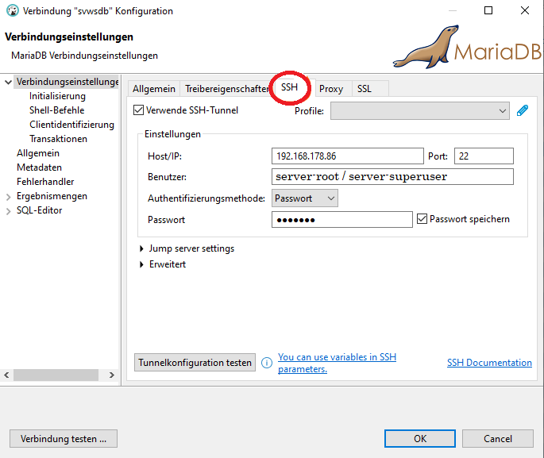
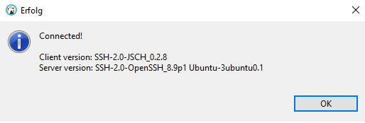
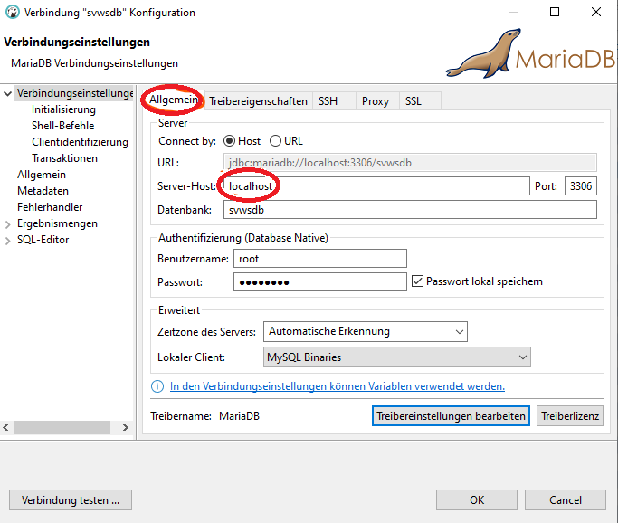
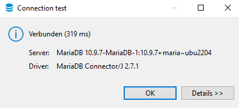
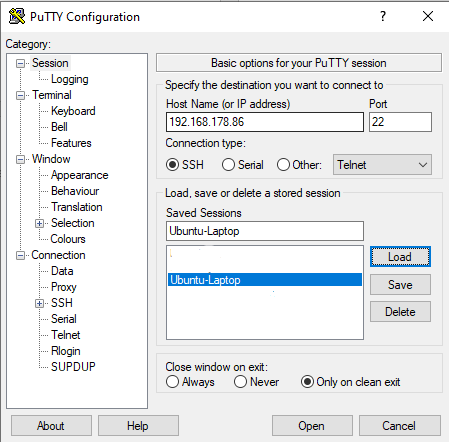
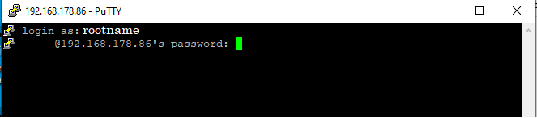

# Installation SVWS-Server unter Linux (Installation)

## Download[GitHub.com/svws-nrw/svws-server/releases](https://github.com/SVWS-NRW/SVWS-Server/releases)  
Dann unter **Assets** den Link der **1.x.x.sh**-Datei kopieren.  `wget <Pfad aus GitHub.com der install-1.x.x.sh einfügen> `  

## Installation(root-Rechte beachten (z.B. sudo))  `(sudo) bash ./install-1.x.x.sh `  Es folgen die Einstellungsabfragen für MariaDB und SVWS-Server.  
Notieren Sie alle Kennwörter.  
Im Wurzelverzeichnis können die Daten in der Datei **.env** eingesehen
werden.  

## Update

Die neue Version muss im selben Verzeichnes der .env liegen.  
(sudo) bash ./install-1.x.x.sh --update  

## Wichtige Verzeichnisse/Dateien:1.  /opt/app/svws/svwsconfig.json
2.  /etc/mysql/mariadb.conf/50-server.cnf (enth. u.a. bind-adress)
3.  .env (Enthält alle Verknüpfungsangaben)

#### Nach Änderungen Dienst neu starten:`(sudo) systemctl restart svws `  
`(sudo) systemctl restart mariadb`

#### Dienste Statusabfragen:`(sudo) systemctl status svws`  
`(sudo) systemctl status mariadb`# Verbindungen mit SVWS-Linux-Server per Win-Clients

## MariaDB von „außen“ erreichbar machen:

#### Server-Terminal auf Linux-Server:`sudo nano /etc/mysql/mariadb.conf.d/50-server.cnf`(*nano* ist hier einer der vielen möglichen Editoren unter Linux.)In dieser Datei in der Zeile:`bind-address: `**`127.0.0.1`**` auf `**`0.0.0.0`**` setzen, speichern  `  
` `  
`   `

#### MariaDB neu starten:`sudo systemctl restart mariadb`

## SSH-Zugriff ermöglichen

#### Linux-Server-Terminal`(sudo) apt install openssh-server  `  
` `

#### Für Diagnosezwecke der Netzwerkkonfiguration:`(sudo) apt install net-tools  `Bemerkung: Mit net-tools ist z.B. der Befehl \`ifconfig\` zum Ermitteln
der Server-IP im Netzwerk ausführbar.

## Datenbank-Zugriff durch DBeaverVerbindungseinstellungen auf dem Win-Client: 1. SSH-Verbindung
herstellen:  

  
IP: hostname oder IP-Adresse des DB-Servers Benutzer: superuser des
Serversystems, z.B. root oder der bei der Installation vergebener Name**Tunnelkonfiguration testen** sollte diese Meldung liefern:  

  
2.DB-Verbindung herstellen (Allgemein)  

  
Serverhost: **localhost**, hier **nicht die Server-IP** eintragen, da
durch die SSH-Verbindung bereits der Zugriff auf dem Server gesteuert
ist. Datenbankname: default ist svwsdb, DB-Name, der bei der
svws-Server-Installation vergeben wurde.`Benutzername: Benutzer der DB, default ist root  `  
`Passwort: DB-Passwort, nicht das des System-Superusers  `Verbindung testen: Möglicherweise erscheint eine Aufforderung zu einer
Treiberinstallation. Dieser einfach folgen. Dann:

## Verbindung auf den Server mittels PUTTY:1\. Einstellungen in PUTTY:

Im Terminal dann als superuser des Server-Systems anmelden (Anmerkung:
Das PW wird nicht angezeigt, also tippen und Enter): 

