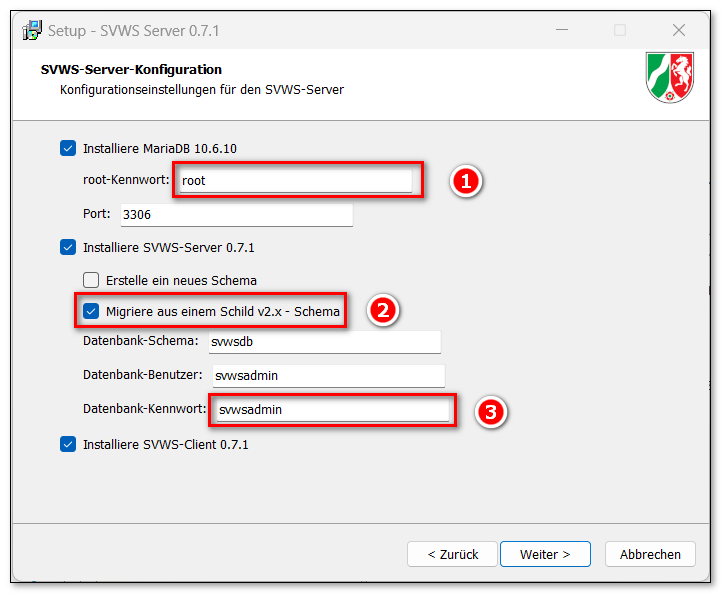
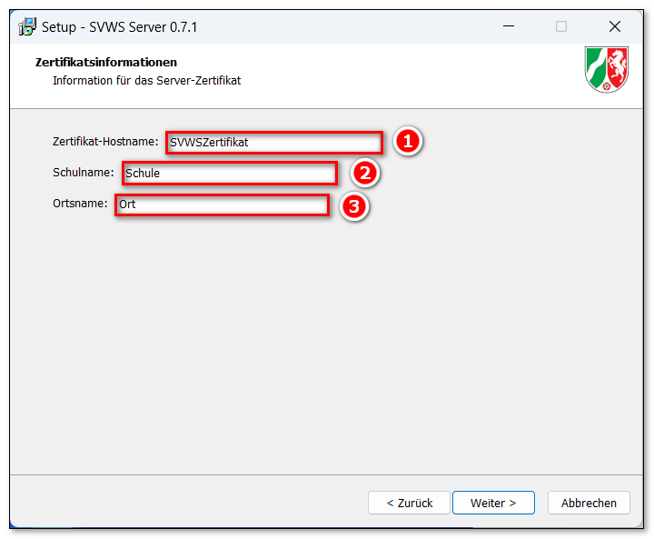
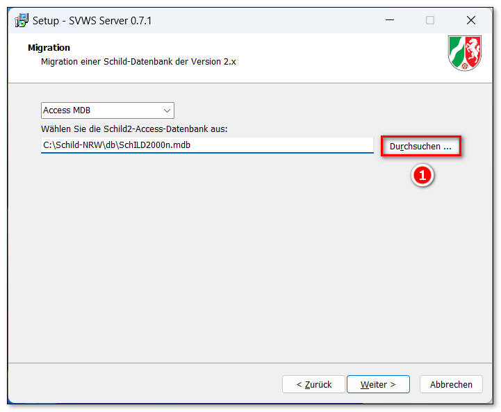
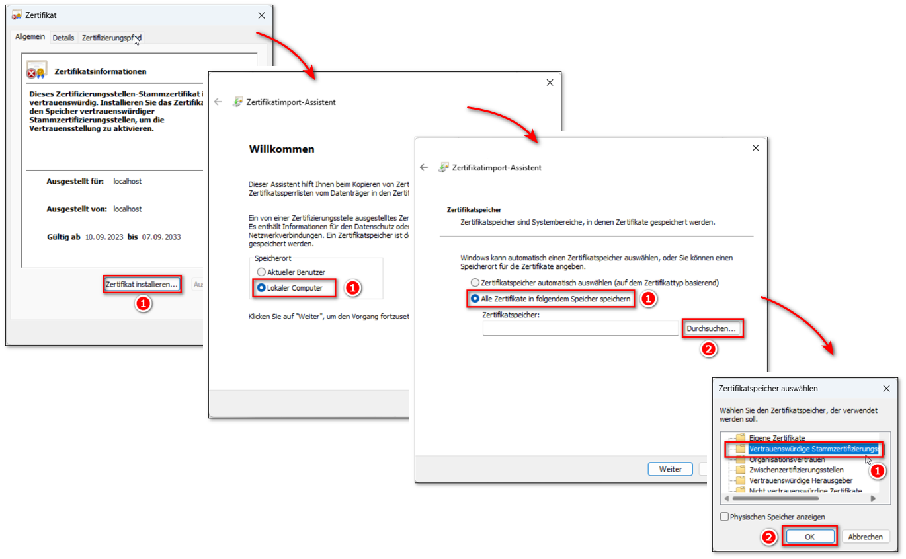

# Schnellinstallation SVWS-Server

::: warning

Die Versionen des SVWS-Servers und von SchILD-NRW 3
müssen zusammenpassen. Kontrollieren Sie vor Beginn der Installation,
dass Sie die korrekten Installer vorliegen haben.

:::

Der folgenden Artikel beinhaltet Hinweise zur Installation des

SVWS-Servers ohne weitere Erläuterungen.

## EinzelplatzinstallationIm Folgenden wird eine **Testinstallation** von dem SVWS-Server
**insbesondere für Fachberaterinnen und Fachberater** auf einem
Einzelplatzrechner ohne weitere Erläuterung vorgestellt. In einer
Produktivumgebung dürfen die Kennwörter keinesfalls wie abgebildet
gesetzt werden.

## Restlose Deinstallation einer vorherigen InstallationBitte laden Sie diese

DEADLINK: Batch-Datei - Medium:Delete_SVWS-Server_and_SchILD-NRW_3.zip.md

herunter und entpacken diese. Klicken Sie mit der RECHTEN-Maustaste auf
die Datei "Delete SVWS-Server and SchILD-NRW 3.bat" und wählen "Als
Administrator ausführen".

Die Deinstallation durch die Batch-Datei funktioniert nur, wenn die
Standardpfade für die Installation belassen wurden.

## Installation des SVWS-ServersLaden Sie sich den neusten Windows-Installer
*"Setup_SchILD3_v3.x.x.exe"* hier herunter:
**<https://github.com/SVWS-NRW/SVWS-Server/releases>**Führen Sie die .exe-Datei aus. Akzeptieren Sie alle vorgeschlagenen
Einstellungen durch Klick auf die Schaltflächen `Weiter`.

 Ändern Sie nur in den folgenden Fenstern die Angaben

:::

::: warning

Geht das Root-Kennwort für die MariaDB verloren, laufen
die Services noch, das Passwort kann aber weder ausgelesen noch
verändert werden. Weiterhin können keine Schemas angelegt oder gelöscht
werden.

:::  ::: warning

Eine Migration dauert je nach verwendeter CPU und Umfang
der Datenbank "einige mitunter lange Minuten". Wenn Sie eine Schule
migrieren, die sich bisher im Quartalsbetrieb befand, werden die alten
Quartale in Halbjahre und Quartalsnoten umgeschrieben. Dieser Prozess
kann im Vergleich zu anderen Migrationen viel länger dauern und je nach
Datenbank und CPU mitunter 30 bis ~60 Minuten zusätzlich in Anspruch
nehmen.In diesem Kontext wäre eventuell darüber nachzudenken, die Datenbank
noch in SchILD2 auf abgelaufene Löschristen zu prüfen und nicht mehr
aufzubewahrende Schuljahre mit den Leistungsdaten löschen zu lassen.Über die Datei *svws_server_service.out.log* im
*SVWS-Daten-Verzeichnis\logs\\* lässt sich die Migration nachvollziehen.
In diesem Verzeichnis finden sich noch weitere logs, z.B. zu Fehlern des
Servers.

:::

 Geben Sie die Daten Ihrer Schule an, die im SSL-Zertifikat
im internen Netzwerk verwendet werden sollen.  

 Wählen Sie zum Beispiel Ihre anonymisierte Realdatenbank.  

## Installation des SSL-Zertifikats

 Installieren Sie das SSL-Zertifikat in MS Windows.  

## Update des SVWS-ServersEin Update des SVWS-Servers erfolgt, indem man den Installer aufruft. Im
Konfigurationsfenster wählen Sie nur diejenigen Komponenten aus, welche
aktualisiert werden müssen. Die Häkchen `Erstelle ein neues Schema` und
`Migriere aus einem Schild v2.x - Schema` werden nicht gesetzt. In der
Folge werden nur die Programmdateien aktualisiert.