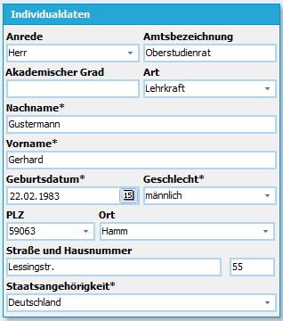
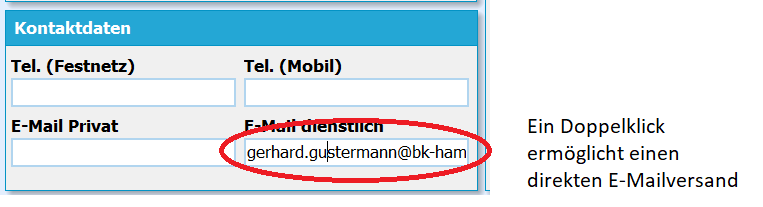
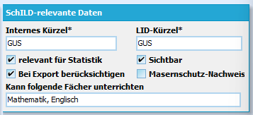
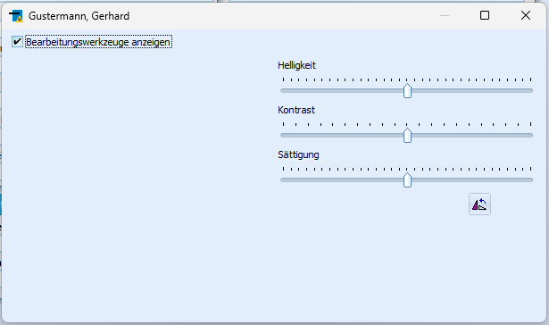

# Basisdaten (Lehrkräfte)Auf diesem Karteireiter werden die Stammdaten der Lehrerinnen und Lehrer
verwaltet. Der Reiter gliedert sich in drei Bereiche, die
Individualdaten, die Kontaktdaten und die für die Statistik relevanten
Daten.

### Individualdaten

 Die Individualdaten enthalten die persönlichen Daten der
Lehrerinnen und Lehrer.Neben der Amtsbezeichnung und der Anschrift können Sie hier auch
eventuell vorhandene Titel und Amtsbezeichnungen eingeben.Bei in Reports und vielen Zeugnisformularen können diese Informationen
dann ausgewertet und korrekt gedruckt werden.  
===Kontaktdaten=== 

 Die Kontaktdaten beinhalten Angaben zu
Telefonnummern und E-Mail-Adressen. Sie sind wichtig, wenn Sie über
Lehrerreports auch Listen für das Kollegium erstellen wollen.Wenn eine E-Mail-Adresse eingetragen ist, kann mit einem Doppelklick
eine E-Mail versendet werden.Der Versand kann auch an mehrere Lehrerinnen und Lehrer gleichzeitig
erfolgen, wenn diese zuvor markiert wurden.  
===SchILD relevante Daten=== 

 Der Haken bei **relevant für
Statistik** steuert, ob der Lehrerdatensatz in die Statistik-Datei
geschrieben wird.Sie könnten so auch andere Personen an Ihrer Schule verwalten, die in
der Hauptstatistik aber nicht gemeldet werden müssen, weil es sich zum
Beispiel um Zusatzkräfte handelt, die über andere Träger finanziert
werden.

Das Feld **Kann folgende Fächer unterrichten** ist ein frei
definierbares Textfeld, auf das Sie im Reporting zurückgreifen können.
Damit ist es zum Beispiel möglich, über einen Report die Lehrerinnen und
Lehrer nach Fächern zuzuordnen.In SchILD-NRW sind mit diesem Feld jedoch zur Zeit keine weiteren
Funktionen verknüpft, so dass Sie sich die Eingabemethode selbst
aussuchen können.Es wird empfohlen die Eingabe nach internem Fachkürzel und mit Komma
getrennt vorzunehmen, da einige Reports aus der Downloadsammlung diese
Notation erwarten (Beispiel: "D,E,PH").Geben Sie *Lehrbefähigungen* aber besser nicht in diesem Feld, sondern
sauber unter den *Schulbezogenen Daten* ein, dort werden diese
statistisch korrekt und verarbeitbar erfasst.  

### Fotos einbinden

Fotos von Lehrerinnen und Lehrern können über den Kamera-Button
eingebunden werden.Bitte beachten Sie dabei, dass die Bilder (möglichst im jpg-Format)
vorher in eine sinnvolle Größe gebracht werden.Über den Button mit dem Radiergummi werden Fotos gelöscht. Der Button
mit dem Pinsel öffnet ein Fenster mit vier Bearbeitungsmöglichkeiten
(Helligkeit, Kontrast, Sättigung und Drehung).