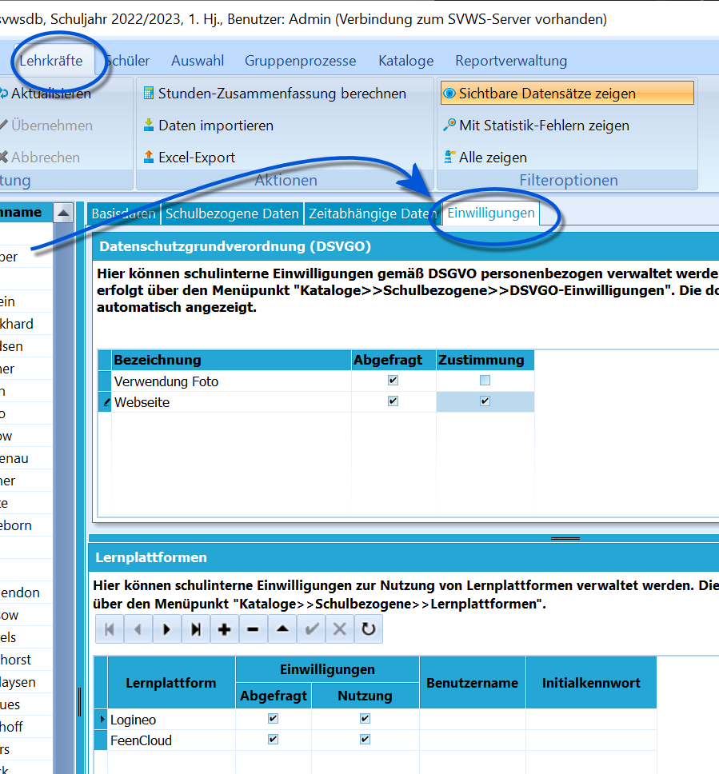

# Einwilligungen (Lehrkräfte)

 Unter *Lehrkräfte ➜ Einwilligungen* werden die
Einwilligungen zur DSGVO-konformen Datenverarbeitung verwaltet.Sie können anklicken, ob eine Einwilligung **Abgefragt** wurde und ob
eine **Zustimmung** vorliegt.Weiterhin steht ein zweites Fenster zur Verfügung, in dem analog die
Nutzung von Lernplattformen verwaltet wird.

Die Einträge werden über *Kataloge ➜ DSGVO-Einwilligungen*
beziehungsweise *Kataloge ➜Lernplattformen* angelegt und bearbeitet.

::: warning

Sie können Einwilligungen für mehrere Lehrkräfte
gleichzeitig erteilen, indem Sie die gewünschten Lehrkräfte markieren
und dann mit der rechten Maustaste auf eine der Lehrkräfte klicken. Sie
gelangen so in das Kontextmenü, in welchem Sie Einwilligungen für die
markierten Lehrkräfte setzen können.

:::