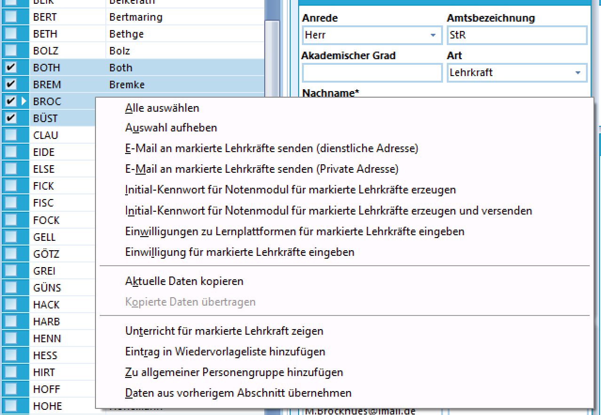

# Kontextmenü (Lehrkräfte)\_\_NOTOC\_\_ 

## Kontextmenü der LehrkräfteSie können einen oder mehrere Lehrkräfte markieren und dann mit der
rechten Maustaste auf die Lehrkräfte klicken. Sie gelangen so in das
Kontextmenü der Lehrkräfte, wo sie verschiedene Optionen zur Auswahl
haben.Alle auswählen  
Markieren Sie alle Lehrkräfte mit Hilfe dieses Menüpunktes.<!-- -->Auswahl aufheben  
Heben Sie alle Markierungen mit Hilfe dieses Menüpunktes auf<!-- -->E-Mail an markierte Lehrkräfte senden (dienstliche Adresse)  
Senden Sie unkompliziert eine E-Mail an die dienstliche E-Mail-Adresse
der markierten Lehrkräfte.<!-- -->E-Mail an markierte Lehrkräfte senden (Private Adresse)  
Senden Sie unkompliziert eine E-Mail an die private E-Mail-Adresse der
markierten Lehrkräfte.<!-- -->Initial-Kennwort für Notenmodul für markierte Lehrkräfte erzeugen  
Erzeugen Sie mit Hilfe dieses Menüpunktes individuelle Kennwörter für
das Notenmodul. Diese werden benötigt, um eine Notendatei öffnen zu
können. Nach der Erzeugung können Sie die Kennwörter ausdrucken.<!-- -->Initial-Kennwort für Notenmodul für markierte Lehrkräfte erzeugen und versenden  
Erzeugen Sie mit Hilfe dieses Menüpunktes individuelle Kennwörter für
das Notenmodul. Diese werden benötigt, um eine Notendatei öffnen zu
können. Nach der Erzeugung können Sie die Kennwörter ausdrucken und per
E-Mail versenden.<!-- -->Einwilligung zu Lernplattformen für markierte Lehrkräfte eingeben  
Setzen Sie über diesen Menüpunkt Einwilligungen zu Lernplattformen für
alle markierten Lehrkräfte.<!-- -->Einwilligung für markierte Lehrkräfte eingeben  
Setzen Sie über diesen Menüpunkt DSGVO-Einwilligungen für alle
markierten Lehrkräfte.<!-- -->Aktuelle Daten kopieren / Kopierte Daten übertragen  
Kopieren Sie die Daten einer einzelnen Lehrkraft und übertragen Sie
diese zu einer anderen Lehrkraft.<!-- -->Unterricht für markierte Lehrkraft anzeigen  
Lassen Sie sich alle Unterrichte anzeigen, in denen die Lehrkraft im
aktuellen Schuljahr eingesetzt ist.<!-- -->Eintrag in die Wiedervorlageliste hinzufügen  
Lassen Sie sich über die Wiedervorlageliste daran erinnern, bei der
ausgewählten Lehrkraft eine Maßnahme vorzunehmen.<!-- -->Zu allgemeiner Personengruppe hinzufügen  
Fügen Sie die markierten Lehrkräfte zu einer allgemeinen personengruppe
hinzu.<!-- -->Daten aus vorherigem Abschnitt übernehmen  
Übernehmen Sie zeitabhängige Daten aus dem vorherigen Abschnitt in den
aktuellen Abschnitt