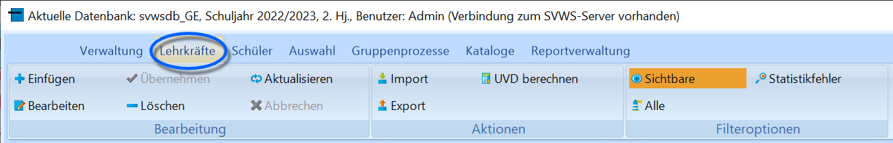

# Menüband (Lehrkräfte)

  
Im Menüband der Lehrkräfte beinhaltet der Bereich **Bearbeitung** die
Funktion, Einträge neu anzulegen, zu löschen oder zu verändern.-   **Einfügen** erzeugt einen neuen Eintrag für eine neue Lehrkraft.
-   **Bearbeiten** über Bearbeiten wird ein existierender Eintrag
    verändert.
    -   *Übernehmen* speichert die aktuelle Änderung. Ebenso wird eine
        Änderung übernommen, wenn das aktuell bearbeitete Feld verlassen
        wird.
    -   *Abbrechen* beendet die aktuelle Änderung.
-   **Aktualisieren** liest die Liste der Lehrkräfte erneut ein.Sollen bestehende Einträge gelöscht werden, erscheinen mehrere
Warnhinweise, die noch bestätigt werden müssen.

::: warning

Warnhinweise sollten genau gelesen werden, denn
Änderungen können nicht rückgängig gemacht werden.

:::

Über **Aktionen** lassen sich Daten Im- und Exportieren sowie angebotene

Funktionen wie die Berechnung der UVD aus den bei den Lehrkräften
eingebebenen Zeitabhängigen Daten und ihren Einsätzen in Fächern und
Kursen und so weiter anzustoßen.-   Der Schalter **UVD berechnen** startet die Berechnung für die
    Stunden im Bereich der zeitabhängigen Daten der Lehrerinnen und
    Lehrer. Auch die zugeordneten Fächer und Kurse und so weiter werden
    ausgewertet.
-   Der Schalter **Import** öffnet ein Feld in dem die zu importierende
    Datei ausgewählt werden muss. Anschließend kann der Import der
    Dateien mit einem Klick gestartet werden.
-   Neben dem Import ist auch der **Export** von Dateien möglich. Bei
    einem Klick auf den Schalter öffnet sich Tabelle mit den wichtigsten
    Daten der Lehrerinnen und Lehrer. Anschließend ist es möglich, diese
    Tabelle als Excel-Datei zu speichern.Über die **Filteroptionen** lassen sich nur die auf *sichtbar*
gestellten Lehrkräfte oder ''alle' anzeigen.Wurde eine Statistikprüfung ausgeführt, können nun auch die Lehrkräfte,
bei denen ein *Statistikfehler* vorliegt anzeigt werden. Somit werden
nur Datensätze angezeigt, die bei der Gesamtprüfung für die Statistik
fehlerhaft waren.