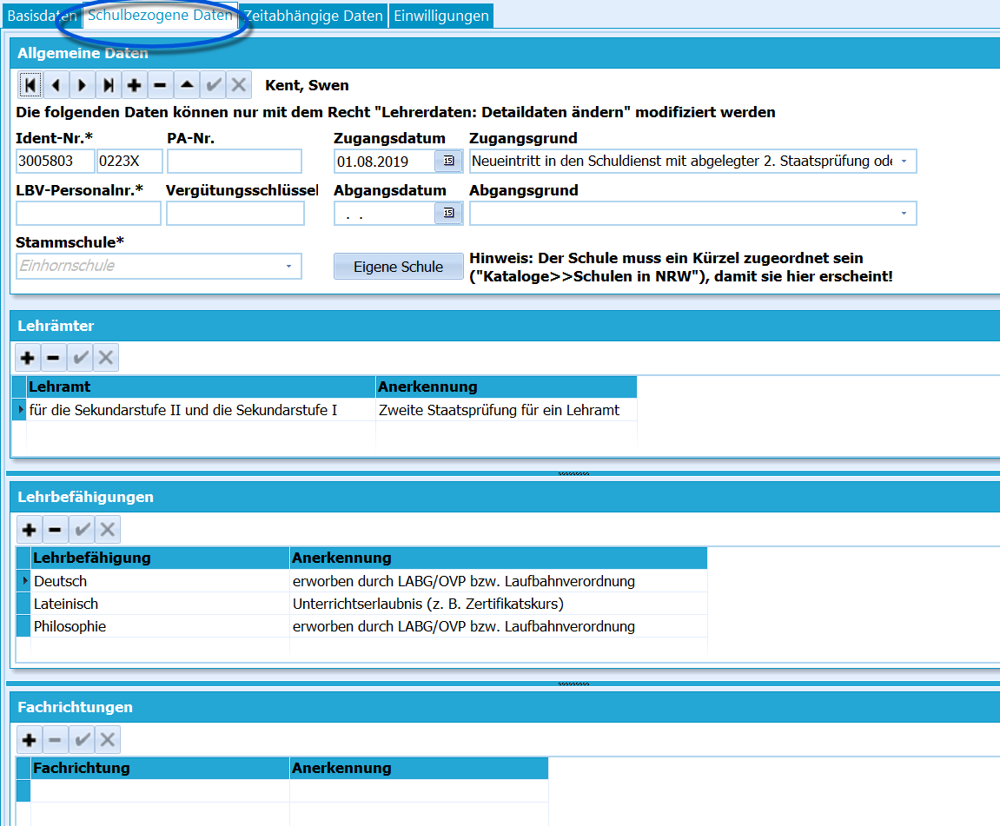

# Schulbezogene Daten (Lehrkräfte)

 Dieser Karteireiter beinhaltet statistikrelevante Daten.
Einige der Daten sind eventuell den Vorgabedaten zu entnehmen. Diese
Eintragungen benötigen Sie, wenn Sie die Lehrerdaten per *Lehrer.txt*
nach ASDPC32 bringen wollen.Für die Schule kann es nützlich sein, hier die Lehrbefähigungen zu
erfassen.

::: warning

Die zur Auswahl stehenden *Lehrämter*, *-befähigungen*
und *Anerkennungen* werden dabei über den SVWS-Server
geliefert.

:::

::: warning

Führen Sie regelmäßig SchILD- und SVWS-Server-Updates
aus, um die aktuellen Option zur Wahl zu haben. Updaten Sie auf jeden
Fall im zeitnahen Vorfeld der Statistik und halten Sie im Zuge der
Statistik auch nach kurzfristig verfügbaren Hotfixes
Ausschau.

:::

Die möglichen und nötigen Eintragungen in den vorgesehenen Weisen in

diesem Bereich können Sie aus den Schlüsselverzeichnissen zur amtlichen
Schulstatistik von IT.NRW entnehmen, diese sind auf der Webseite des

DEADLINK: zur Schulverwaltungssoftware - https://www.svws.nrw.de%7CMSB

herunterzuladen.