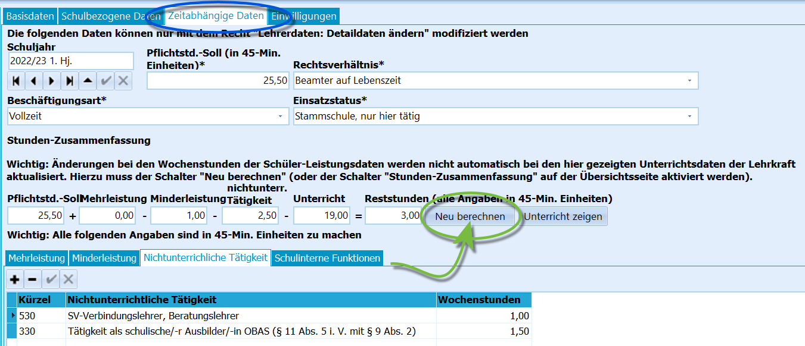
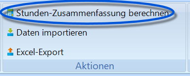
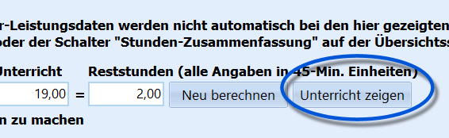
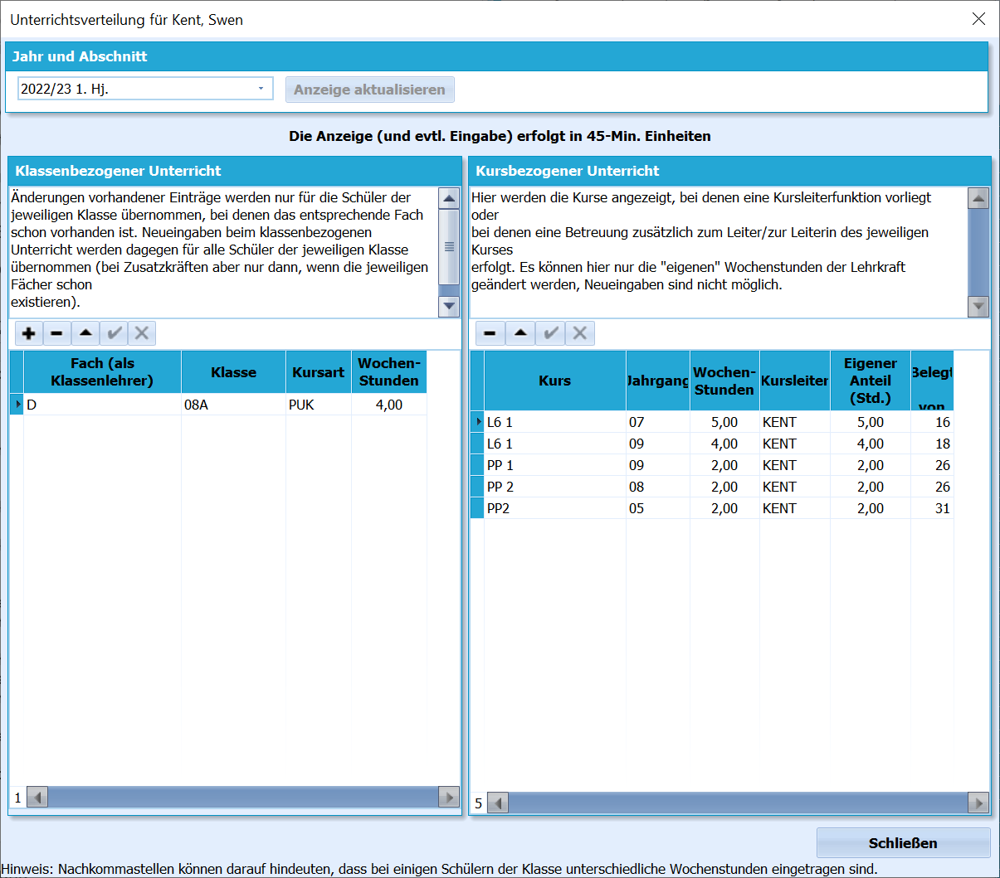

# Zeitabhängige Daten (Lehrkräfte)

## Zeitabhängige Daten

 Unter **Zeitabhängige Daten** werden die Daten der
Lehrerinnen und Lehrer erfasst, die abschnittsweise gespeichert sind.Zum Beispiel können sich das **Pflichtstundensoll** und der gegebene
Unterricht wie auch andere Be- und Entlastungen hier von Schuljahr zu
Schuljahr ändern. Tragen Sie im oberen Bereich die von der Statistik
geforderten Werte ein.Der Eintrag der Stammschule ist in der Regel die "Eigene Schule". Es
stehen hierzu alle Schulen zur Auswahl, die im Katalog "Schulen in NRW"
ein Kürzel haben. Wenn nach dem Klick auf den Button "Eigene Schule"
kein Eintrag erfolgt, so nehmen Sie bitte Ihre Schule in den Katalog
"Schulen in NRW" auf und vergeben Sie dort in der Spalte "Kürzel" ein
solches (mit bis zu 12 Zeichen) für Ihre Schule.

Die Angaben für *Mehrleistung*, *Minderleistung* und
*Nichtunterrichtliche Tätigkeit* werden so eingetragen, wie das auch für
ASDPC32 in der Statistik gefordert ist. Entnehmen Sie bitte auch hier
die Eintragungsmöglichkeiten den Schlüsselverzeichnissen von IT.NRW.  

::: warning

Denken Sie nach Änderungen daran, den Knopf **Neu
berechnen** anzuklicken, damit sich die Änderungen auch bei den
*Reststunden* bemerkbar machen.Über den Schalter **Stunden-Zusammenfassung berechnen** in der
Menüleiste von *Lehrkräfte* können Sie die Neuberechnung der Stunden
über alle Lehrkräfte starten.

:::

Der Reiter *Schulinterne Funktionen* bietet Ihnen zusätzlich bei den

Lehrkräften eigene Funktionen oder Merkmale zu verwalten. Bevor Sie bei
"Funktion" auswählen können, müssen Sie über den Schalter "Katalog der
schulinternen Funktionen bearbeiten" zunächst die gewünschten Funktionen
definieren, wobei Sie die gewünschten Bezeichnungen frei wählen können.
Dieser Katalog ist nicht relevant für die Statistik.

::: warning

In einem Report können Sie über die Datenquelle
"Lehrerfunktionen" als Unterdatenquelle auf diese Werte
zugreifen.

:::  

## Unterricht zeigen

 

Um die Reststunden passend einzustellen kann es helfen, sich aus den
*zeitabhängigen Daten* heraus anzeigen zu lassen, in welchen Klassen-
und Kursunterrichten eine Lehrkraft derzeit eingeplant ist.Klicken Sie für eine Übersicht auf **Unterricht zeigen**.