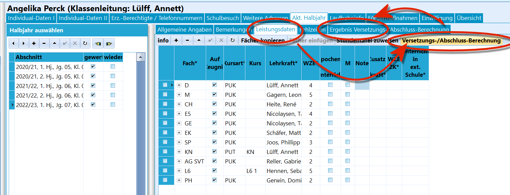
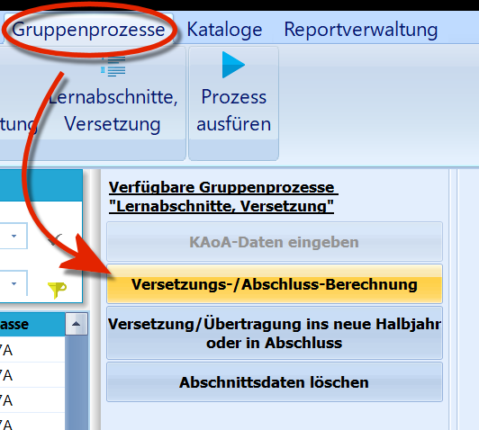
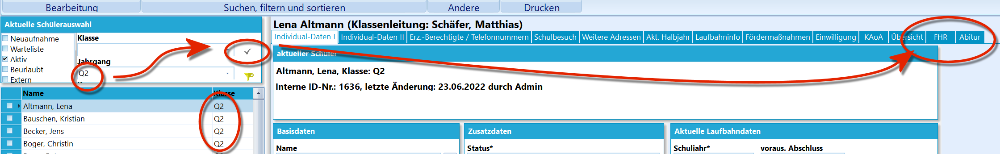
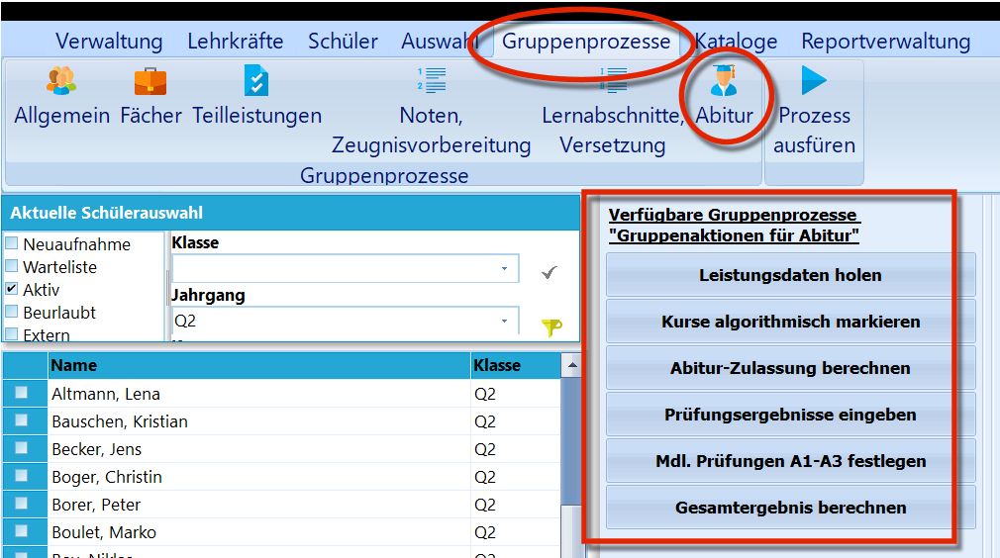

# Ergebnis Versetzungs-/Abschluss-Berechnung (Aktuelles Halbjahr / Aktueller Abschnitt

 Im Reiter *"Ergebnis Versetzungs-/Abschlussberechnung"*
werden die Details einer durchgeführten Versetzungs- und/oder
Abschlussberechnung festgehalten.In diesem Ergebnis werden Fehler oder Anmerkungen zu möglichen
Ausgleichen aufgeführt.Eine Berechnung lässt sich manuell über den Schalter *Schüler* ➜ *Akt.
Halbjahr* ➜ *Leistungsdaten* ➜ **Versetzungs-/Abschluss-Berechnung** für
die individuell ausgewählte Person anstoßen.  

 Alternativ kann die Berechnung für eine Schülergruppe über
den *Gruppenprozess* ➜ **Versetzungs-/Abschluss-Berechnung** gestartet.
Die Ergebnisse sind dann im Nachhinein über diesen Reiter *"Ergebnis
Versetzungs-/Abschlussberechnung"* abrufbar.

::: warning

Die Verantwortung für die Korrektheit von Versetzungen
und Abschlüssen trägt die Schule über Prüfungen durch die betreuende
Lehrkraft und Beschlüsse der Zeugniskonferenzen. Die automatische
Prüfung über Schulverwaltungssoftware ist als Hilfestellung ohne Gewähr
zu verstehen.

:::  

 Um Berechnungen für das Abitur beziehungsweise die FHR
durchzuführen, werden in dafür relevanten Jahrgängen die Reiter *FHR*
und *Abitur* eingeblendet.  

 Unter *Gruppenprozesse* werden dann ebenfalls Felder für
Abitur und FHR eingeblendet.

::: warning

Die Ergebnisse der Berechnungen werden für jeden
Lernabschnitt gespeichert. Entsprechend ist es auch möglich,
nachträglich für Lernabschnitte diese Berechnungen
durchzuführen.

:::