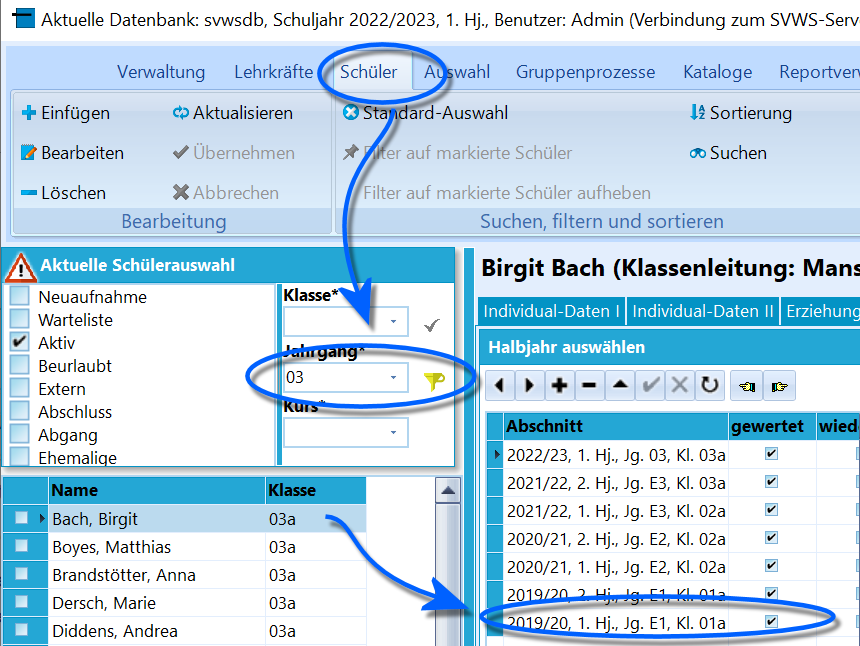
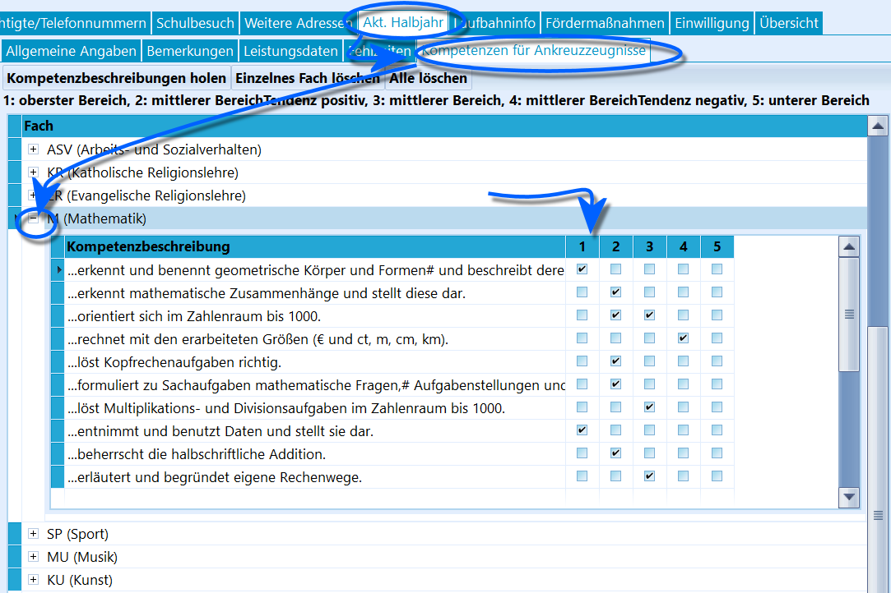

# Kompetenzen für Ankreuzzeugnisse ((Aktuelles Halbjahr / Aktueller Abschnitt)

 Wird ein Schüler angewählt, für dessen *Klasse* in
*Kataloge ➜ Klassen-/Versetzungstabelle* der Haken bei **In dieser
Klasse werden Ankreuzkompetenzen verwendet** aktiviert ist, wird unter
*Schüler Akt. Halbjahr* der neue Reiter **Kompetenzen für
Ankreuzzeugnisse** eingeblendet.  

 Es werden im Reiter *Schüler ➜ Akt. Halbjahr* ➜
**Kompetenzen für Ankreuzzeugnisse** nun fachweise, inklusive der Rubrik
*Arbeits- und Sozialverhalten* und eventuell ein frei definierbares Fach
*Sonstiges* angezeigt.  
Damit Ankreuzkompetenzen angezeigt werden, müssen1.  die Klassen erst - siehe oben - entsprechend markiert sein.
2.  Ankreuzkompetenzen für die Kombination aus *Jahrgang* und *Fach* in
    *Kataloge Angaben für Ankreuzzeugnisse* hinterlegt worden sein.
3.  Der Schüler benötigt die entsprechenden *Fächer* in den
    Leistungsdaten. Dies gilt nicht für das ASV, diese können auch ohne
    Fächer hinzugefügt werden.
4.  Die Ankreuzkompetenzen müssen für die beabsichtigte Schülergruppe im
    aktuellen Lernabschnitt über *Gruppenprozesse ➜ Noten,
    Zeugnisvorbereitung* ➜ **Ankreuzkompetenzen eintragen** zugewiesen
    worden sein.Dann lassen sich die Kompetenzen wie im Screenshot gezeigt durch
Anklicken setzen.

::: warning

Wenn das Fenster zu klein ist, ziehen Sie erst ganz oben
die Spalte *Fach* breiter. Dann lässt sich die Kompetenzbeschreibung
ebenfalls breiter ziehen. Schlussendlich lassen sich dann alle Einträge
in der Höhe verändern. SchILD-NRW speichert die hier vorgenommenen
Einstellungen.

:::

::: warning

Nehmen Sie hier bitte den Artikel *Kataloge*
**Ankreuzkompetenzen** sowie das Tutorial zu **Grundschulzeugnis
Ankreuzzeugnis** zur Kenntnis.

:::