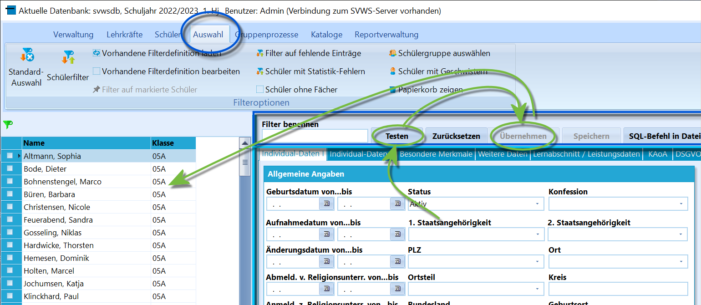
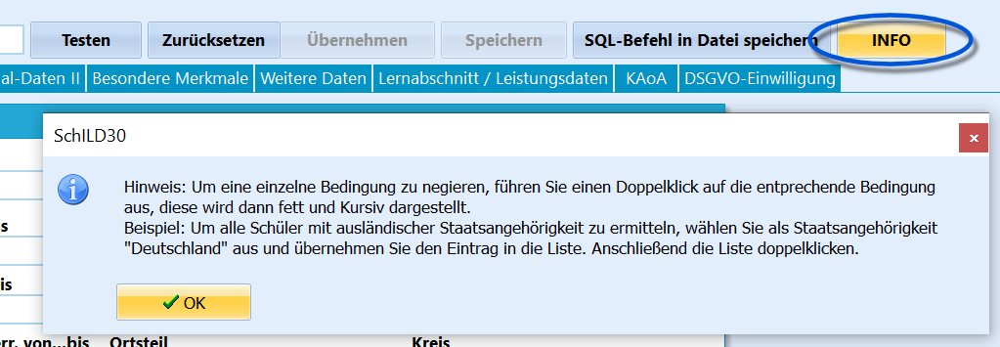
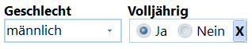
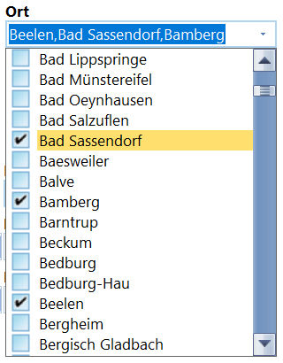
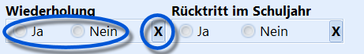
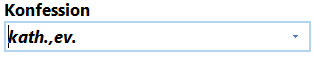
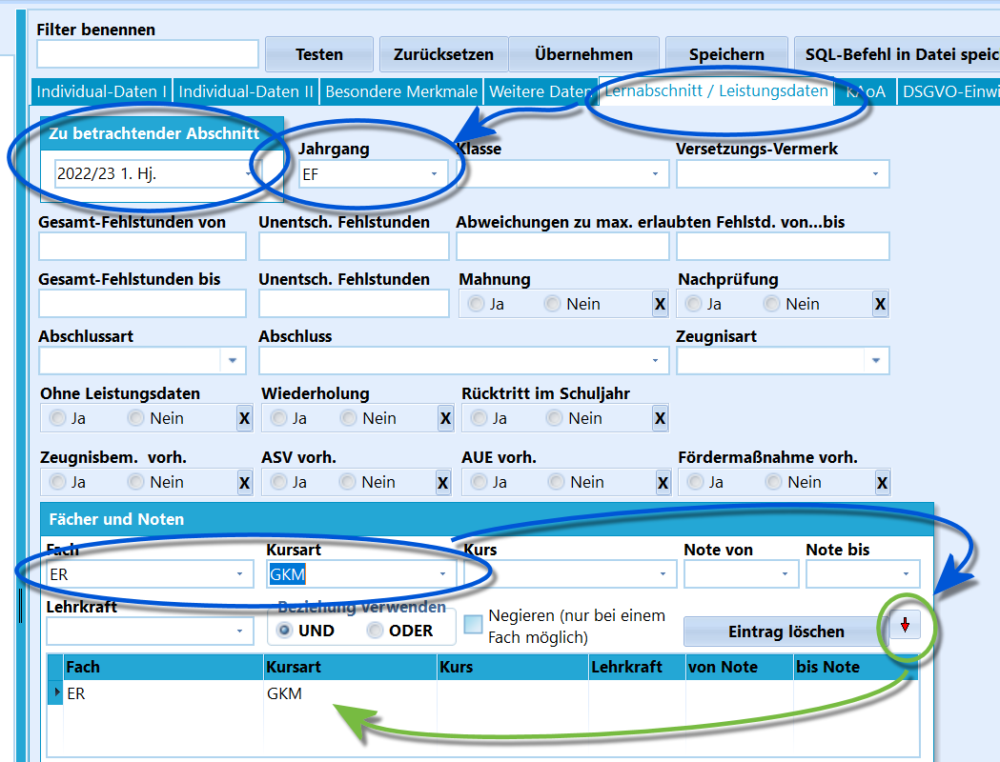
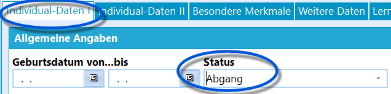
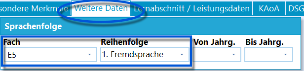

# Schülerfilter (Auswahl)

## Der Schülerfilter

 Mit dem *Schülerfilter* steht ein sehr mächtiges Werkzeug
zur Verfügung, um Schüler in Kombination von vielen Eigenschaften zu
finden.Rufen Sie ihn über *Auswahl* auf.Es öffnet sich ein Fenster, das an den Kartereiter *Schüler* erinnert.Der Filter hat eine Kopfzeile, hier in Dunkelblau hervorgehoben:-   **Filter benennen** wenn sie beabsichtigen, eine zusammengeklickte
    Filterbedingung zu speichern, geben Sie ihr hier eine Bezeichnung.
    Wollen Sie nur einmalig Filtern, kann das Feld frei bleiben.
-   **Testen** führt dazu, dass eine unten zusammengestellte
    Filterbedingung einmal ausgeführt und getestet wird. Es wird noch
    nichts im Schülercontainer links verändert. Sind Sie mit der
    Filterbedingung zufrieden, klicken Sie nach dem *Testen* auf
-   **Übernehmen**, um die gefilterten Schüler in den Container links zu
    übernehmen und mit ihnen weiterarbeiten zu können.
-   **Speichern** führt dazu, dass ein Filter, dem Sie eine Bezeichnung
    gegeben haben, über *Vorhandende Filterbedingungen laden* im
    Menüband oben wieder aufgerufen werden kann.
-   **SQL-Befehl in Datei speichern** erlaubt es computeraffinen Nutzern
    den tatsächlichen Datenbankbefehl in einer Datei abzulegen.  

 Über **Info** lässt sich eine kurze Bedienungsanleitung zu
den Filterbedingungen aufrufen, um Einträge zu negieren, also NICHT nach
dem entsprechenden Feldwert zu suchen.    

 Mitunter taucht ein **roter Pfeil** auf. Dieser bedeutet,
dass eine Filterbedingung eingestellt wird und mit einem Klick auf den
Pfeil wird diese in eine Liste aus optional mehreren Einträgen
übernommen.  

 

 Der *Schülerfilter* stellt über seine Reiter
die Daten der entsprechenden Reiter unter *Schüler* zur Verfügung.  

 An vielen Stellen kann eine getätigte Wahl, oft lässt sich
bei einem Merkmal *Ja* oder *Nein* wählen, mit dem **X** wieder entfernt
werden.  

### VerknüpfungenStandardmäßig nutzt der Filter UND-Verknüpfungen, bei einigen Feldern
werden aber auch ODER-Verknüpfungen genutzt.-   **UND**: Beide Kriterien müssen zutreffen, damit ein Eintrag
    angezeigt wird. **Beispiel**: der Schüler ist *Volljährig UND
    Männlich*.
-   **ODER**: Manche Felder werden als ODER-Verknüpfung interpretiert,
    es reicht also, wenn eines (oder beide) Kriterien zutrifft. LIsten
    mit Mehrfachauswahl werden also ODER-Verknüpfung interpretiert.
    **Beispiel**: Eine Person ist aus *Beelen ODER Bad Sassendorf ODER
    Bamberg*.  

-   Wird ein Wert ausgewählt und Doppelt angeklickt, wird der Eintrag
    **negiert**. Im Fall dieses Beispiels wurden *katholisch ODER
    evangelisch* ausgewählt und negiert, was im Filter alle Personen
    anzeigt, die WEDER *katholisch* NOCH *evangelisch* sind.  

### Beispiel: Leistungsdaten filtern

 Gefiltert werden soll auf alle Schüler, die im aktuellen
Schuljahr in der Einführungsphase evangelische Religion als mündlichen
Grundkurs belegt haben.

Die dafür nötigen Einstellungen müssen unter dem Reiter
*Lernabschnitt/Leistungsdaten* getätigt werdenDort stellt man den entsprechenden Abschnitt ein, wählt unter Jahrgang
die Einführungsphase EF aus.Unter *Fächer und Noten* stellt man das gesuchte *Fach* und die
*Kursart* ein.Als verwendete Beziehung muss in diesem Fall UND ausgewählt werden. Die
Einstellungen durch einen Klick auf den **roten Pfeil** übernommen.  

### Beispiel: Filtern über mehrere Reiter hinwegGefiltert werden soll nach allen Schülern, die im-   Schuljahr 2021/22
-   die Abiturzulassung erhalten,
-   das Abitur dann aber nicht bestanden haben und abgegangen sind
-   und Englisch als erste Fremdsprache hatten.Dafür müssen Einstellungen unter mehreren Reitern getätigt werden:

-   Zuerst muss man unter den *Individual-Daten I* unter *Status* nur
    den Haken bei den *Abgängern*. Wählen Sie auch den Haken bei *Aktiv*
    ab.  

-   Dann wechselt man zum Reiter *Weitere Daten* und stellt dort unter
    *Sprachenfolge* Englisch als erste Sprache ein.  

0-   Unter dem Reiter *Lernabschnitt/Leistungsdaten* stellt man nun noch
    das gewünschte Schuljahr ein (das Halbjahr ist in diesem Fall nicht
    relevant). Die Datenbank ist im Schuljahr 2022/23, daher wird hier
    das vorherig Schuljahr 2021/22 gewählt.
-   Ganz unten finden sich die Angaben für die *Abiturzulassung* und das
    *Bestehen des Abiturs*.Entfernen Sie hier auch mit dem **X** die Angabe, ob eine Prüfung
angesetzt wurde oder nicht. Im Beispiel des Screenshots wird nur
gezeigt, wenn zusätzlich auch eine nündliche Prüfung *nicht* angesetzt
war.  
**Testen** und **Übernehmen** übernimmt die gefunden Schüler in den
Container zur Weiterarbeit.