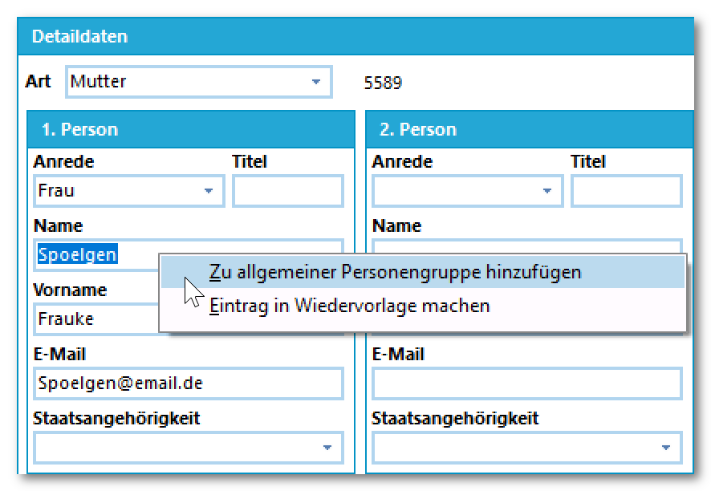

# Erzieher mit Funktionen (Tutorial)Erstellen Sie für Erzieherfunktionen passende **Personengruppen** über
***Kataloge ➜ Personengruppen***. Beachten Sie **

WIKILINK: Personengruppen_(Schulbezogene_Kataloge)**
für weitere Informationen.Sie können anschließend auf dem Reiter der Erzieher einen Klick mit der
**rechten** Maustaste auf die Anrede, den Namen oder den Titel eines
Erziehers ausführen. Im Kontextmenü können Sie diesen Erzieher dann
einer vorab definierten Personengruppe zuordnen.

